# 🏃‍♂️ 2025-06-19 のランログ

- 距離：10.03km
- 時間：00:58:40
- 平均心拍数：147
- 時間帯：06:29
- 天候：晴れ
- コース：河川敷ロード
- 補給：水
- 睡眠：6時間
- 今日の目的：3kmアップ、5kmビルドアップ、2kmダウンジョグ
- コメント：やっぱり7時過ぎると暑い

### 🗒️ コーチコメント：
9km付近で少し歩いたものの、暑さの中でも最後まで10km完走。ピッチ・フォームも安定しており、夏のフルマラソン練習として良い一歩。無理せず調整できた判断も◎。

## 📸 写真一覧
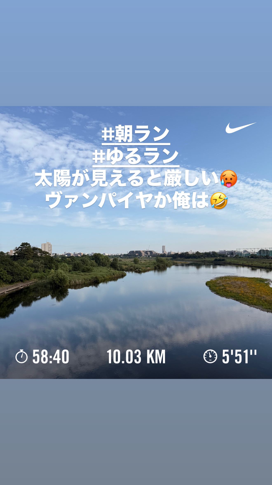
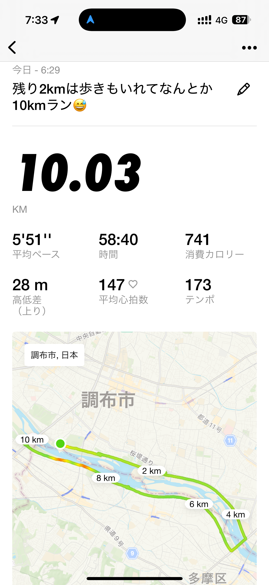
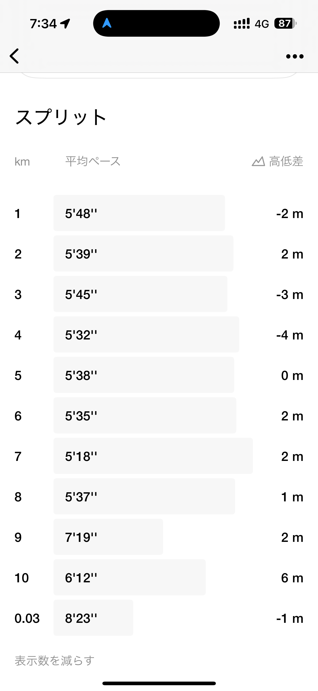
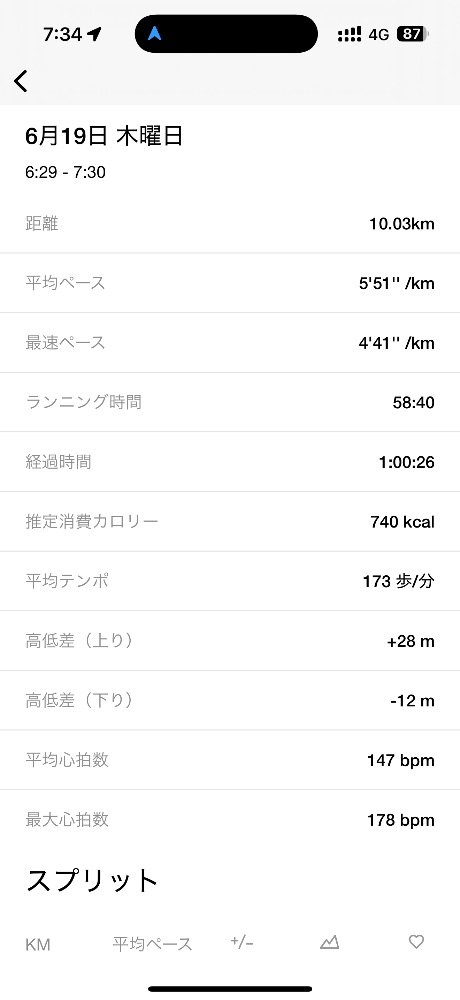
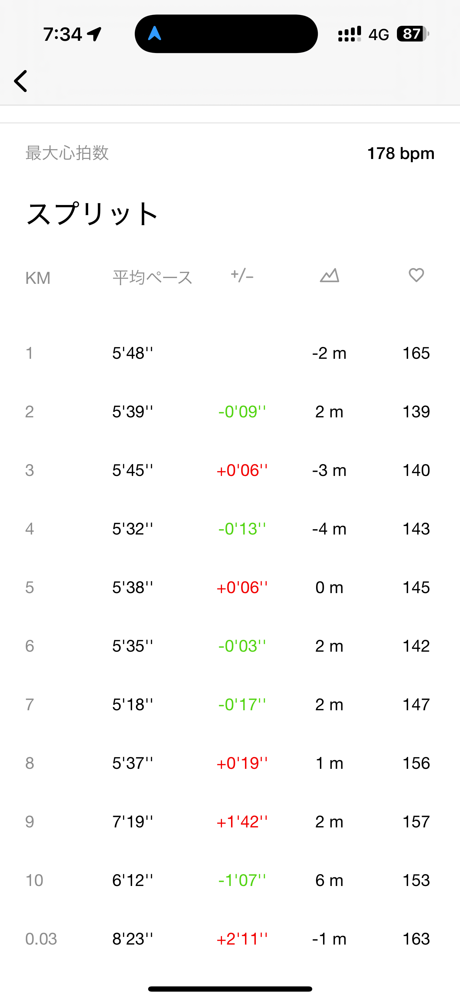
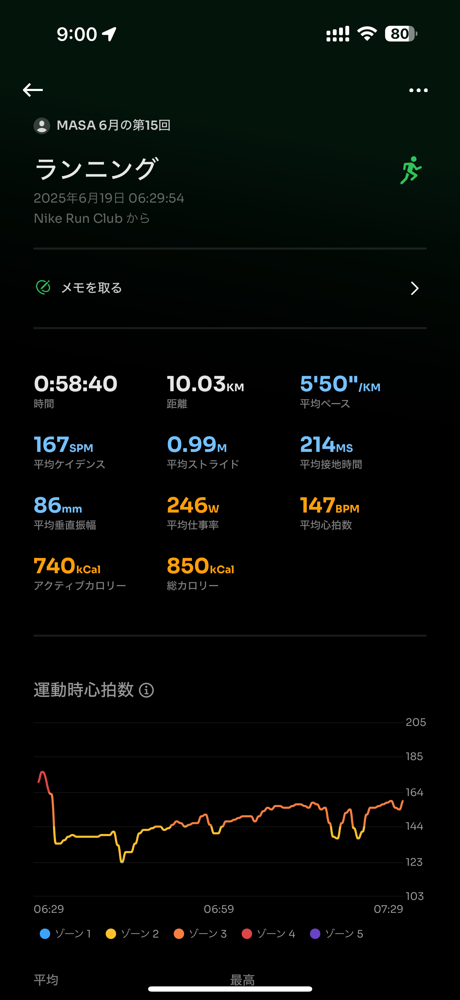
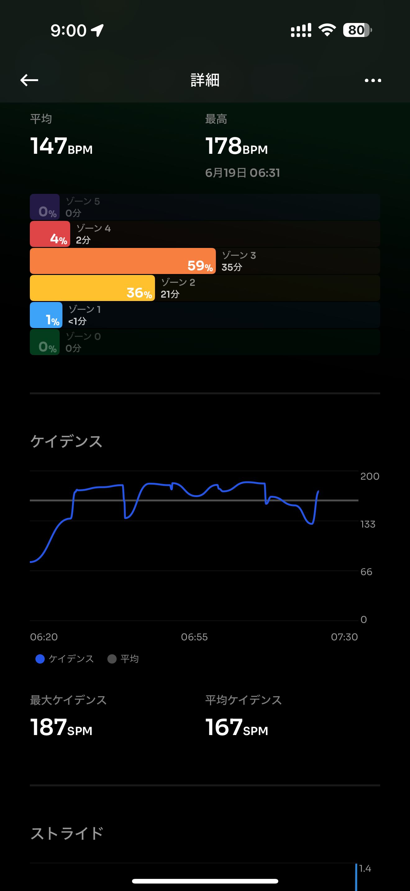
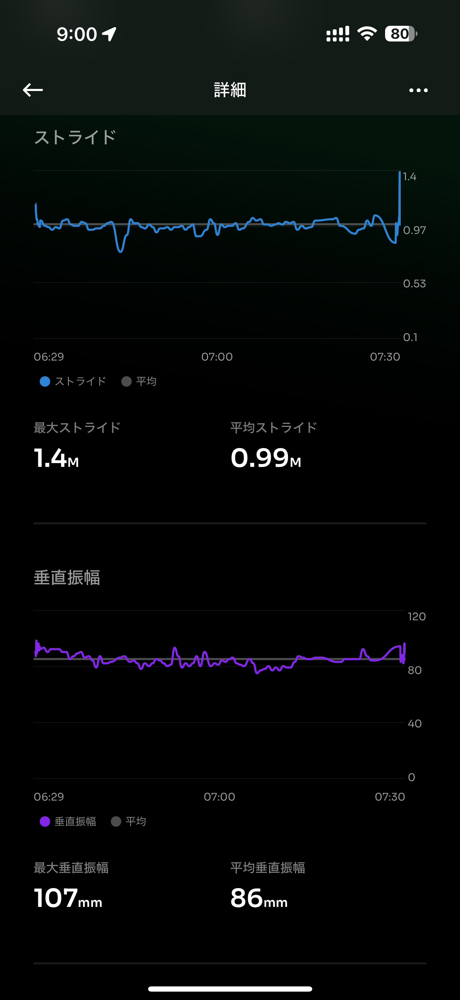
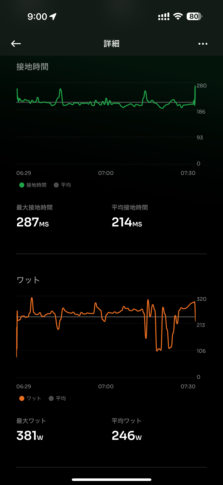
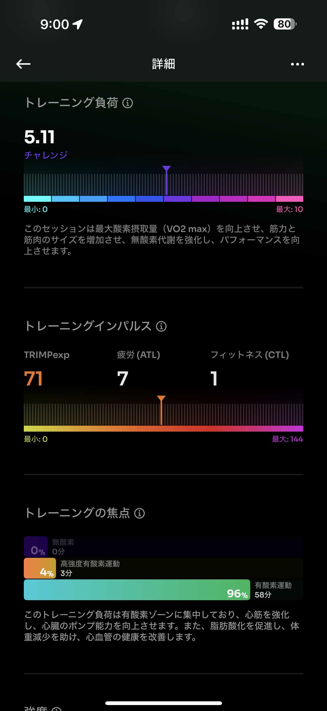
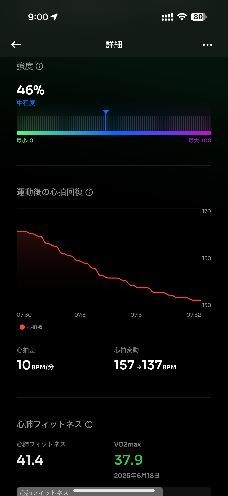
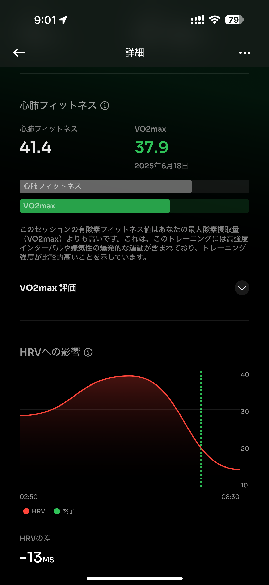
