# 🏃‍♂️ 2025-07-04 のランログ

- 距離：4.08km
- 時間：00:25:26
- 平均心拍数：138
- 時間帯：6:30
- 天候：曇り
- コース：多摩川河川敷（調布川折り返し）
- 補給：なし
- 睡眠：6時間
- 今日の目的：ちょっとだけカラダを動かす
- コメント：6分台でカラダを動かせたのでOKでは？

## 📝 コーチコメント：

## 📸 写真一覧
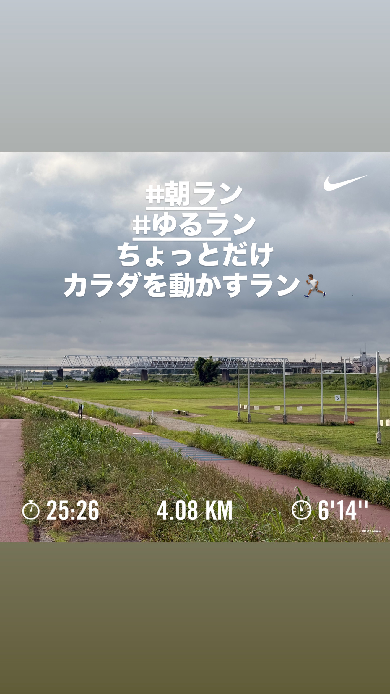
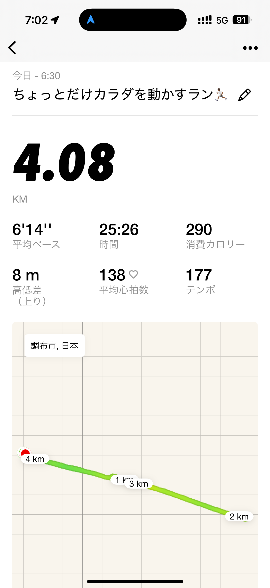
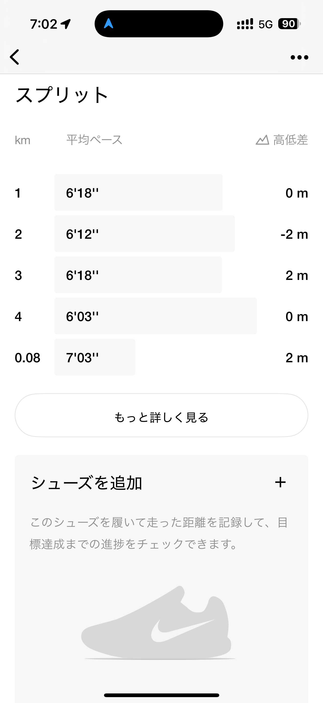
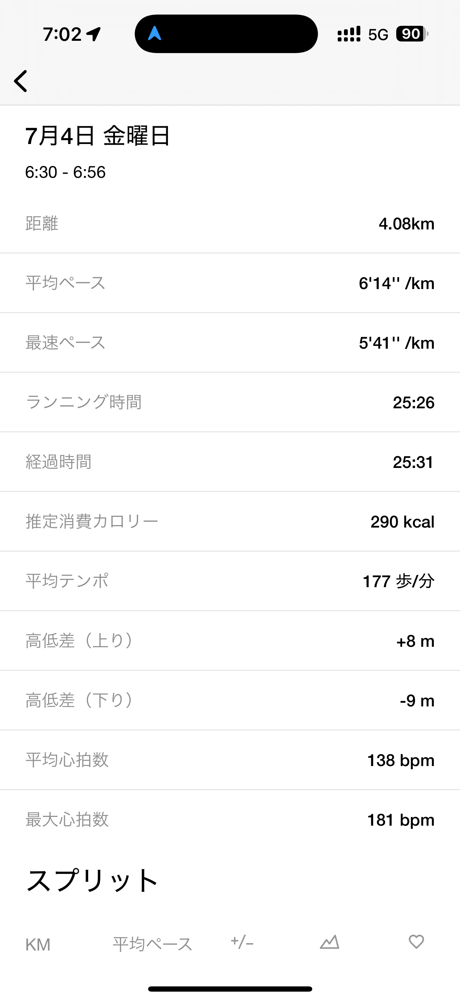
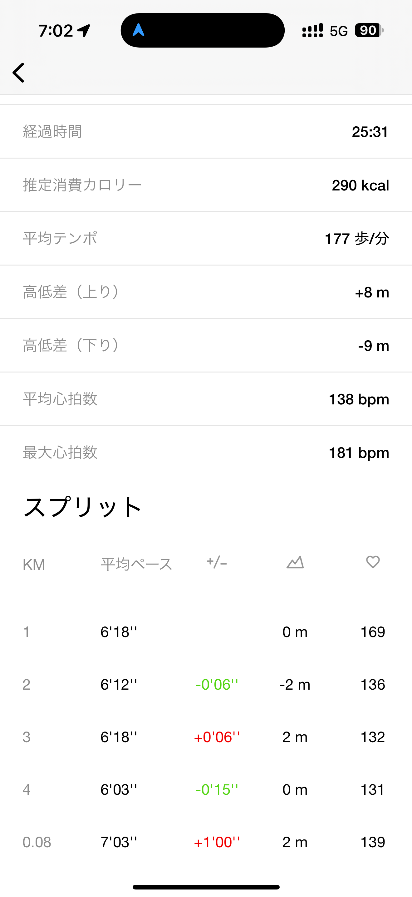
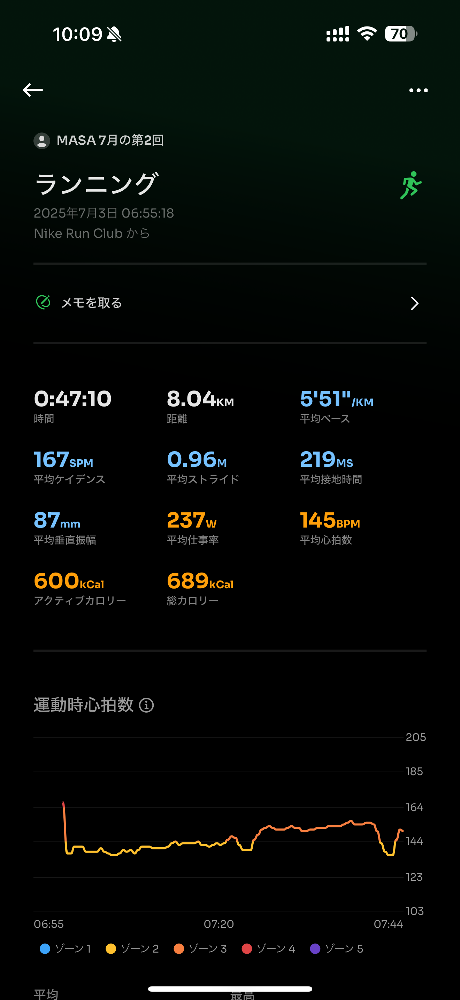
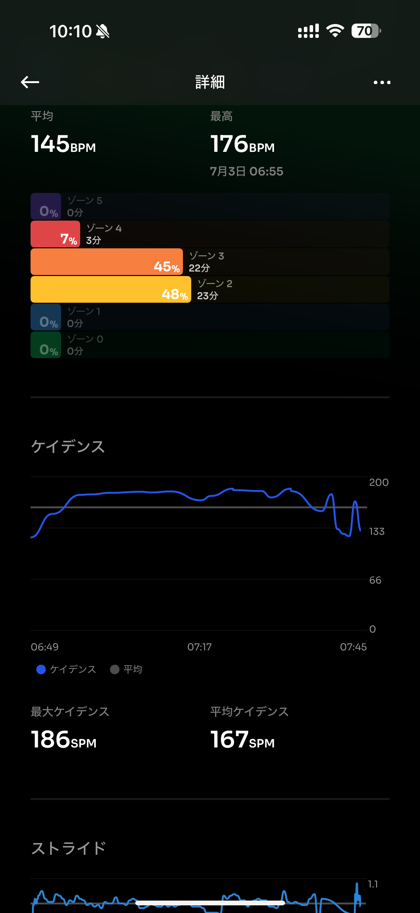
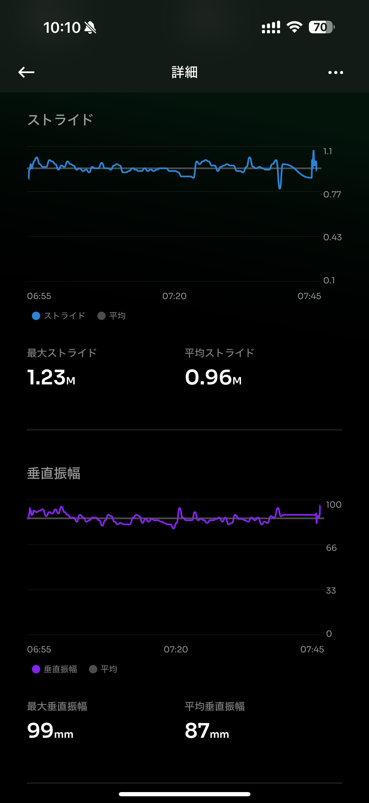
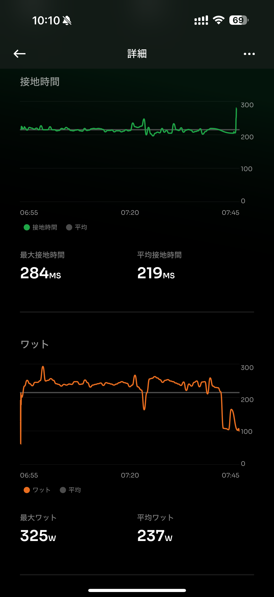
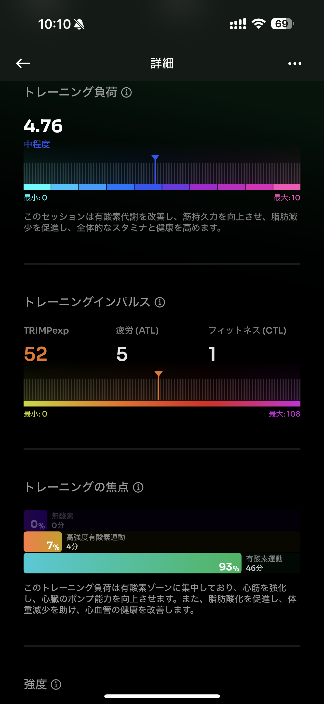
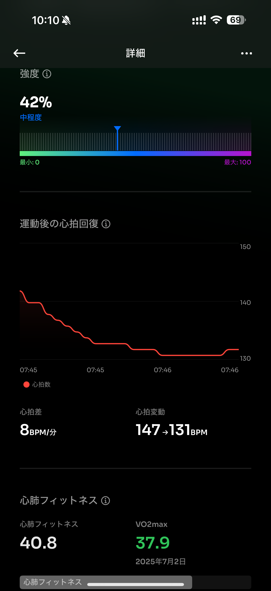
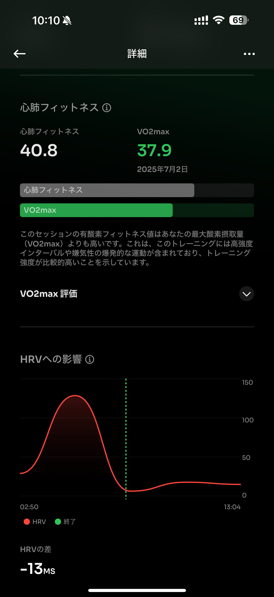
