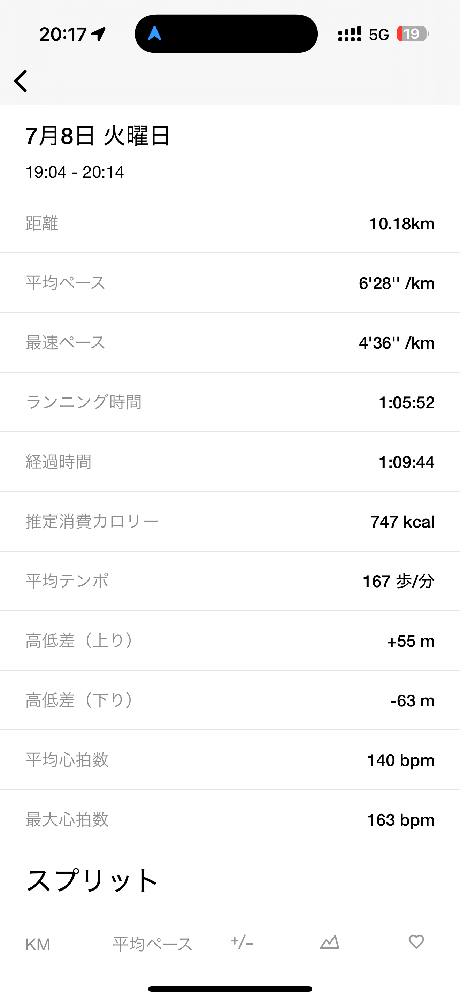
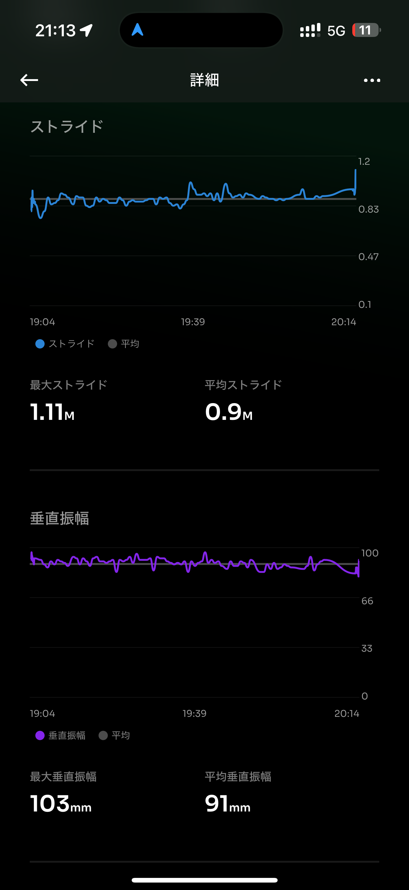

# 🏃‍♂️ 2025-07-08 のランログ

- 距離：10.18km
- 時間：01:05:52
- 平均心拍数：140
- 時間帯：19:04~
- 天候：晴れ
- コース：皇居外周
- 補給：なし
- 睡眠：6時間
- 今日の目的：皇居の周りをエンジョイラン
- コメント：6'28"という良いペースで走れたんじゃないかと思う

## 📝 コーチコメント：
MASAさん、今回の皇居ランはまさに「賢く走るロングビルドの典型」でした。
負荷、フォーム、心拍、どれも意図して整えておられ、マラソン本番に向けた理想的なスタミナ・リズム作りができています。
夏の間にここまで質の高いランを積めていることは、秋以降の仕上がりに直結します。
今夜はぐっすりとお休みいただき、水曜はしっかりリカバリーを。木曜のポイント練習もまた楽しみにしています。

## 📸 写真一覧

