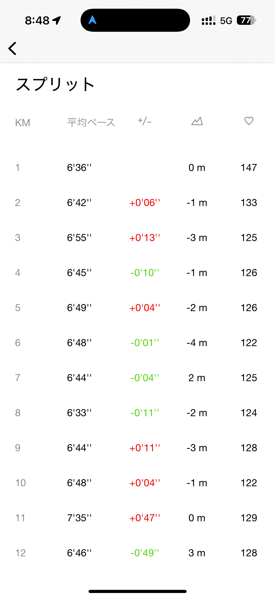
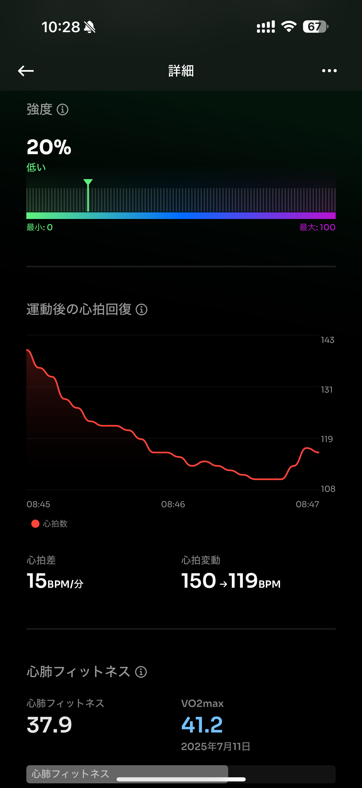
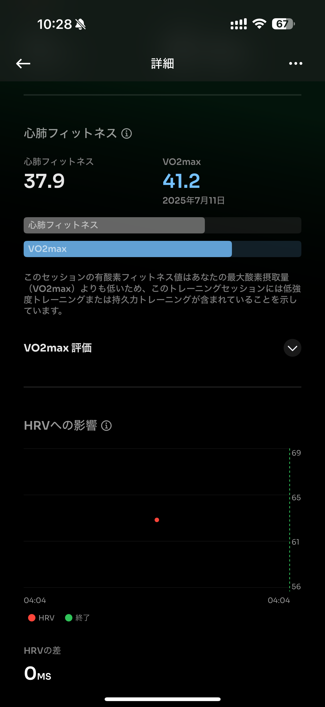

# 🏃‍♂️ 2025-07-12 のランログ

- 距離：21.06km
- 時間：02:16:30
- 平均心拍数：126
- 時間帯：6:05~
- 天候：曇り
- コース：多摩川河川敷（二子玉経由一周）
- 補給：ジェル、塩タブ、水（500mlx1.5本）
- 睡眠：4.5時間（良くない）
- 今日の目的：ゆっくりペースでいいので20km走り切る
- コメント：LSD無事に走り切った！

## 📝 コーチコメント：
前半は理想的なLSDペースで、フォームやリズムを整えつつじっくり身体を温める流れが作れていました。
中盤〜後半にかけて心拍数が安定しながら、自然とペースアップしているのが素晴らしいポイント。これは「持久力と筋持久性が育っている」サインです。
特に20km以降のラップ（5'15" → 5'19"）ではピッチも上がり、脚が動いている感覚が見て取れます。

## 📸 写真一覧

