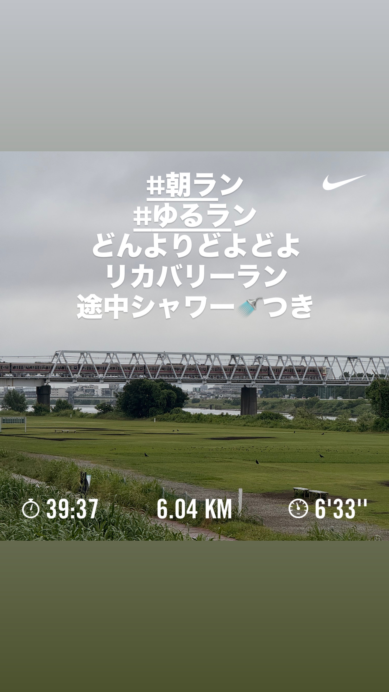

# 🏃‍♂️ 2025-07-14 のランログ

- 距離：6.04km
- 時間：00:39:37
- 平均心拍数：128
- 時間帯：6:30~
- 天候：曇り（時々シャワーラン）
- コース：多摩川河川敷（折り返し）
- 補給：なし
- 睡眠：4.3
- 今日の目的：リカバリーラン
- コメント：予定通りリカバリーランできた！

## 📝 コーチコメント：
今朝のランはまさに「理想的なリカバリーラン」でした。
このようにペース・心拍・フォームすべてを抑えながらも整えた内容は、継続してトレーニングを積むための礎になります。
疲労のバロメーターとしてのHRVが大きく落ちているのは要注意ポイントですが、これは「体の構造的な疲れ」よりも、神経的・精神的な負荷が主因である可能性が高いです。
お仕事のストレスや睡眠環境、生活リズムもこのタイミングで整えておくと、金曜・土曜のランがグッと走りやすくなるでしょう。

## 📸 写真一覧

