# 🏃‍♂️ 2025-07-15 のランログ

- 距離：10.15km
- 時間：00:58:51
- 平均心拍数：150
- 時間帯：6:41~
- 天候：曇り（湿度高め）
- コース：多摩川河川敷（登戸経由一周）
- 補給：なし
- 睡眠：5時間48分
- 今日の目的：3kmアップ、5km閾値走、2kmダウン。
- コメント：雨降る前に無事達成！

## 📝 コーチコメント：
テンポ走として非常に完成度の高い内容でした。特に、中盤〜後半（5'21"〜5'17"）のペース維持と、リズムの安定性が秀逸です。
最大心拍がやや高め（184bpm）になったのは、気温や湿度の影響もあると思われますが、最後までしっかり走り切ったのは素晴らしいです。
ラスト2kmでペースダウンした点についても、これは「意図的なダウンジョグ」と読み取れる動きで、疲労コントロールがうまくなってきています。

## 📸 写真一覧
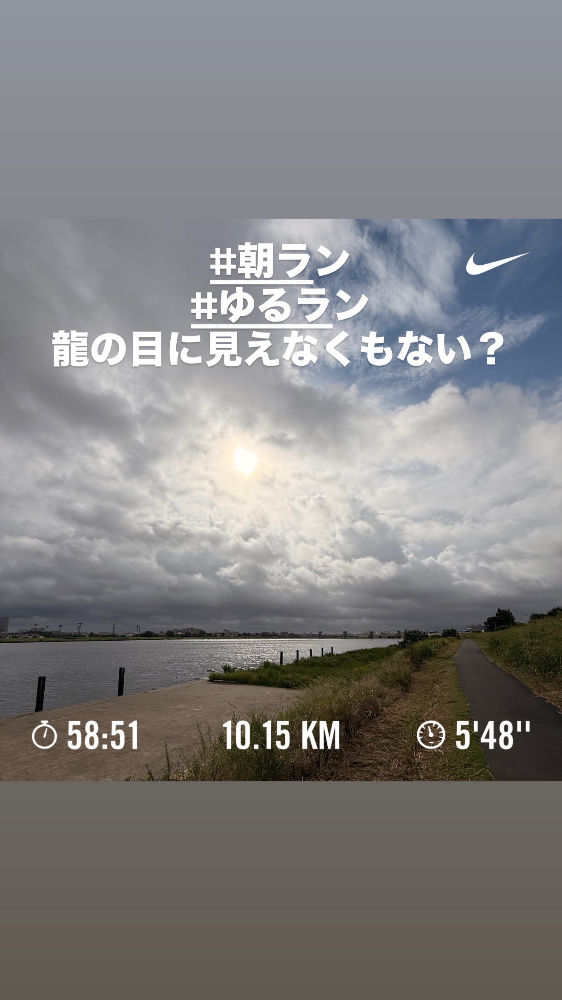
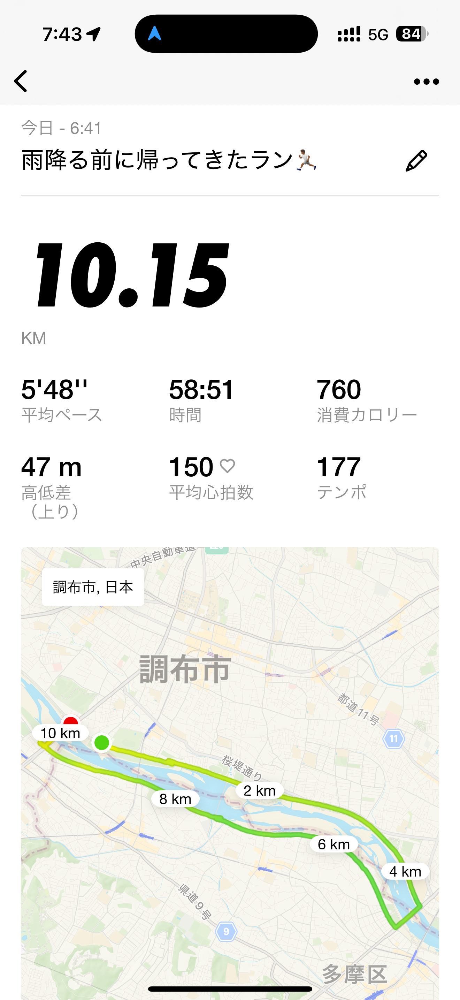
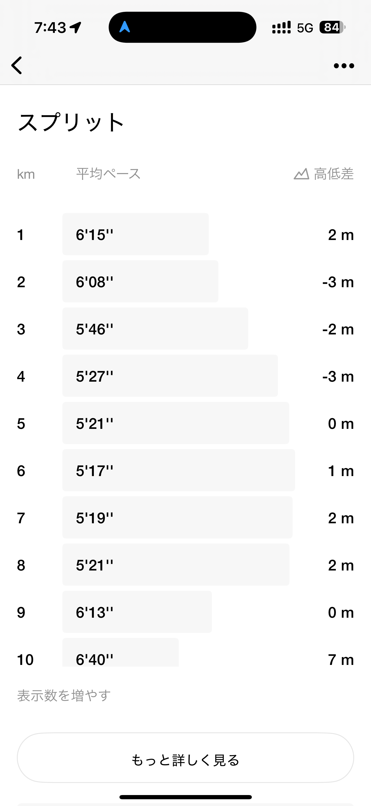
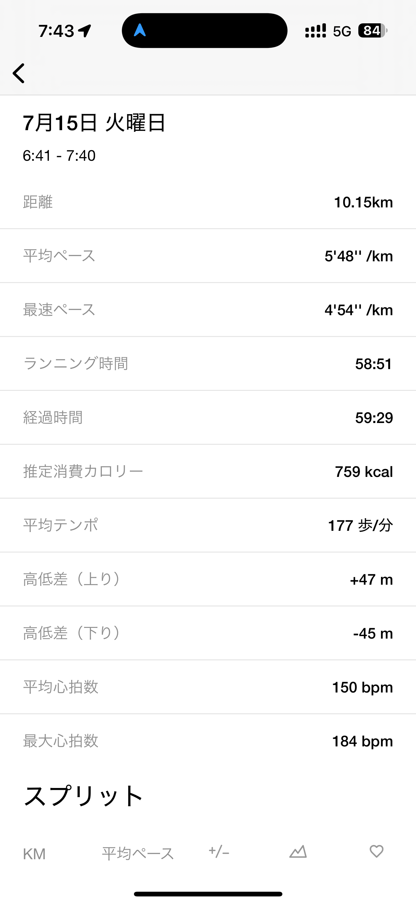
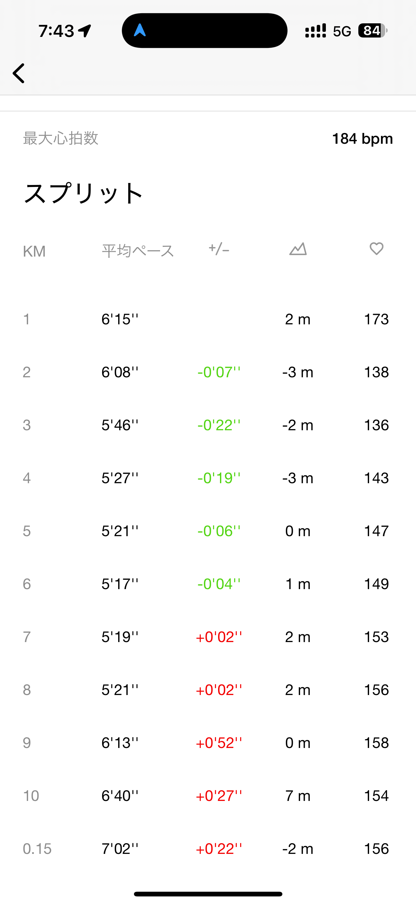
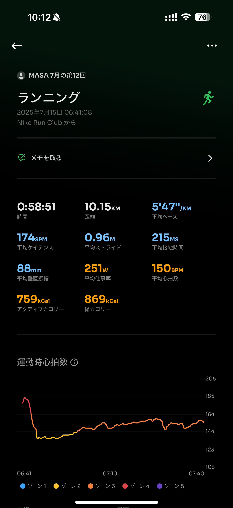
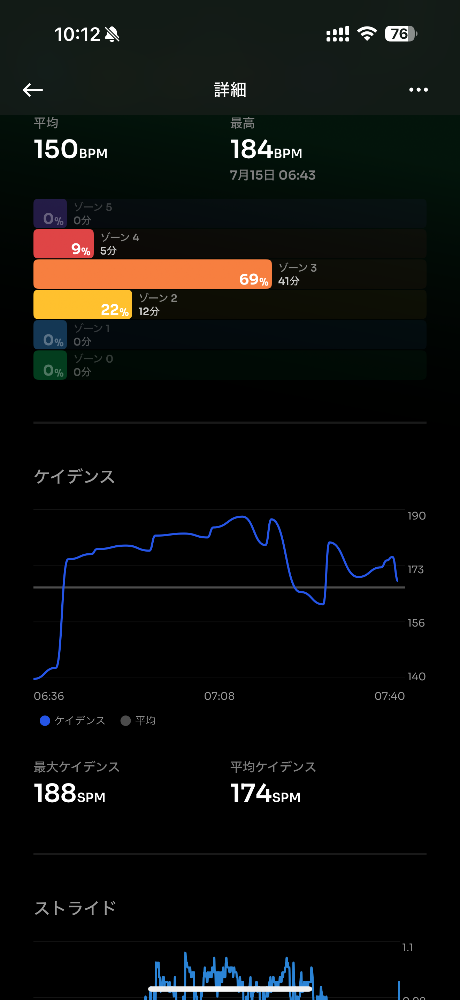
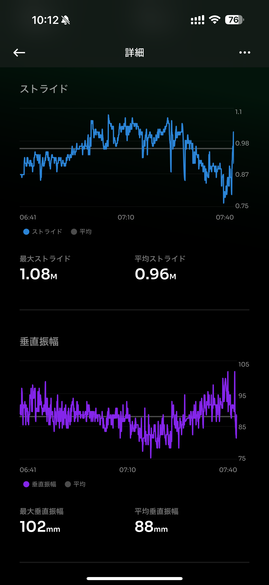
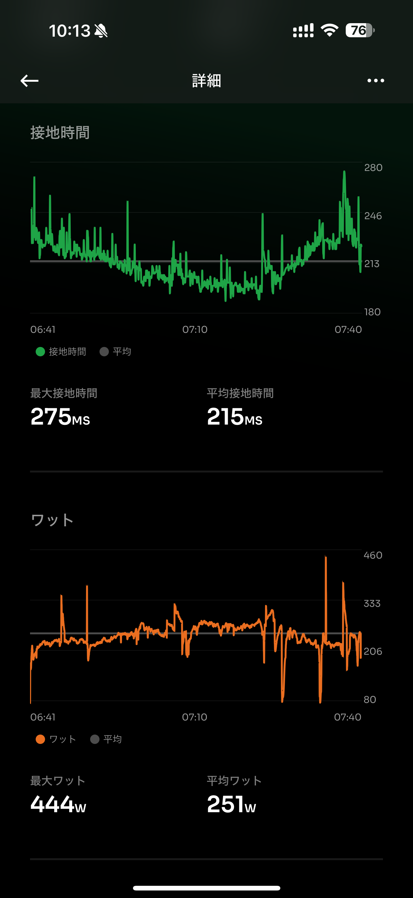
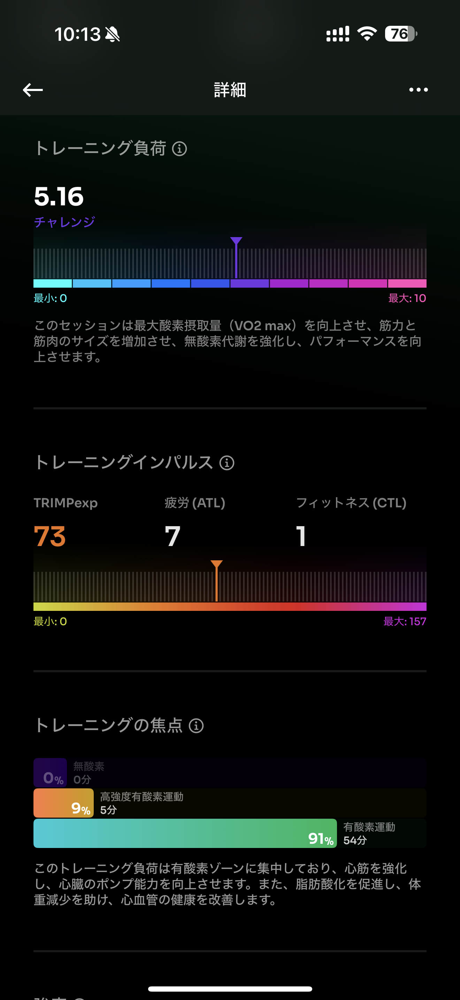
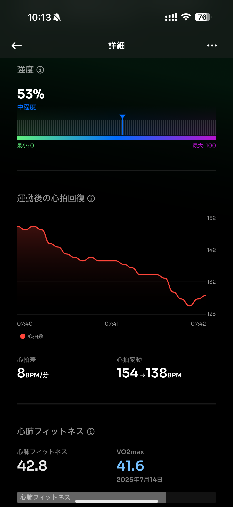
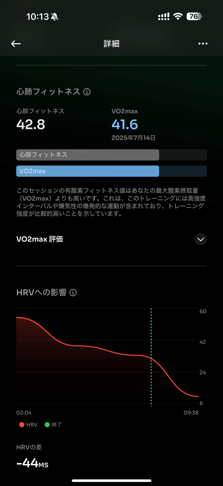
