# 🏃‍♂️ 2025-07-17 のランログ

- 距離：10.16km
- 時間：01:03:43
- 平均心拍数：136
- 時間帯：6:54~
- 天候：曇りのち晴れ
- コース：多摩川河川敷（登戸経由一周）
- 補給：なし
- 睡眠：5.5時間ぐらい
- 今日の目的：Eペースラン
- コメント：晴れたら暑かったラン。ワラーチ

## 📝 コーチコメント：
暑い中10kmEペース完遂、見事！素晴らしい心肺機能と効率的なフォームを維持しています。HRV回復を優先し、週末の休養で次へ繋げましょう！

## 📸 写真一覧
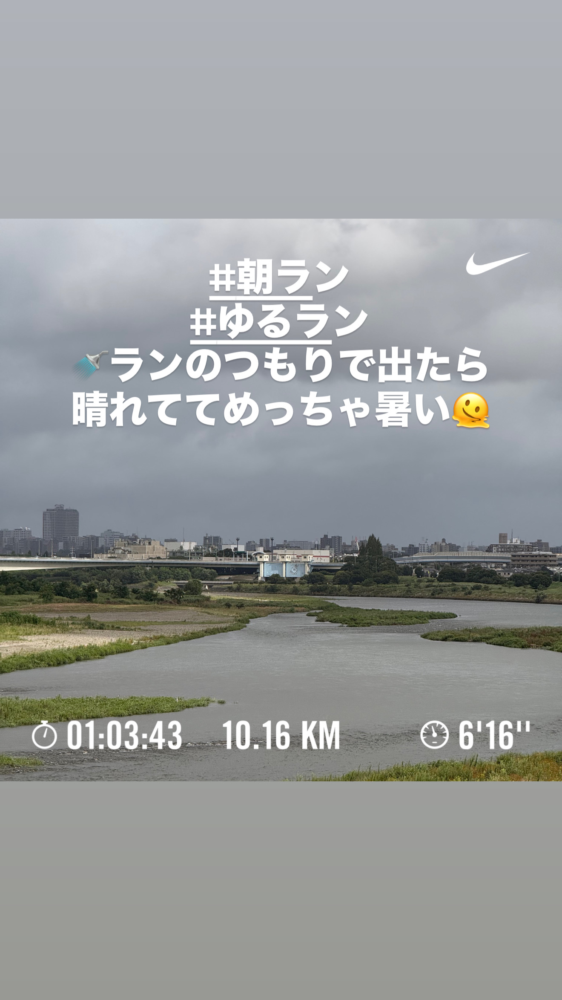
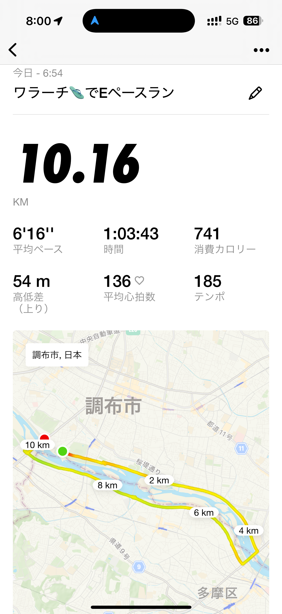
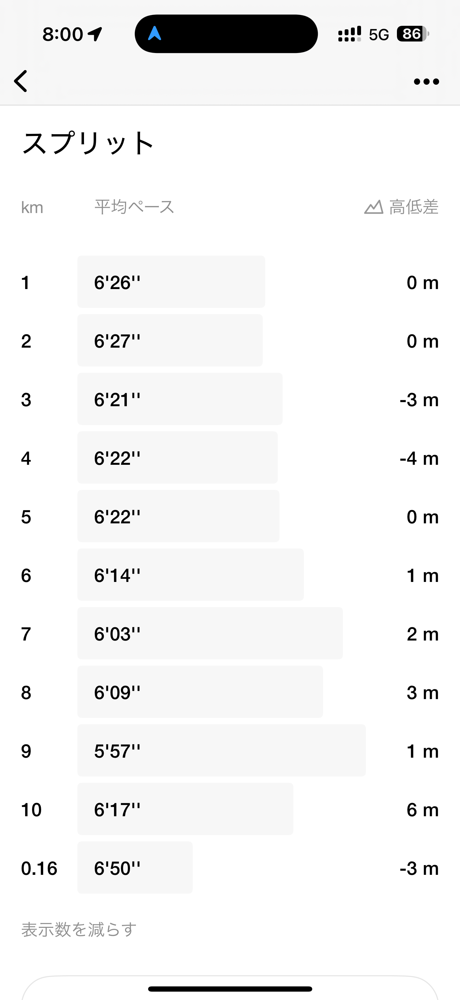
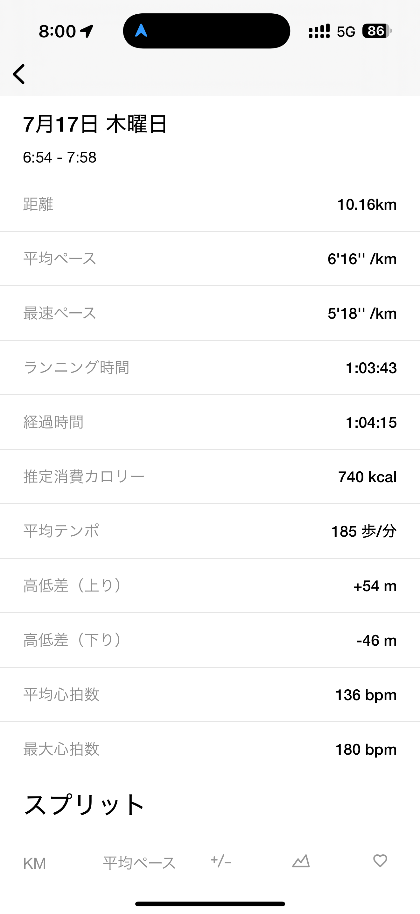
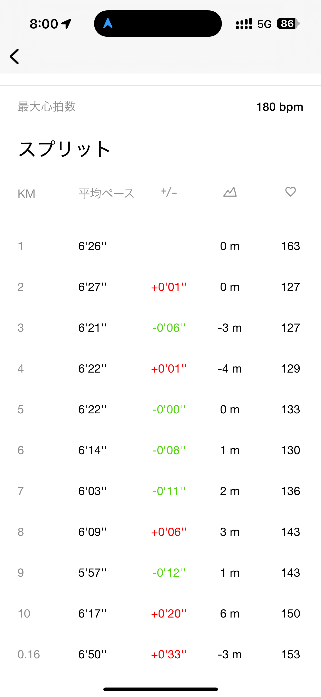
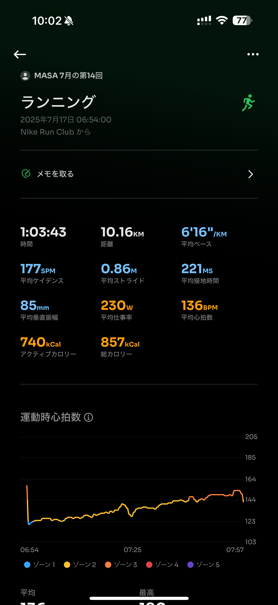
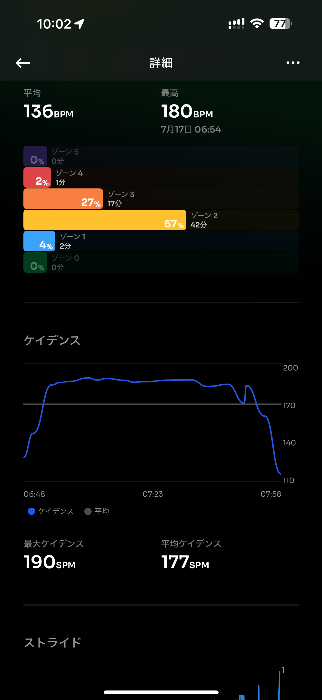
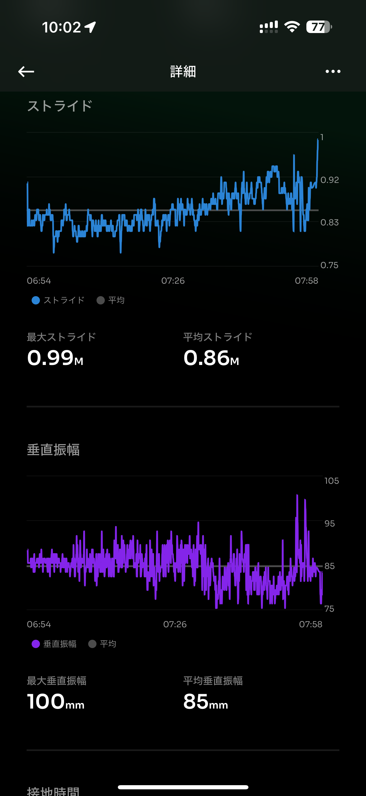
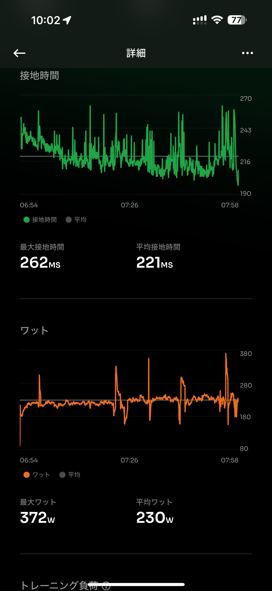

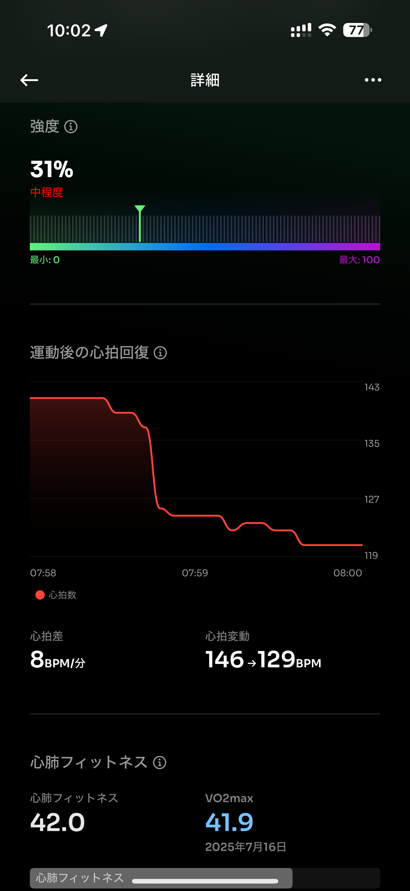
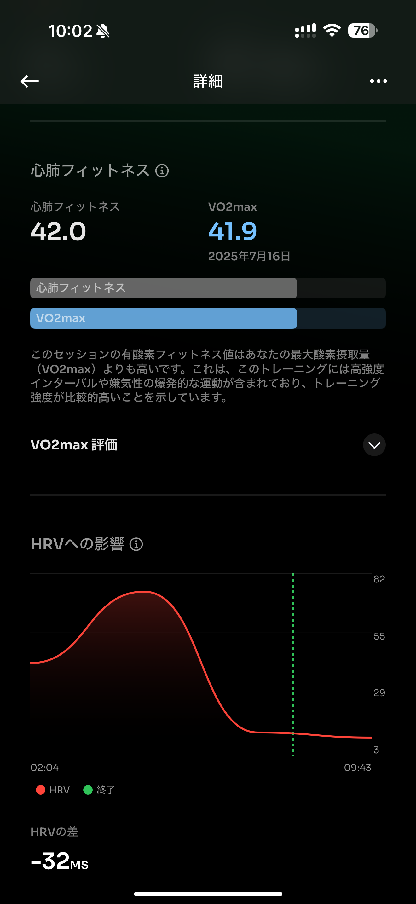
