# 🏃‍♂️ 2025-07-25 のランログ

- 距離：10.14km
- 時間：01:02:35
- 平均心拍数：144
- 時間帯：6:37~
- 天候：晴れ
- コース：多摩川河川敷（周回）
- 補給：なし
- 睡眠：5時間
- 今日の目的：Eペースロングジョグ
- コメント：まぁ思ったように走れたかな？ラストでスピード落として回復をイメージ

## 📝 コーチコメント：
Gemini：暑い中10kmEペース完遂、HRVも大幅プラスで回復力抜群！この調子で明日は完全休養、週末ロングへ万全で臨みましょう！

GPT：今日のEペース走は、「疲労をためない有酸素ベースの構築」という観点で、
今週の最も理想的な“つなぎの一手”になりました。VO2maxに直結するほどの強度ではないものの、
トレーニング負荷も適度に乗り、フォーム・心拍・HRVともに理想的な結果です。
この暑さの中でここまで丁寧な走りができるのは、
春から積み重ねてきた基礎力と意識の高さゆえだと思います。

## 📸 写真一覧
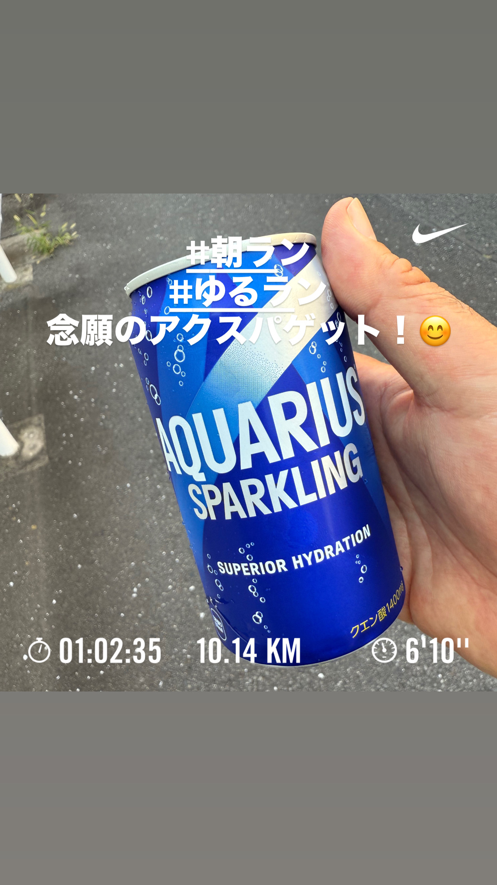
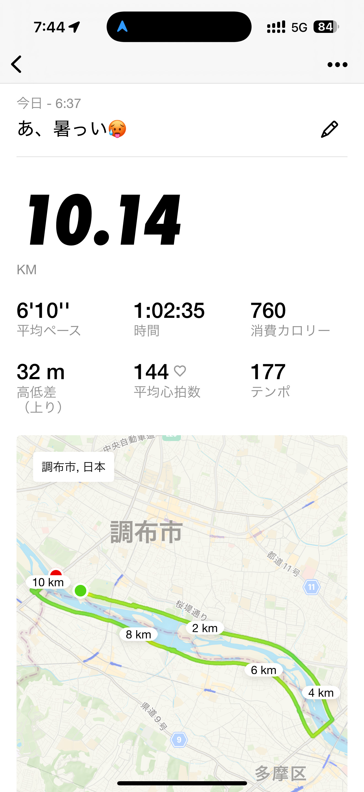
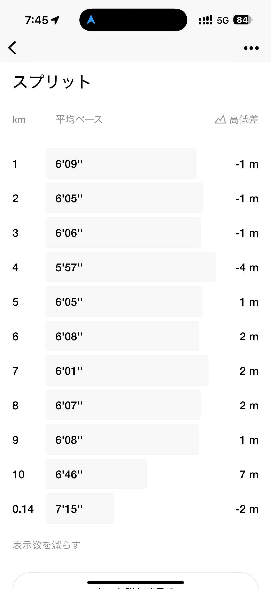
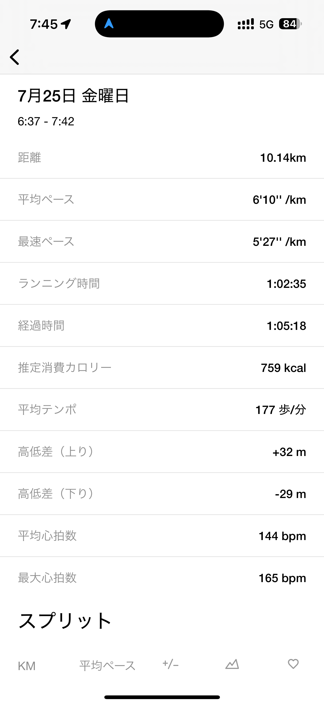
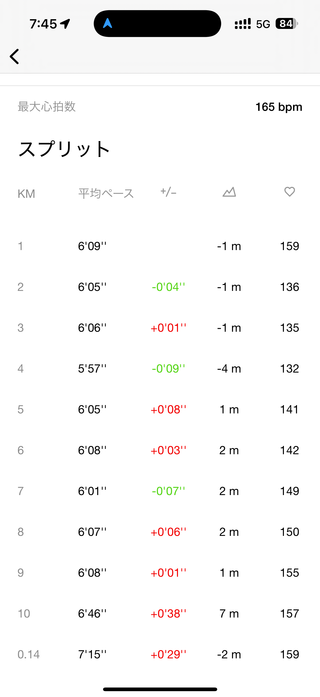
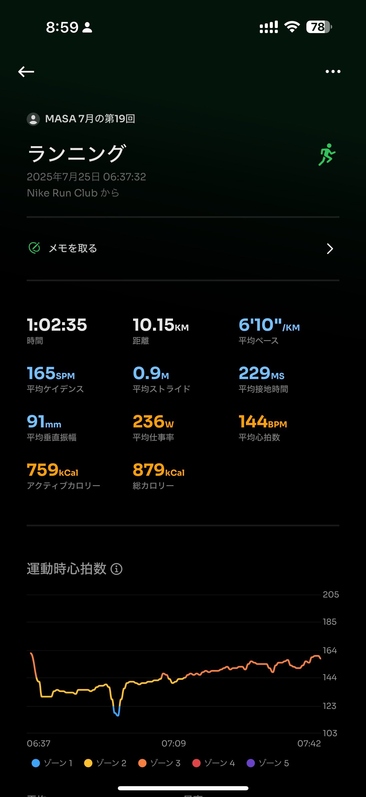
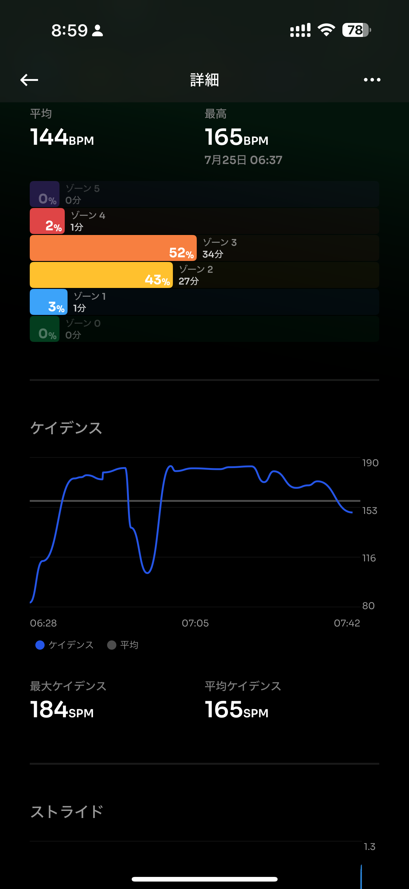
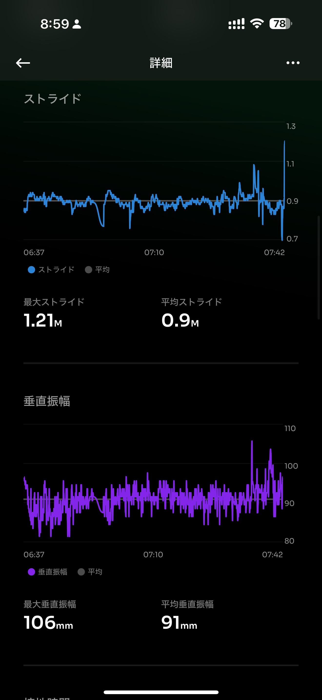
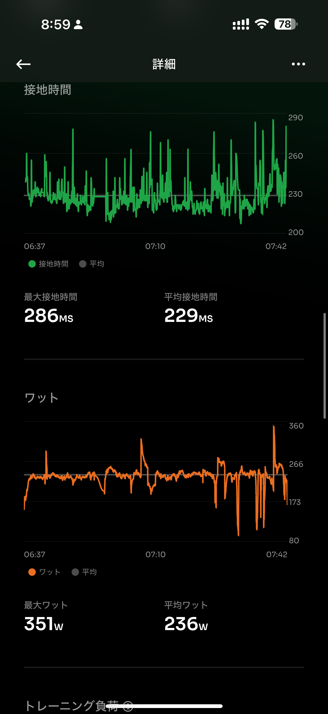
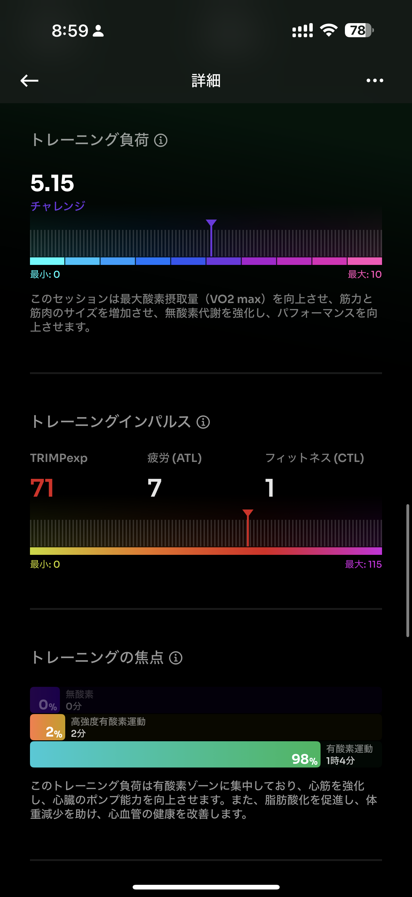
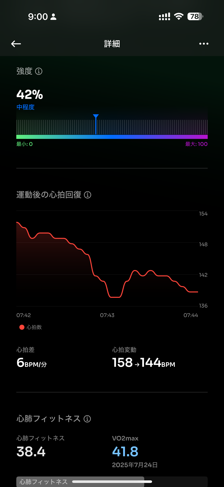
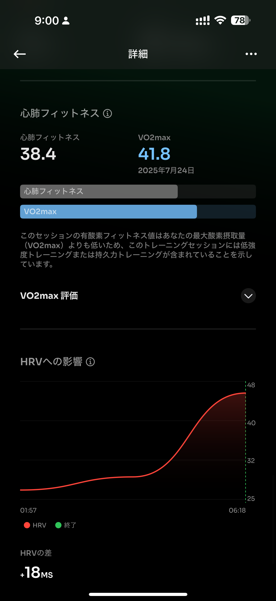
