# 🏃‍♂️ 2025-07-30 のランログ

- 距離：9.02km
- 時間：00:55:29
- 平均心拍数：144
- 時間帯：6:33~
- 天候：晴れ
- コース：多摩川河川敷（周回コース）
- 補給：なし
- 睡眠：5時間
- 今日の目的：ポイント練習
- コメント：まぁダウンジョグはグダグダですね。

## 📝 コーチコメント：
暑い中、閾値走5km超、驚異的！サブ4.5ペース大幅クリアは走力向上の証。だが身体は疲労困憊。明日は必ず休養し、賢く回復優先を！
意図された2kmアップ → 5km閾値走 → 2kmダウンの構成がしっかり実践できており、内容として非常に優れたトレーニングでした。

## 📸 写真一覧
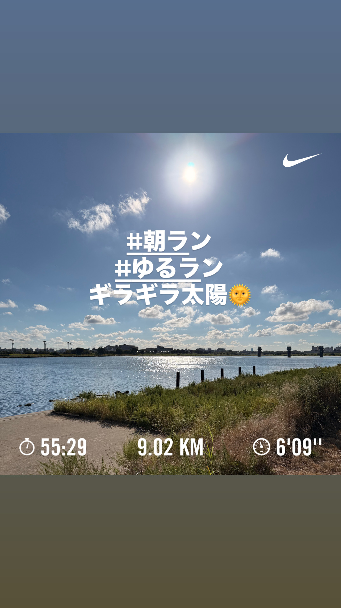
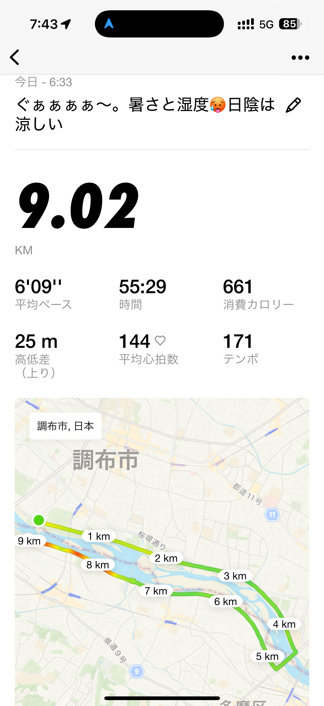
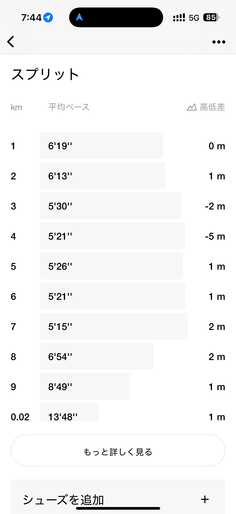
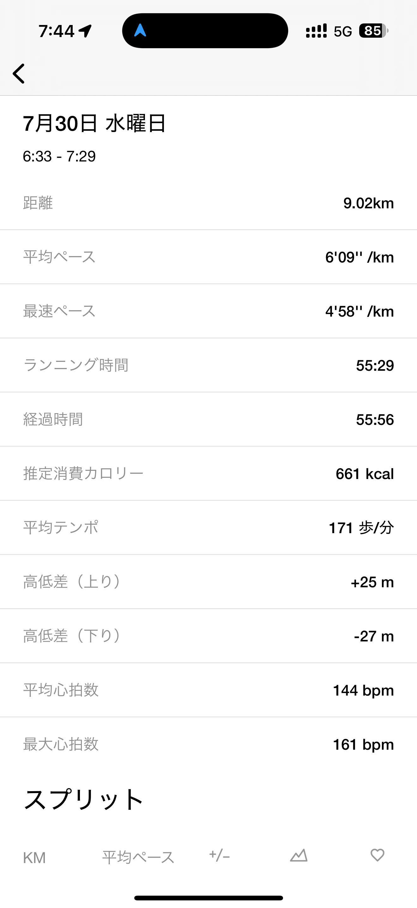
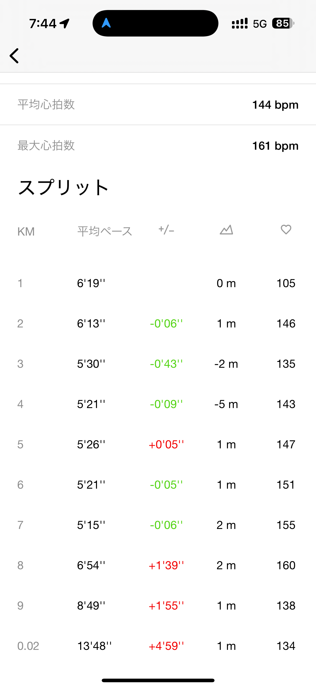
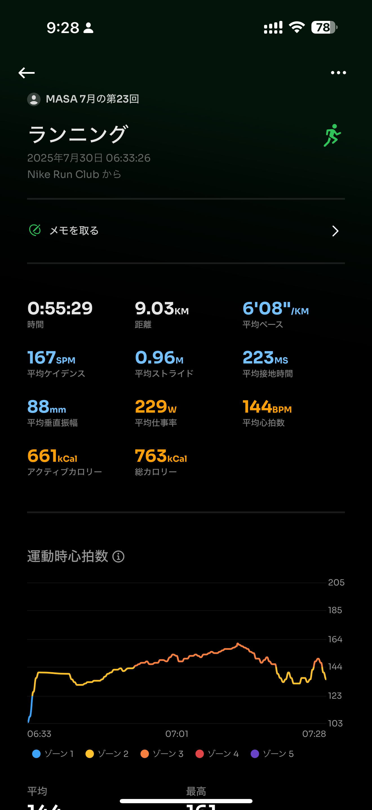
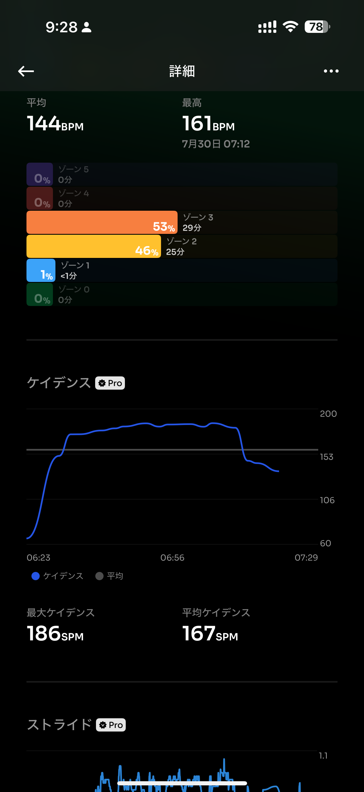
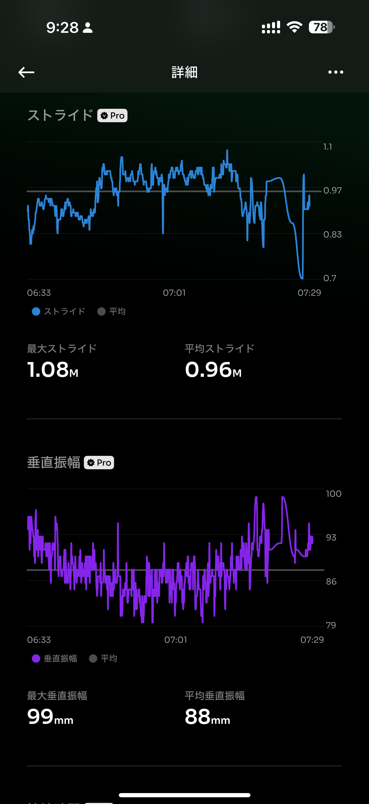
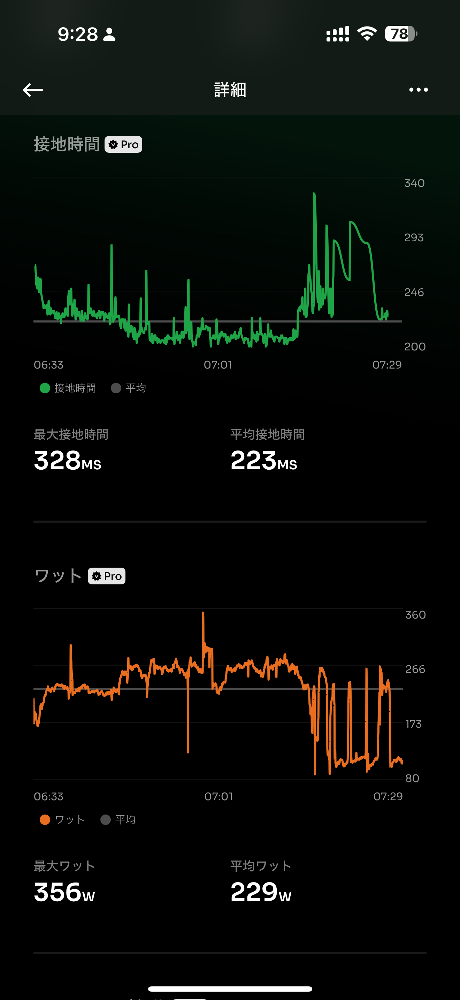
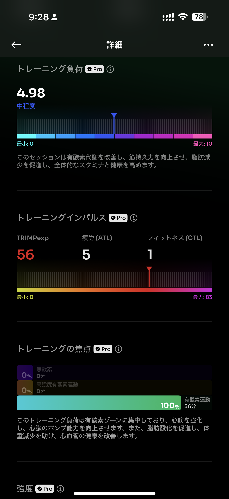
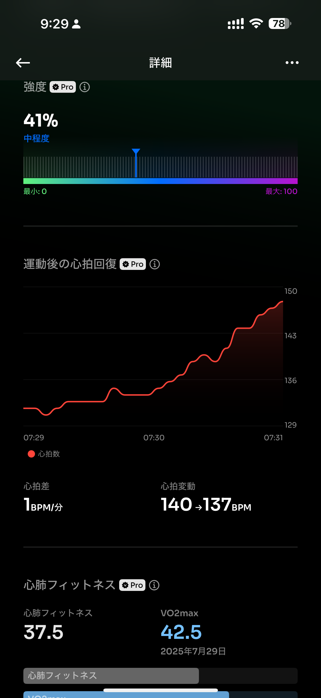
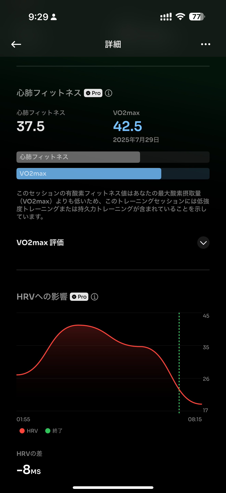
