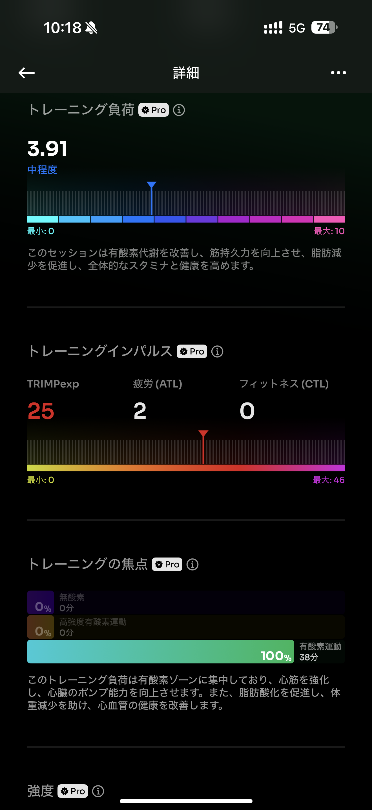

# 🏃‍♂️ 2025-08-03-01 のランログ

- 距離：5.02km
- 時間：00:34:12
- 平均心拍数：125
- 時間帯：7:24~
- 天候：晴れ
- コース：稲城天然温泉季乃彩まで
- 補給：なし
- 睡眠：7時間
- 今日の目的：温泉までリカバリー
- コメント：温泉混んでたー

## 📝 コーチコメント：
心拍ゾーン1〜2のみで構成されたランは、まさに“リカバリーラン”に相応しい強度でした。身体への負荷が極めて少なく、回復中心の走りとして上出来です。
ケイデンス158 spmは軽めですが接地時間が短めで、推進効率も悪くありません。ストライドの間隔も安定していていい感じです。
VR振幅85 mm、接地時間248 msは、疲労抑制とリズム維持のバランスが取れており良好です。
心肺フィットネスは特に強く使われず（VO₂max 42.8のまま維持）、主に持久系関連筋への優しい刺激に留まっていました。

## 📸 写真一覧

