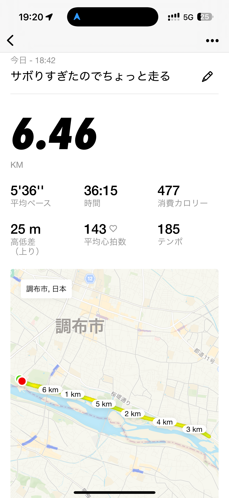
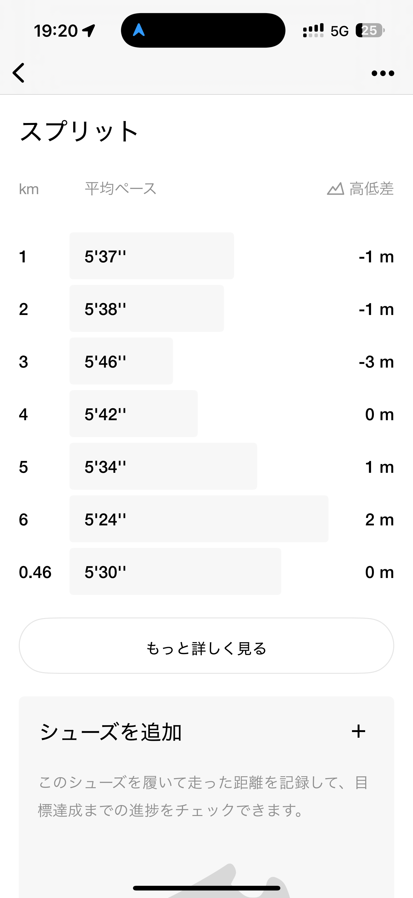
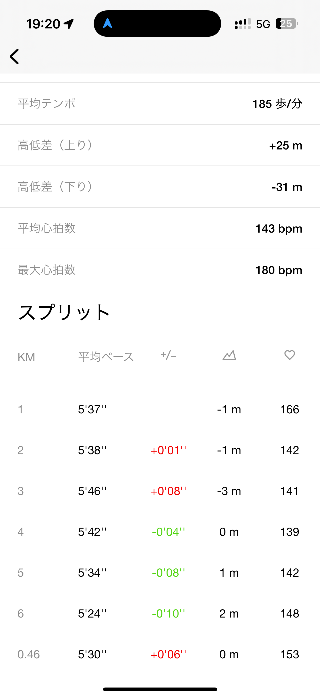
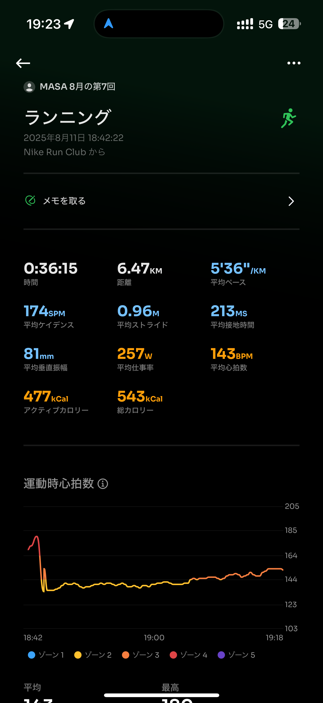
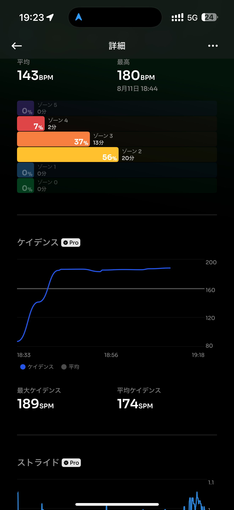
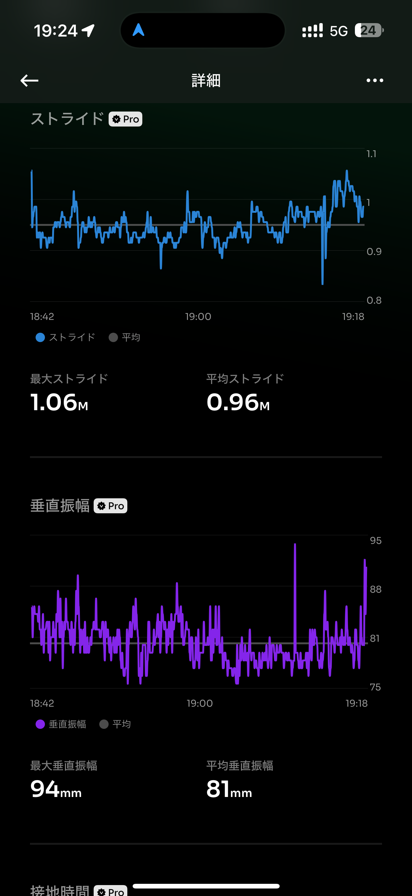
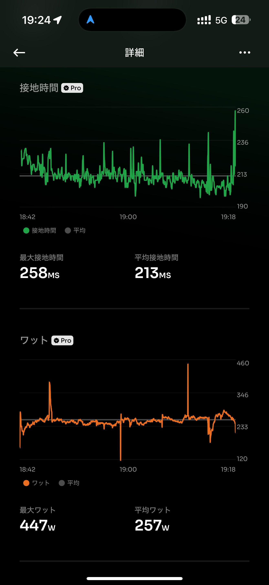
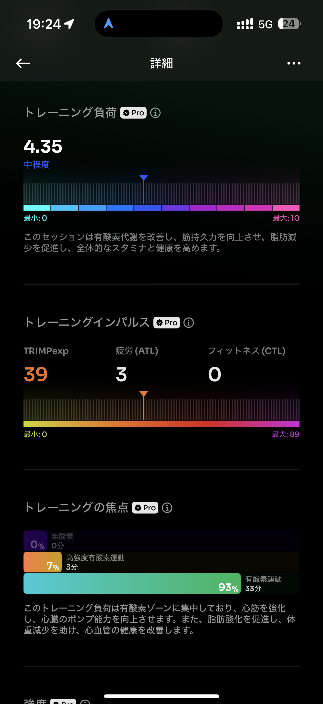
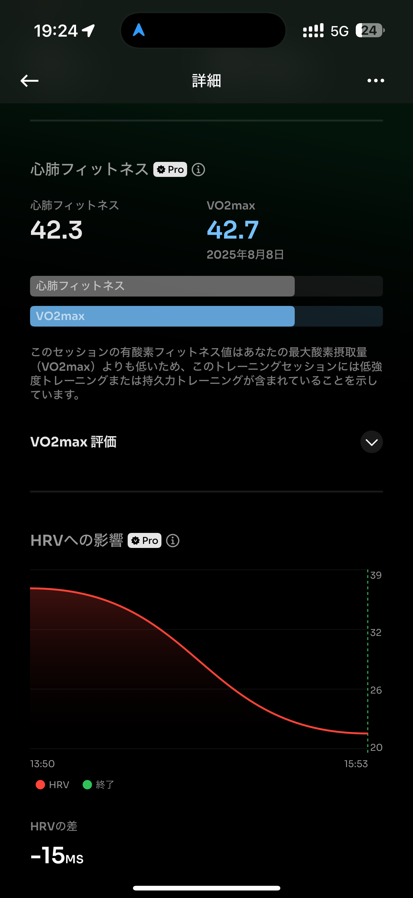

# 🏃‍♂️ 2025-08-11-01 のランログ

- 距離：6.46km
- 時間：00:36:15
- 平均心拍数：143
- 時間帯：18:42~
- 天候：曇り
- コース：多摩川河川敷（折り返し）
- 補給：なし
- 睡眠：6時間32分
- 今日の目的：サボりすぎたのでちょっと走る
- コメント：もーちょっと走れたかもしれない

## 📝 コーチコメント：
今日は余裕度のあるEペースジョグで脚と心肺に適度な刺激を入れられました。ただ、HRVの低下が残っているので、明日のリカバリーは距離・強度をしっかり抑えていきましょう。ポイント練習に向けて、今日のリズムをキープできると好調を維持できます。
休養明けに非常に効率の良い、質の高い走りができています。ただ、HRVが下がっていることから、疲労がまだ少し残っている可能性があるので、明後日のロング走に向けて、今日はしっかり身体を休めてください。

## 📸 写真一覧

