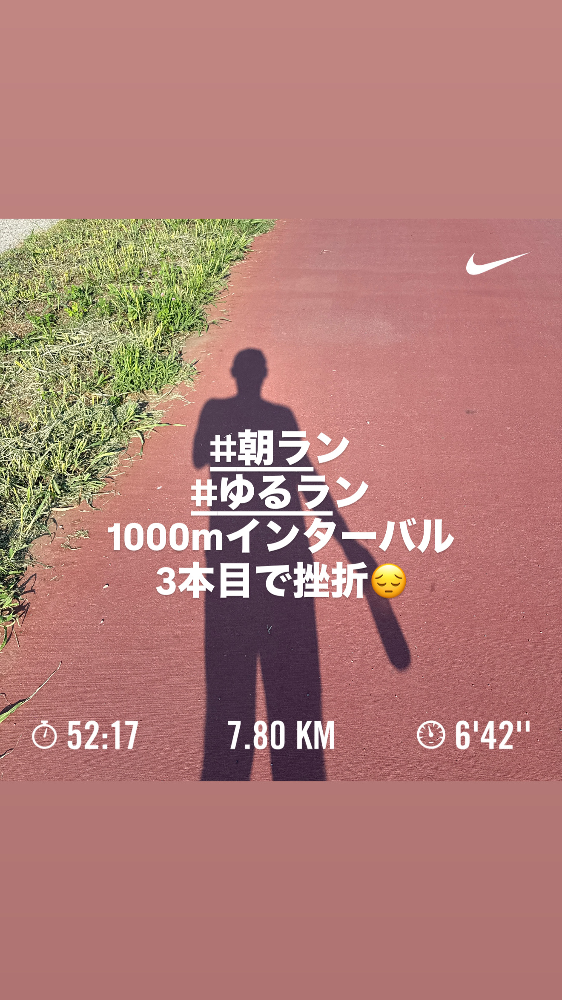
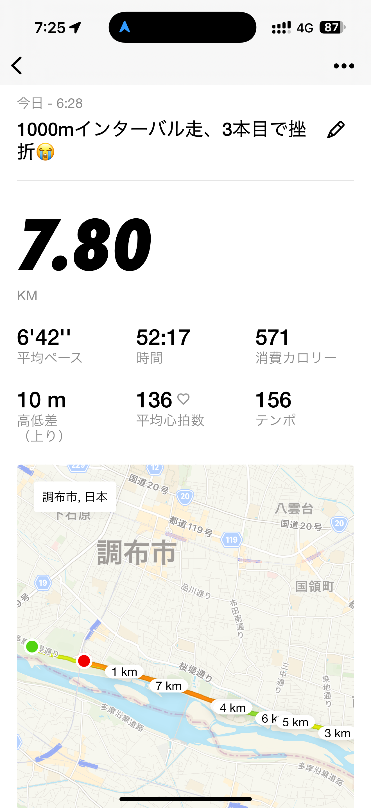
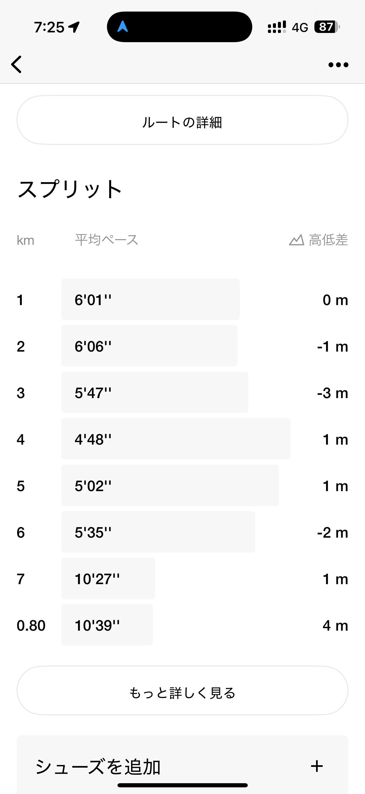
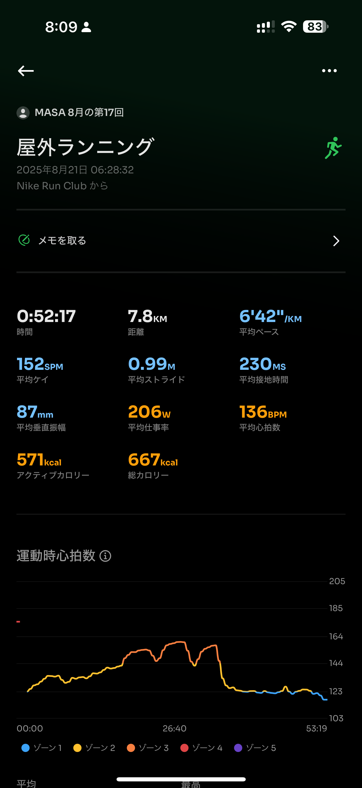
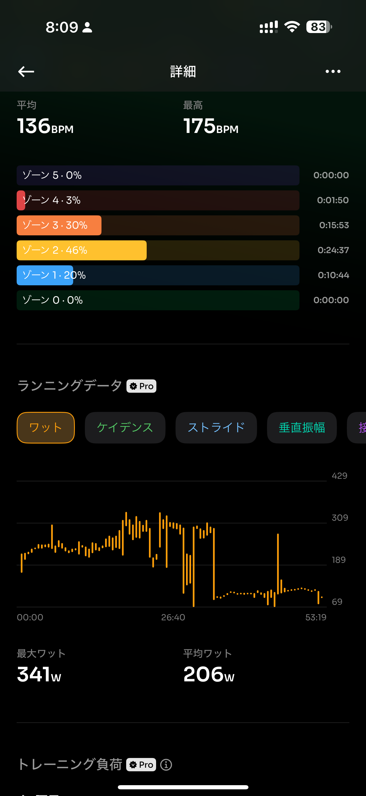
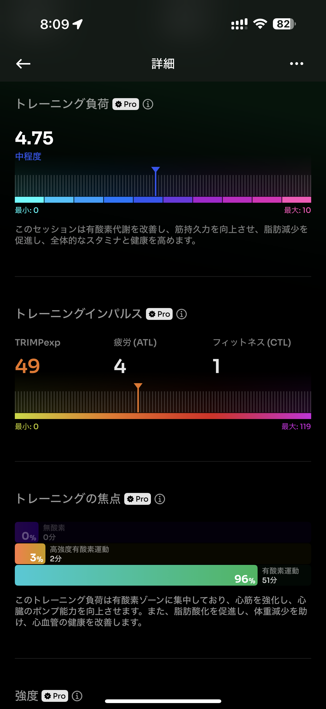
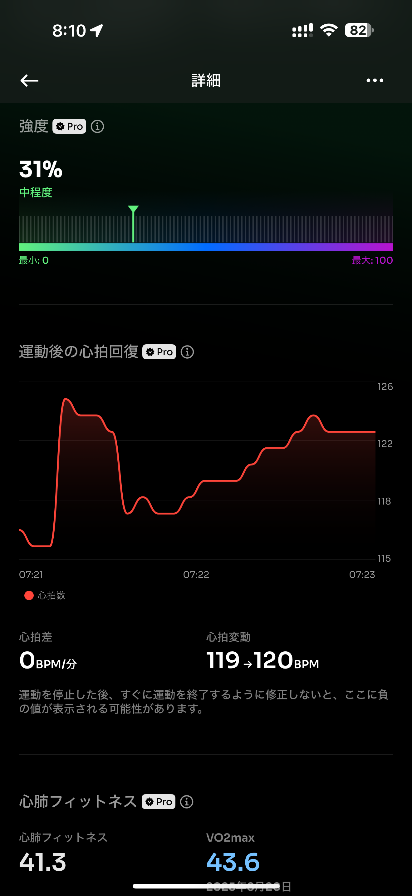
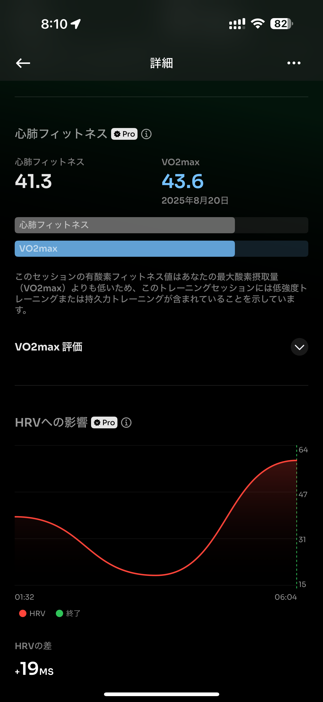
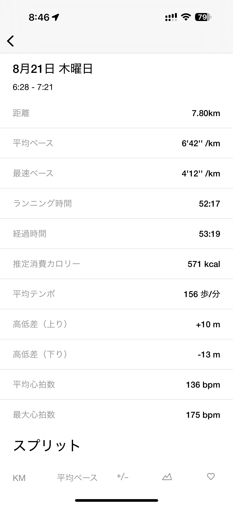
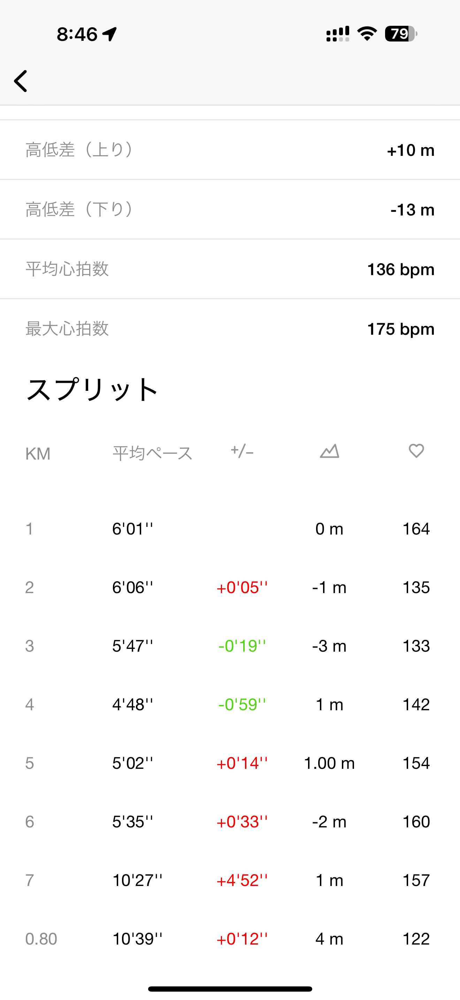

- 距離：7.80km
- 時間：00:52:17
- 平均心拍数：136
- 時間帯：6:28~
- 天候：晴れ
- コース：多摩川河川敷
- 補給：水
- 睡眠：5時間58分
- 今日の目的：1000m x 5本インターバル
- コメント：3本目で失速・・・あららららら。

## 📝 コーチコメント：
初挑戦の1000mインターバルで3本しっかり追い込み、心肺に強い刺激を入れることができました。最後までやり切れなくても十分トレーニング効果は得られており、次回につながる大きな一歩です！

## 📸 写真一覧

