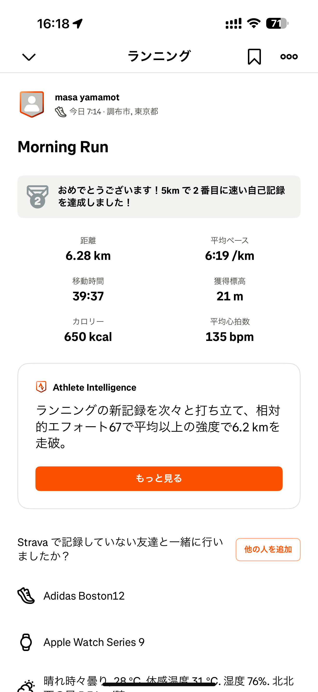

- 距離：6.28km
- 時間：00:39:37
- 平均心拍数：135
- 時間帯：7:14~
- 天候：晴れ
- コース：多摩川河川敷
- 補給：水、ジェル
- 睡眠：7時間47分
- 今日の目的：ロング走
- コメント：失敗・・・

## 📝 コーチコメント：
気温が高い中でも安定した心拍で走れたのはナイス判断！ただロング走は環境次第で成功率が変わるので、次は夜や早朝の時間帯を狙ってトライしましょう。

## 📸 写真一覧

