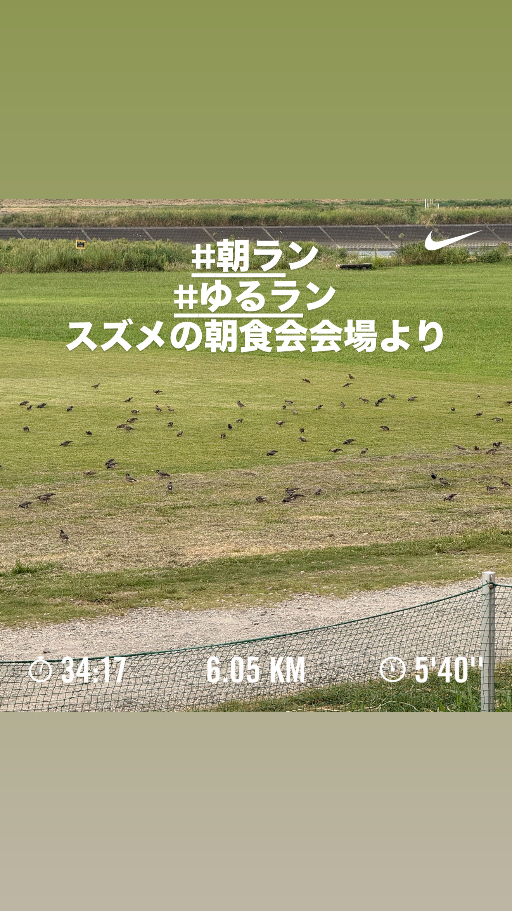
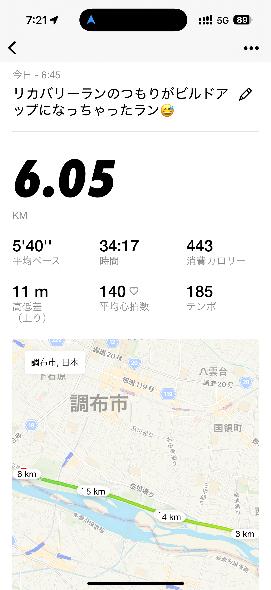
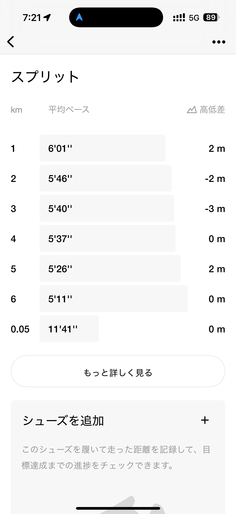
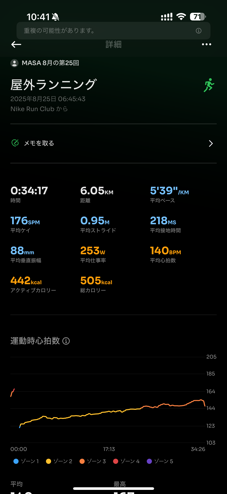
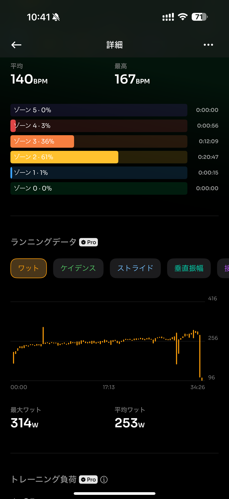
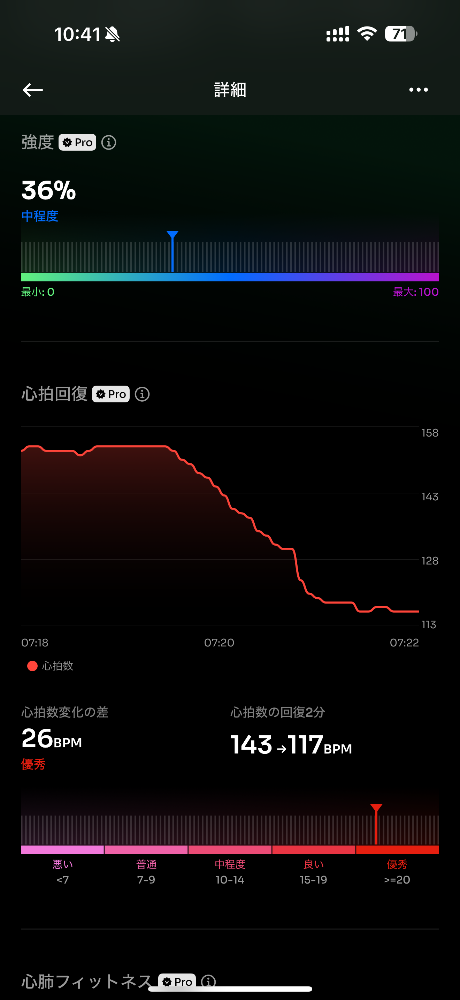
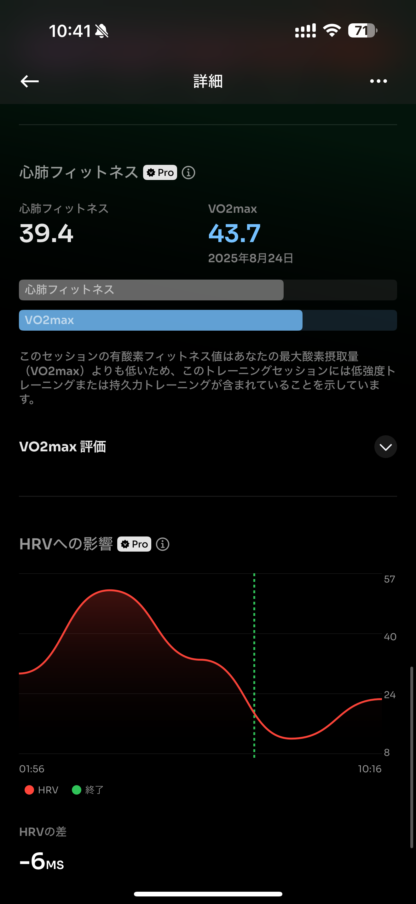

- 距離：6.05km
- 時間：00:34:17
- 平均心拍数：140
- 時間帯：6:45~
- 天候：晴れ
- コース：多摩川河川敷
- 補給：なし
- 睡眠：6時間34分
- 今日の目的：気持ちよくラン
- コメント：まぁ良かったんじゃないの？

## 📝 コーチコメント：
「リカバリーランのつもりがビルドアップ」になったとのことですが、心拍・フォームともに安定しており、自然なビルドアップはむしろ調子が良い証拠です✨ 暑さの中でもゾーン2中心で走れているので、疲労を溜めずに持久力向上に繋がっています。この感覚を大切に！

## 📸 写真一覧

