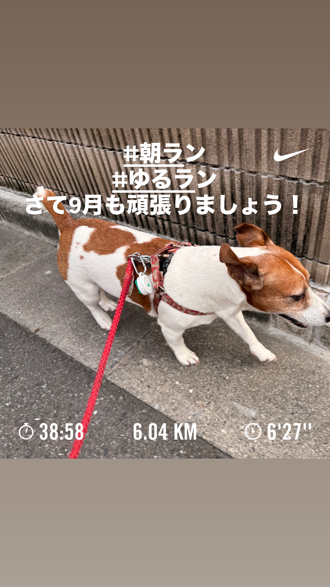
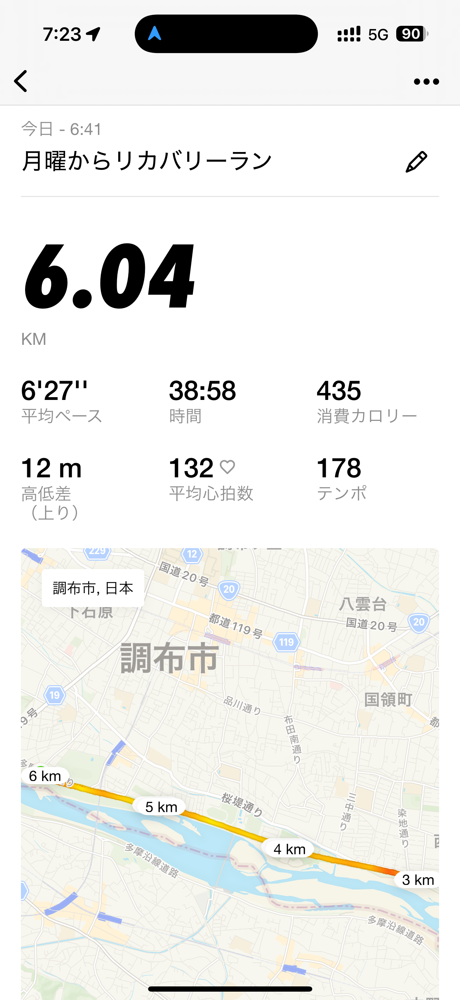
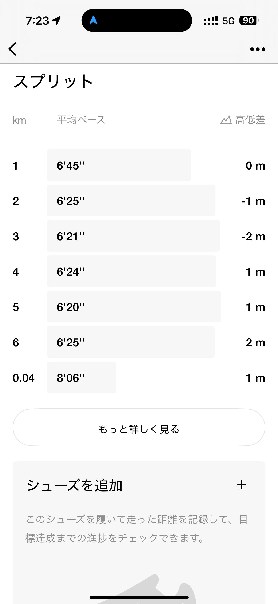
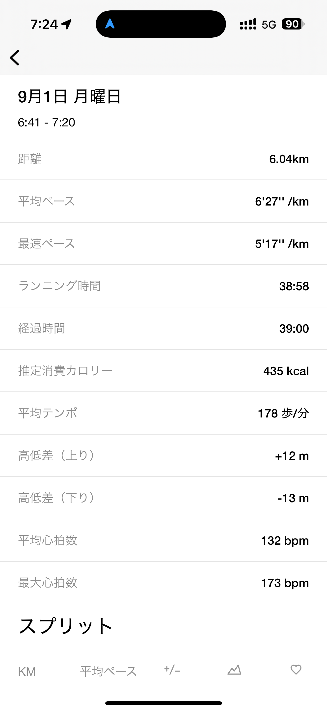
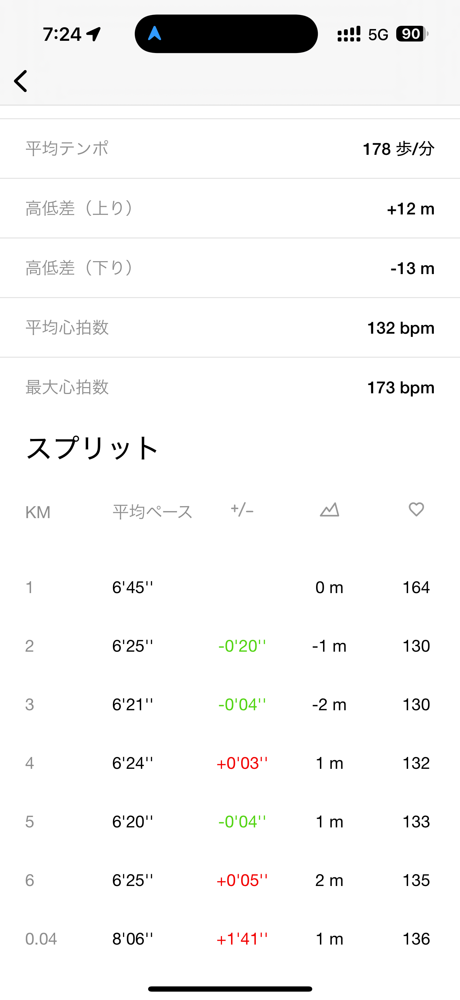
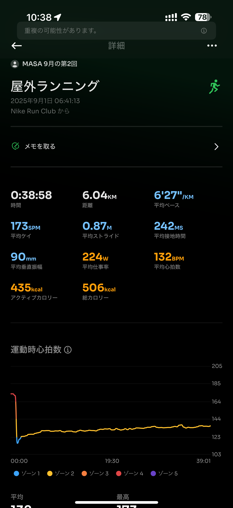
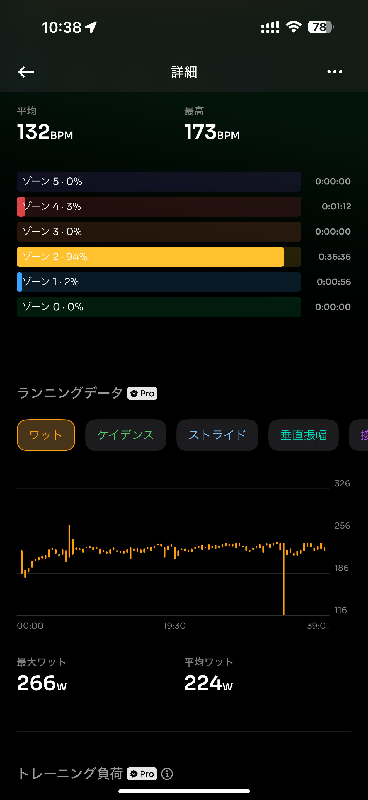
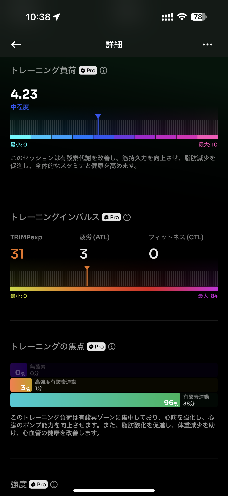
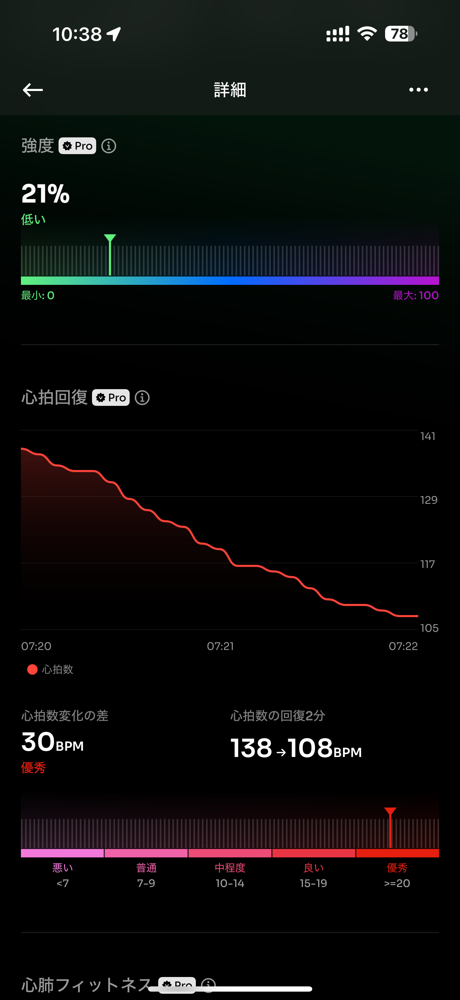
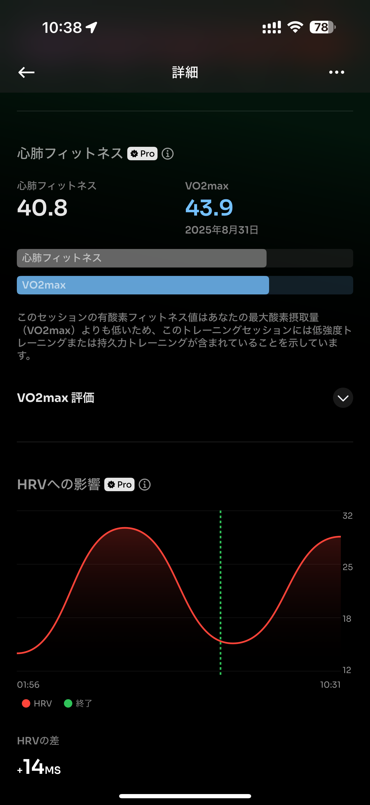

- 距離：6.04km
- 時間：00:38:58
- 平均心拍数：132
- 時間帯：6:41~
- 天候： 晴れ
- コース：多摩川河川敷
- 補給：なし
- 睡眠：5時間24分
- 今日の目的：リカバリーラン
- コメント：しっかりリカバリーできた気がする

## 📝 コーチコメント：
昨日までの疲労が抜けきっていない中で、しっかりリカバリーランを実践できたのが素晴らしいです。心拍もゾーン2中心で「脚を動かす＋血流を良くする」役割を果たしています。VO2maxは落ち気味ですが、リカバリー週の範囲内なので問題なし。むしろこの積み重ねが9/7の30kmへの余力をつくってくれます。

## 📸 写真一覧

