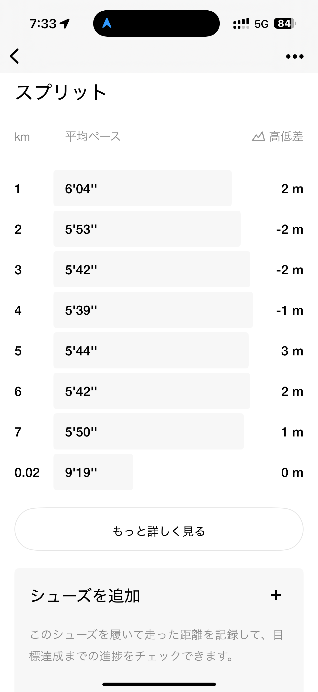

- 距離：7.02km
- 時間：00:40:50
- 平均心拍数：142
- 時間帯：6:50~
- 天候：晴れ
- コース：多摩川河川敷
- 補給：なし
- 睡眠：4時間42分
- 今日の目的：軽めジョグ
- コメント：まぁほんと軽めにですな

## 📝 コーチコメント：
翌日のポイント練習に備え、心肺に刺激を与えつつも無理のないペースで走り切れており、非常に効果的なつなぎのランニングです。身体の回復も順調に進んでいるので、明日のインターバル走も自信を持って臨んでください。

## 📸 写真一覧

