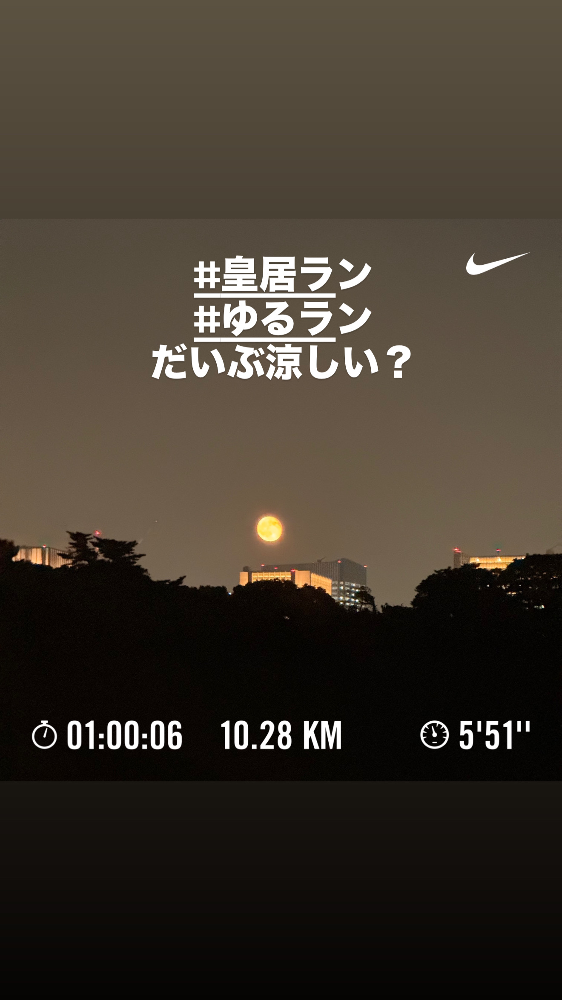
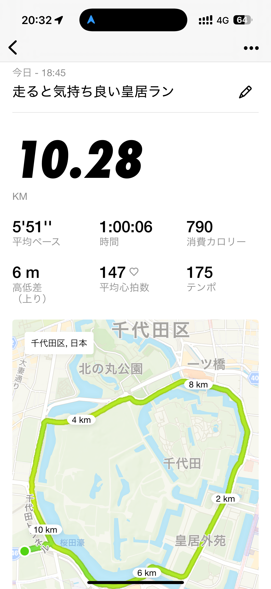
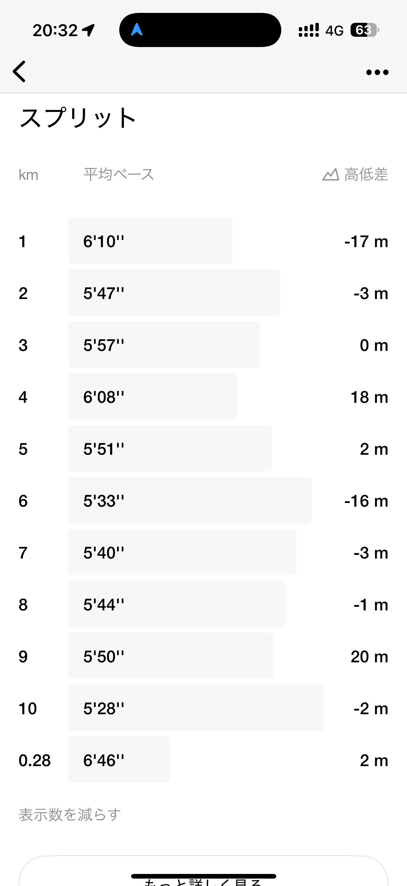
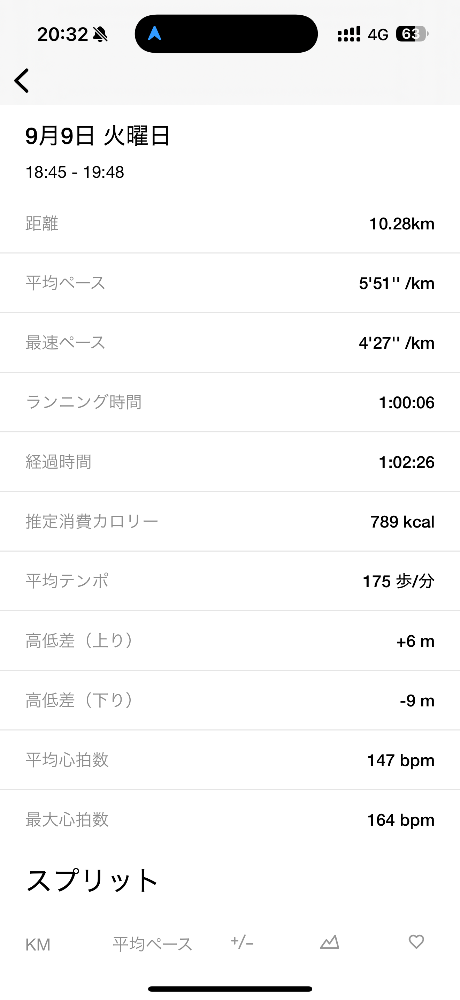
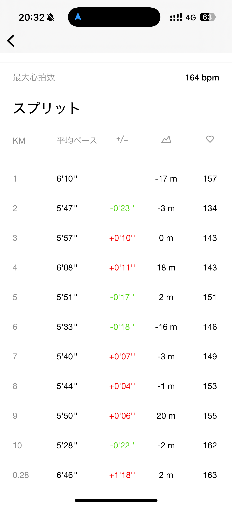
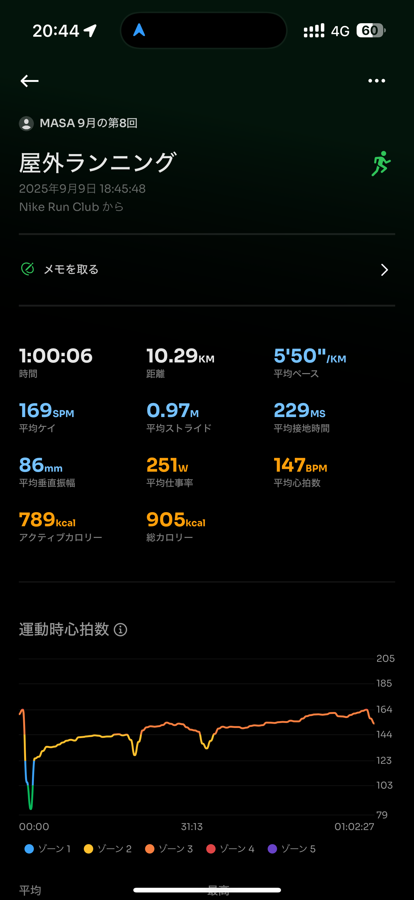
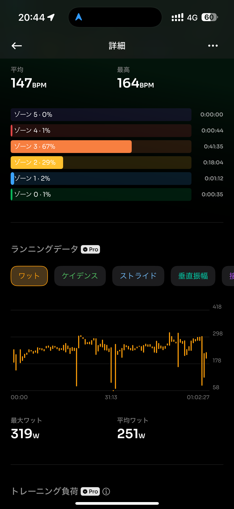
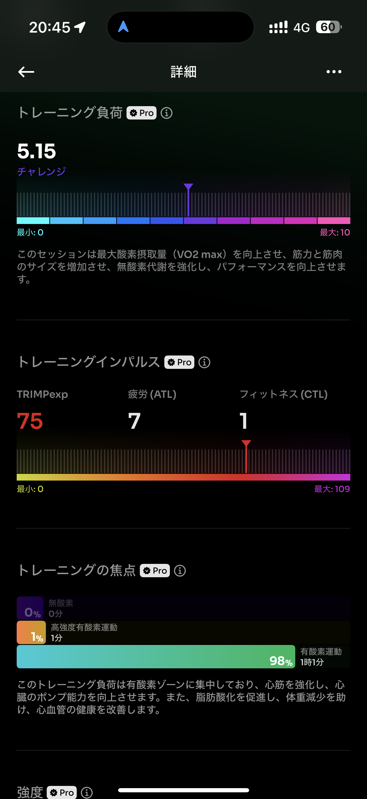
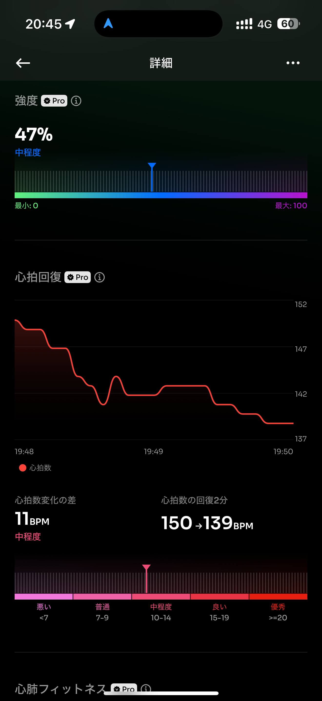
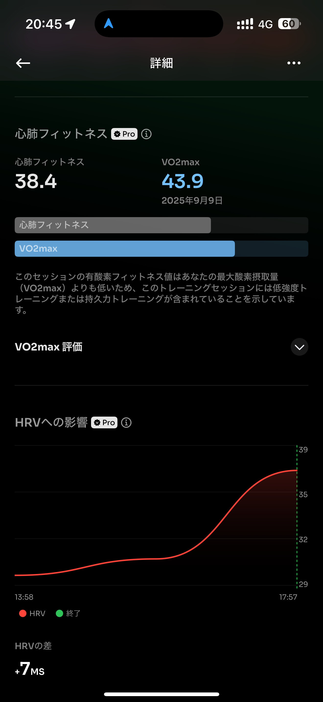

- 距離：10.28km
- 時間：01:00:06
- 平均心拍数：147
- 時間帯：18:45~
- 天候：晴れ
- コース：皇居2周
- 補給：なし
- 睡眠：5時間24分
- 今日の目的：皇居を楽しく走る。
- コメント：楽しく走れたと思う。

## 📝 コーチコメント：
10.3kmを平均5'50/km、心拍147bpmと、とても良いコントロールで走れてますね👏 夜の涼しさもあって気持ちよく走れたのが伝わってきます。

## 📸 写真一覧

