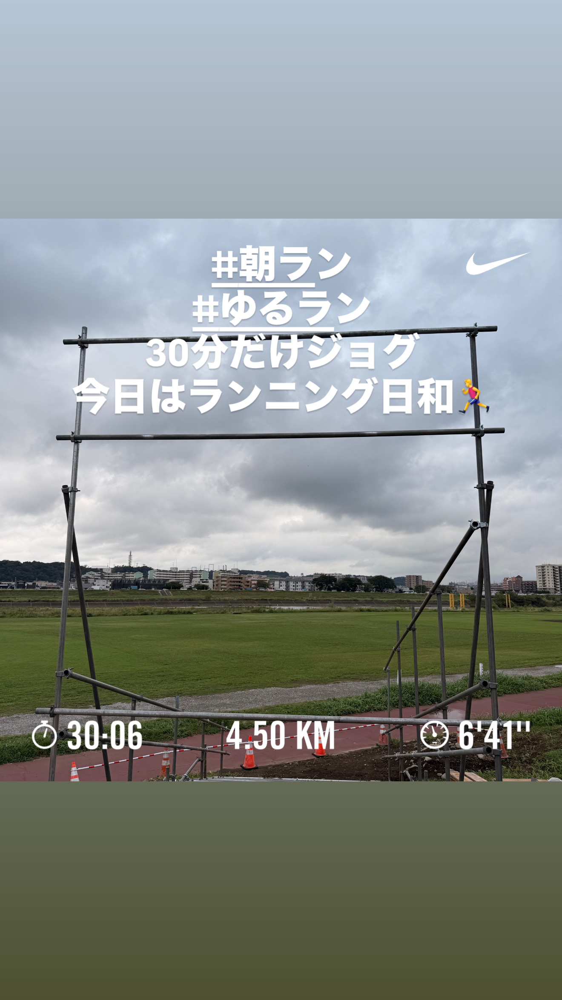
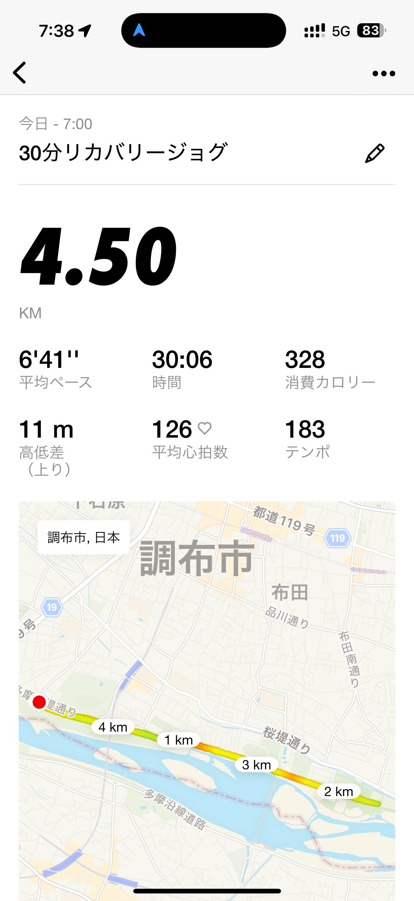
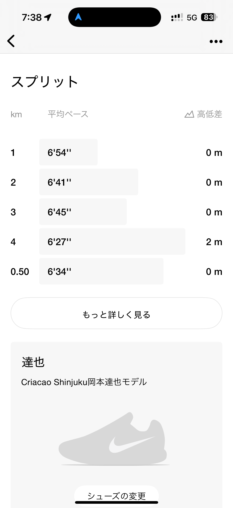
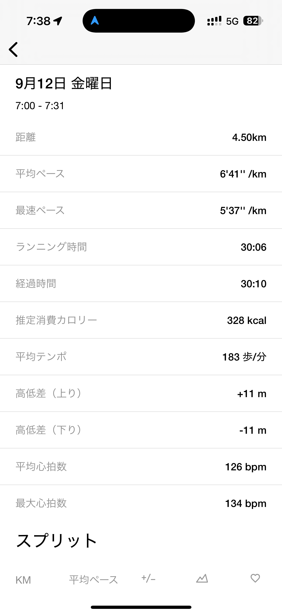
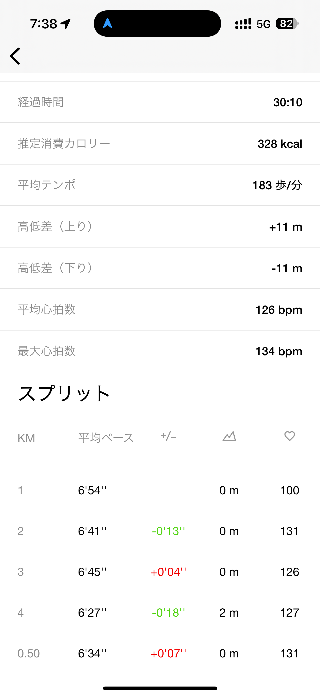
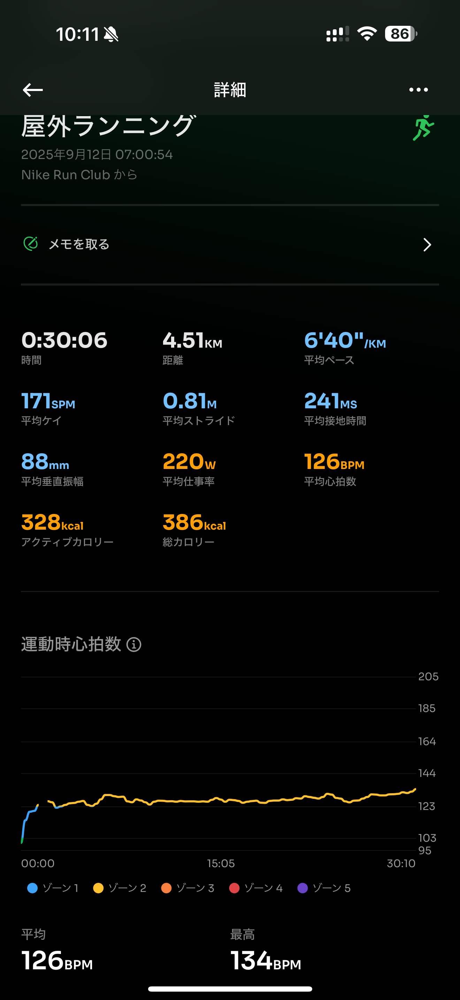
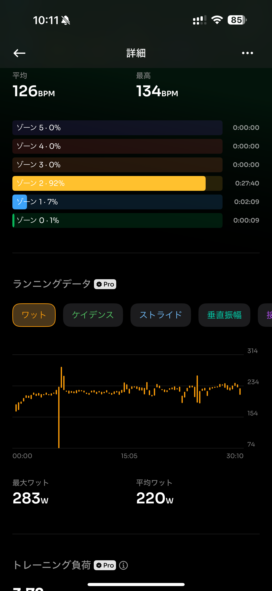
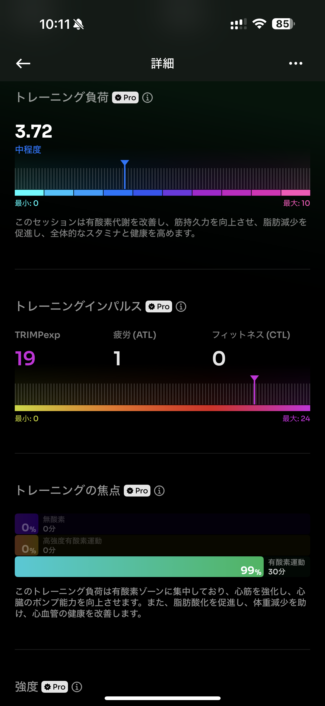
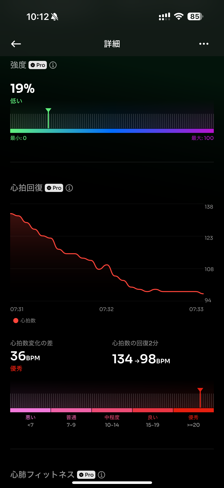
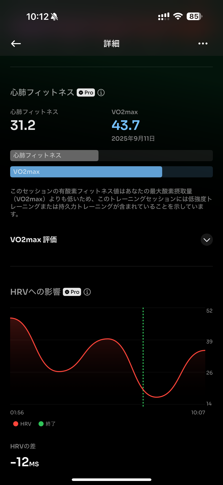

- 距離：4.50km
- 時間：00:30:06
- 平均心拍数：126
- 時間帯：7:00~
- 天候：曇り
- コース：多摩川河川敷
- 補給：なし
- 睡眠：3時間58分（もーちょっと寝てるはず）
- 今日の目的：リカバリージョグ
- コメント：ワラーチでちょうどいい感じだったかも

## 📝 コーチコメント：
疲労を残さず心拍も抑えて走れた、理想的なリカバリーランでした！

## 📸 写真一覧

