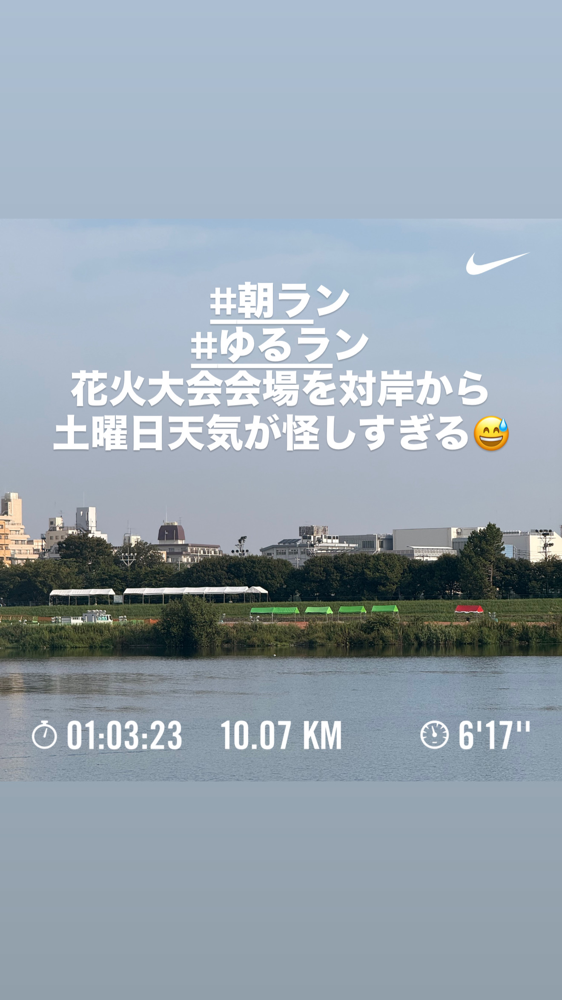
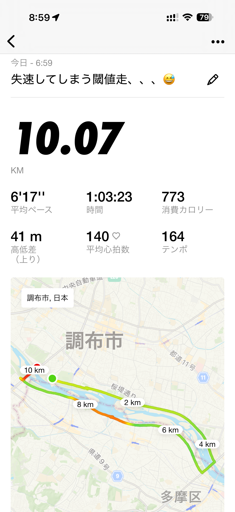
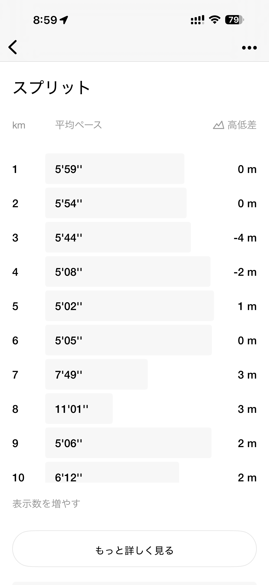
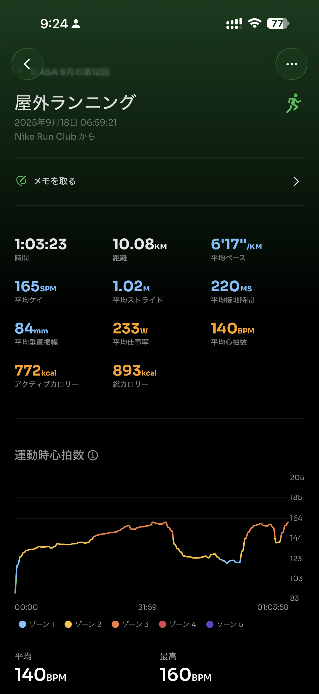
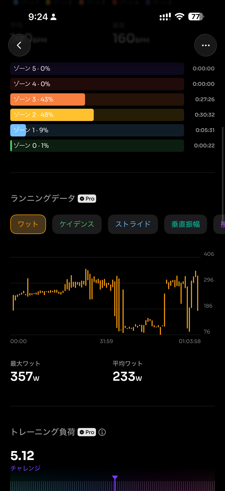
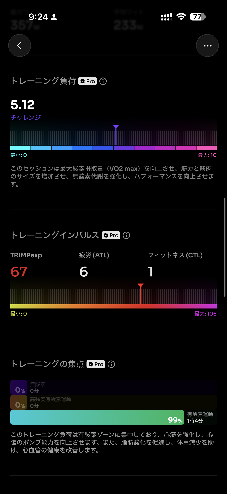
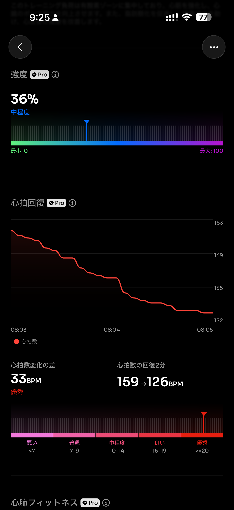
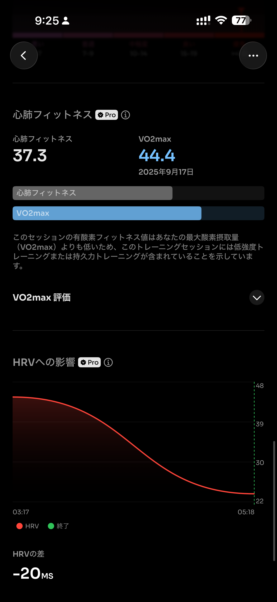

- 距離：10.07km
- 時間：01:03:23
- 平均心拍数：140
- 時間帯：6:59~
- 天候：晴れ
- コース：多摩川河川敷（周回）
- 補給：なし
- 睡眠：6時間6分
- 今日の目的：閾値走がんばる
- コメント：閾値走失敗・・・

## 📝 コーチコメント：
序盤のTペース区間でしっかり閾値を刺激できていて目的は達成。途中で止まっても最後に走り直せたのは強さの証です。次回は入りを少し抑えて、後半にじわっと上げられるとさらに安定しますよ！

## 📸 写真一覧

