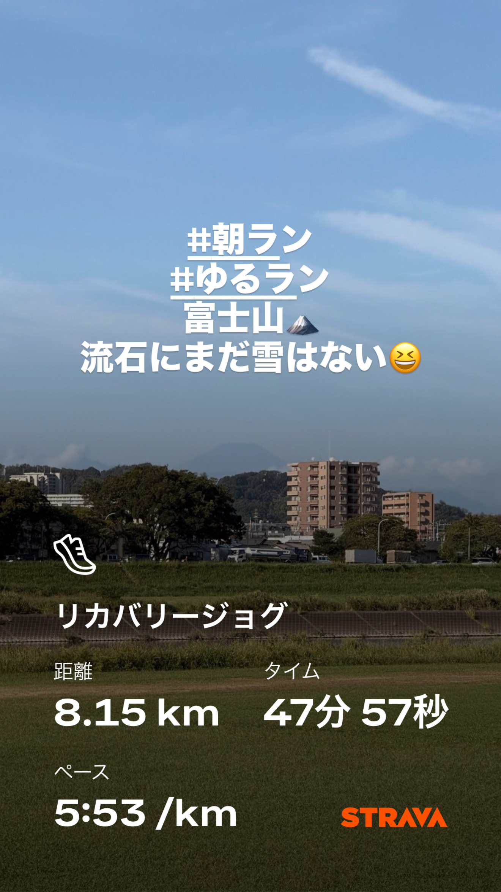
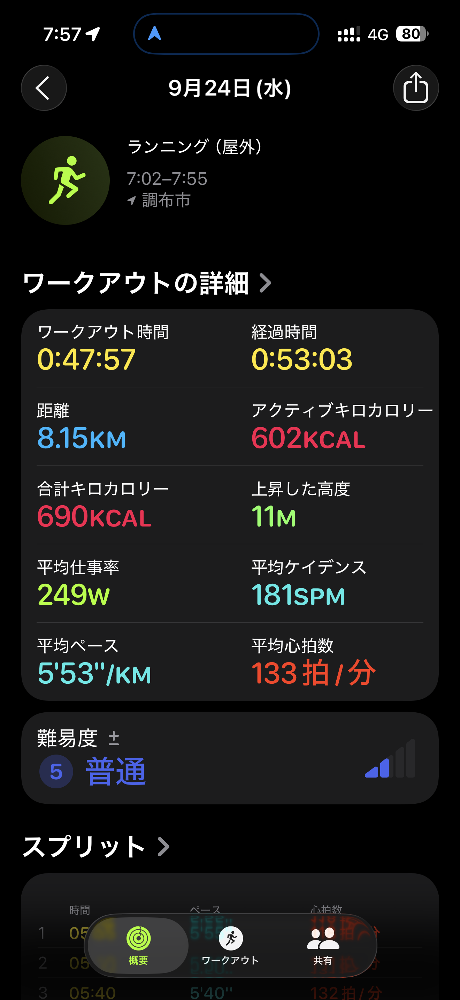
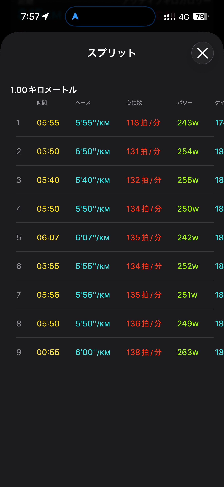
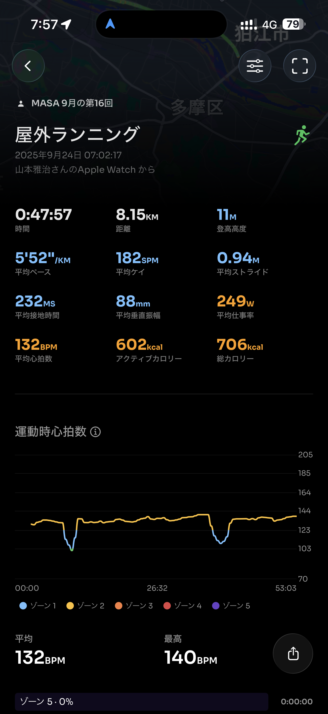
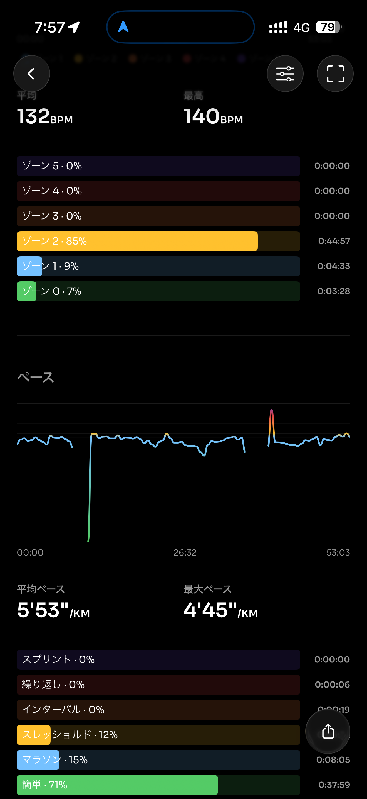
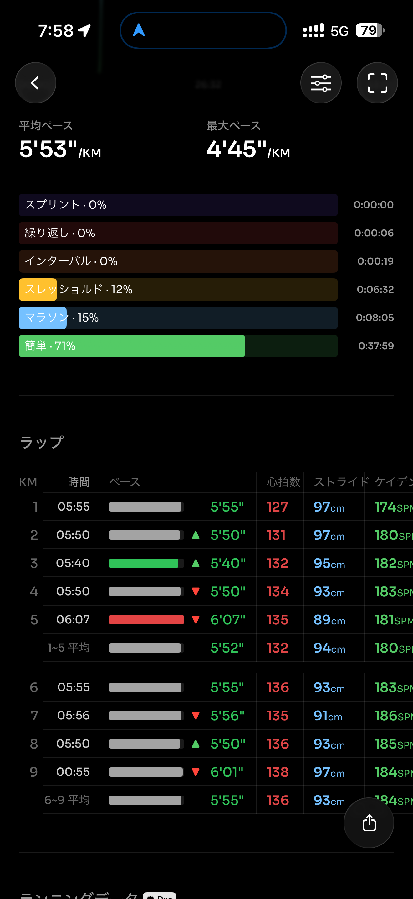
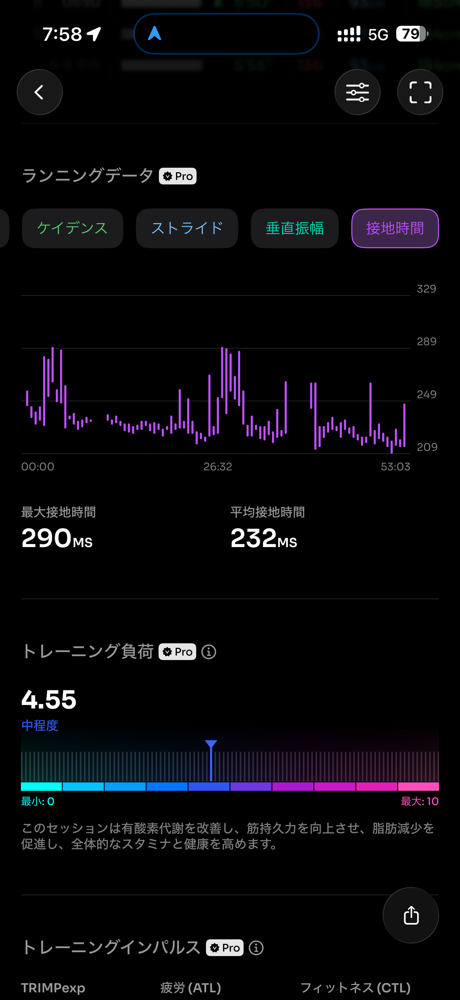
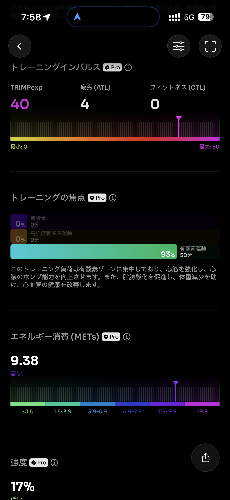
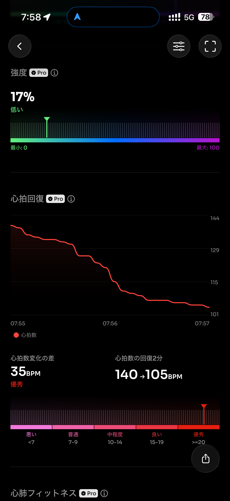
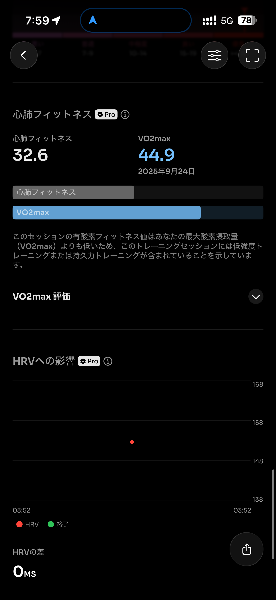

- 距離：8.15km
- 時間：00:47:57
- 平均心拍数：133
- 時間帯：7:02〜
- 天候：晴れ
- コース：多摩川河川敷（折り返し）
- 補給：なし
- 睡眠：5時間52分
- 今日の目的：リカバリージョグ
- コメント：ちょっとペース速いかも。6分ぐらいにしたかった

## 📝 コーチコメント：
富士山を眺めながらのリカバリー、気持ちも走りも余裕たっぷりでしたね！心拍も低く抑えつつしっかり8km走れていて、翌日のTペース走につながるいい準備になりました🙌

## 📸 写真一覧

