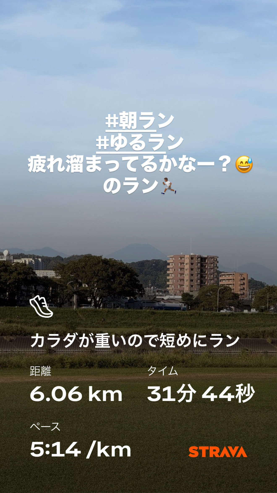
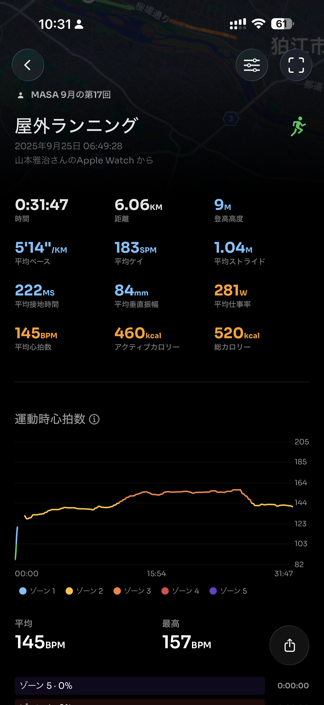
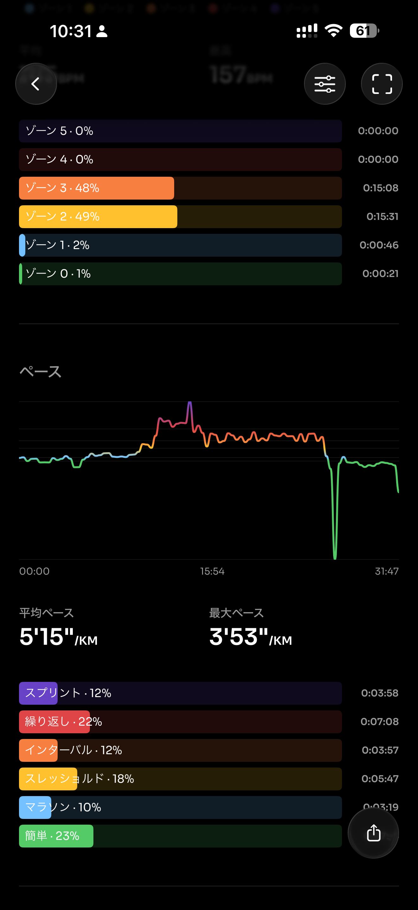
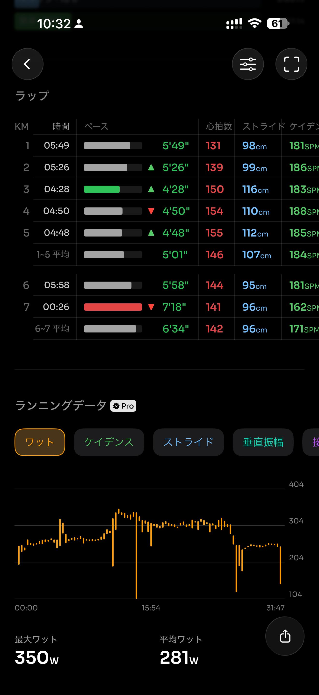
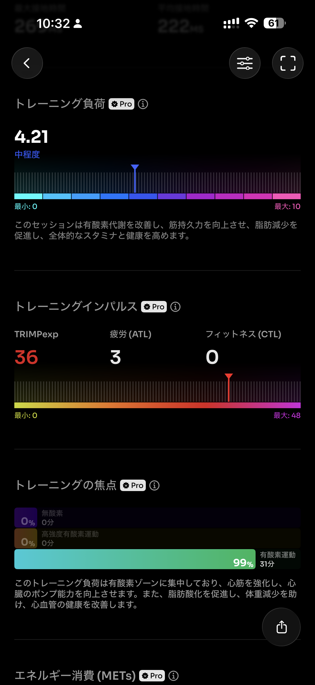
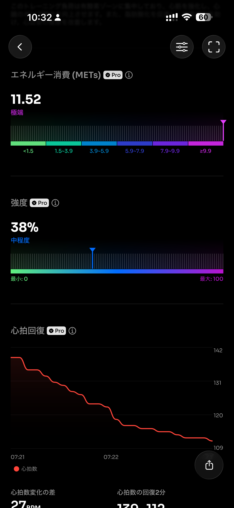
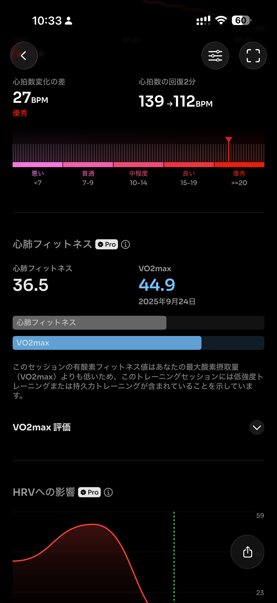
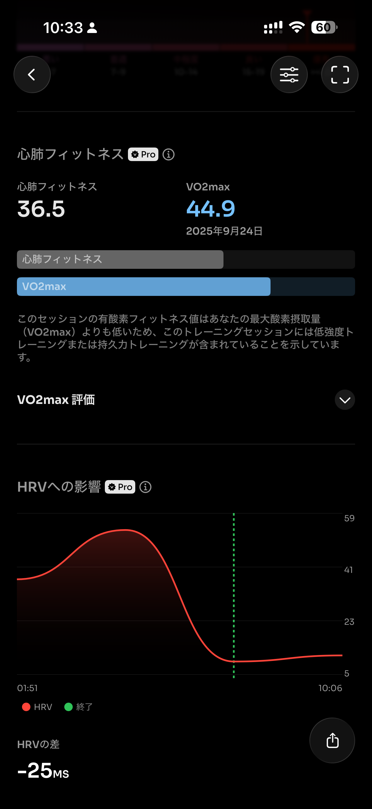

- 距離：6.06km
- 時間：00:31:47
- 平均心拍数：144
- 時間帯：6:49~
- 天候：晴れ
- コース：多摩川河川敷
- 補給：なし
- 睡眠：5時間46分
- 今日の目的：閾値走だったけど、疲れているので短めに
- コメント：2kmアップ、3kmペースアップ、1kmダウン。まぁまぁ走れたんじゃなかろうか。

## 📝 コーチコメント：
今日のランは「短い刺激入れ＋疲労度チェック」として大成功です！

## 📸 写真一覧

