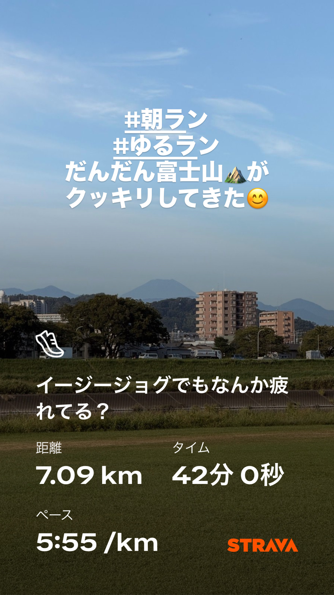
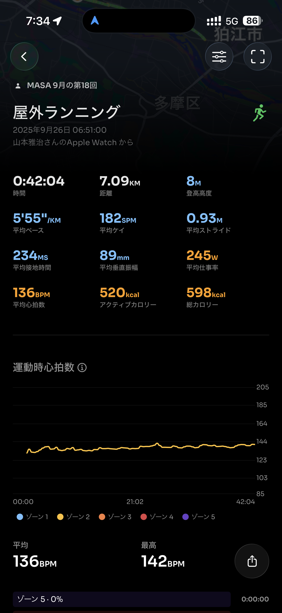
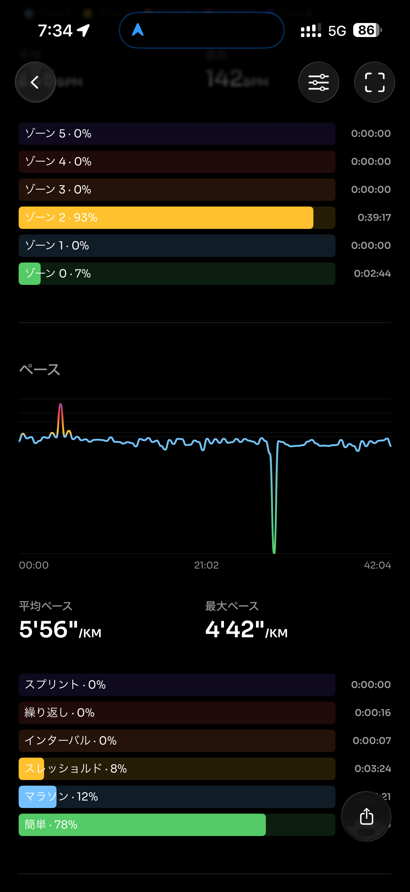
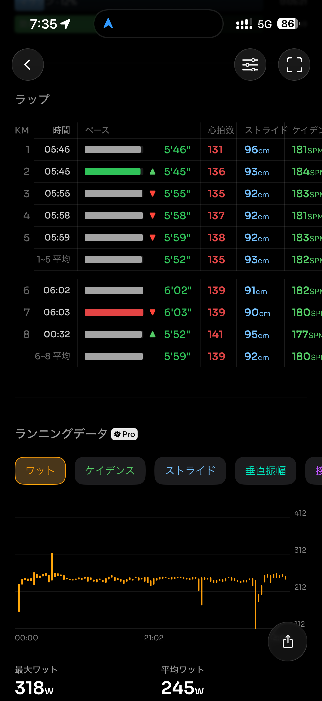
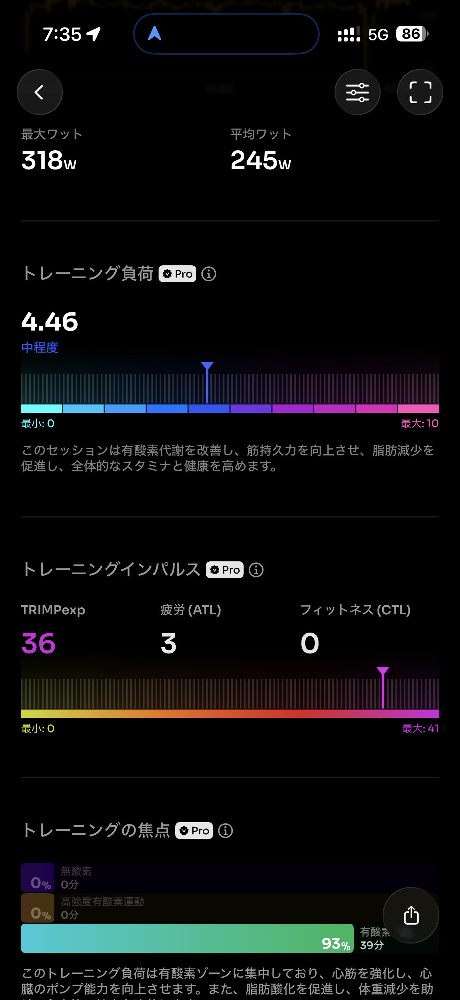
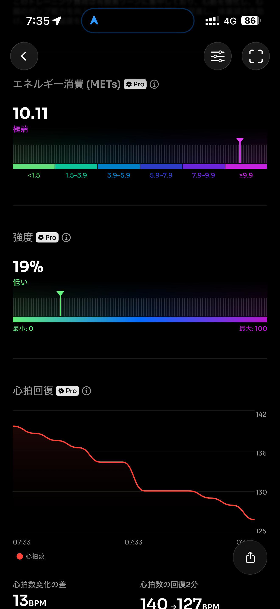
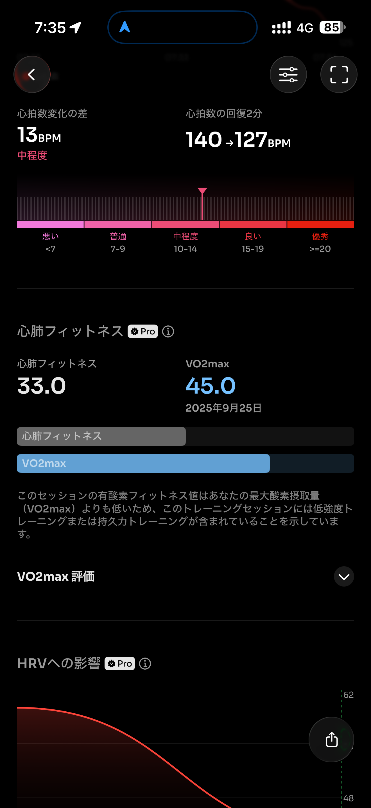
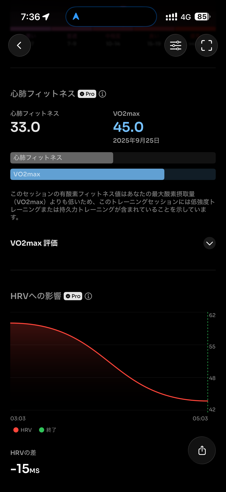
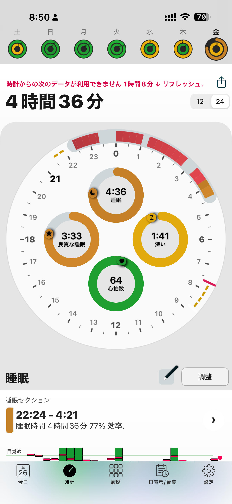

- 距離：7.09km
- 時間：00:42:04
- 平均心拍数：136
- 時間帯：6:51~7:33
- 天候：晴れ
- コース：多摩川河川敷
- 補給：なし
- 睡眠：4時間36分
- 今日の目的：Eペースジョグ
- コメント：まぁまぁEペースジョグ完了。

## 📝 コーチコメント：
疲れていても「Eペースを守れた」ことが大きな収穫！本番30kmでも「キロ6分で淡々と」をこの感覚でいけそうです💪

## 📸 写真一覧

