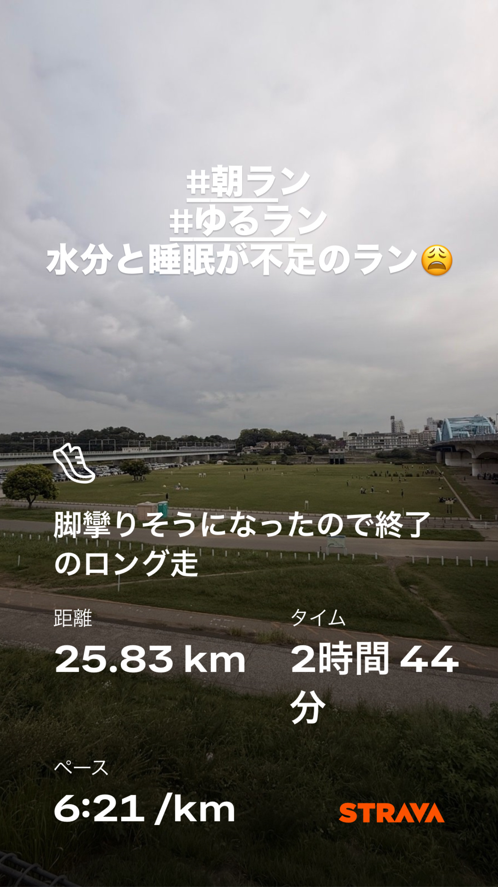
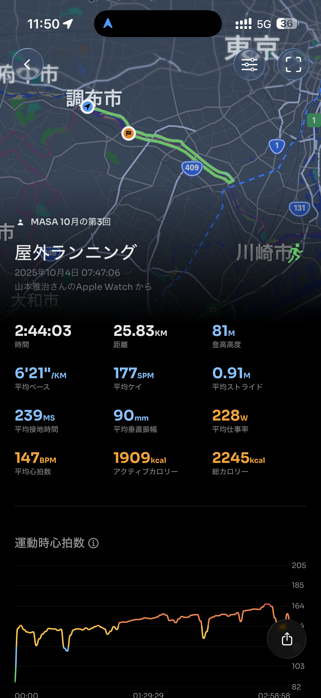
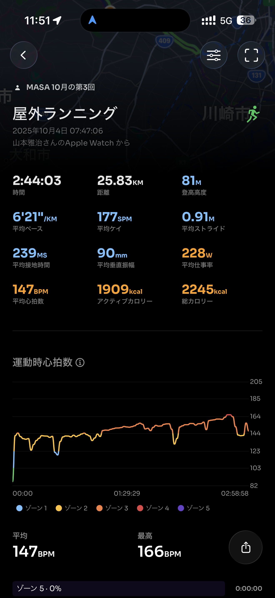
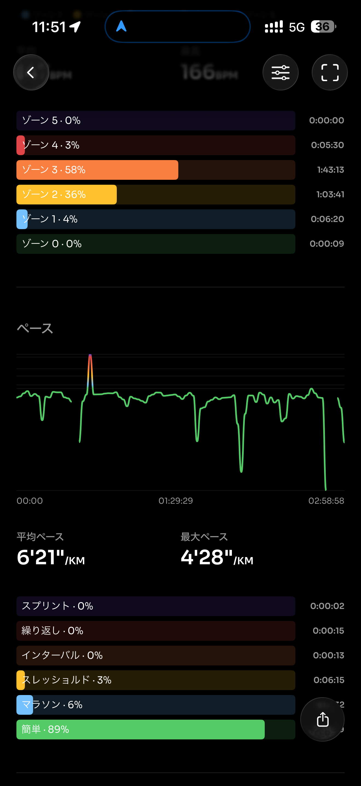
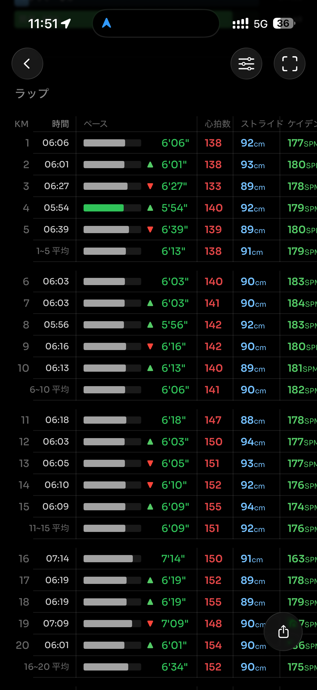
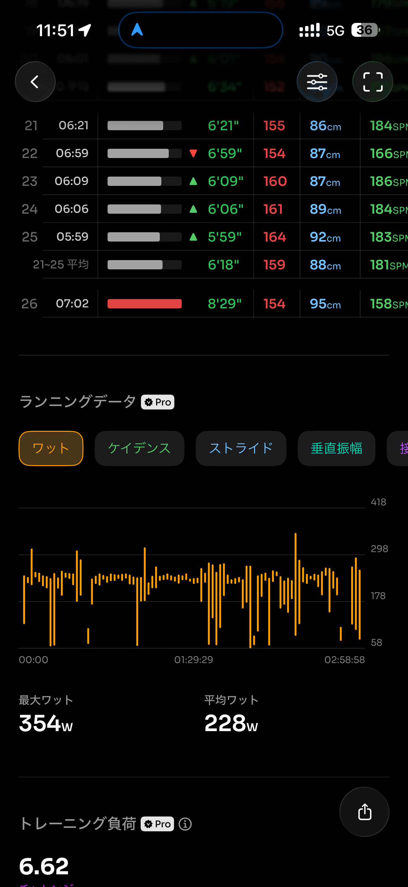
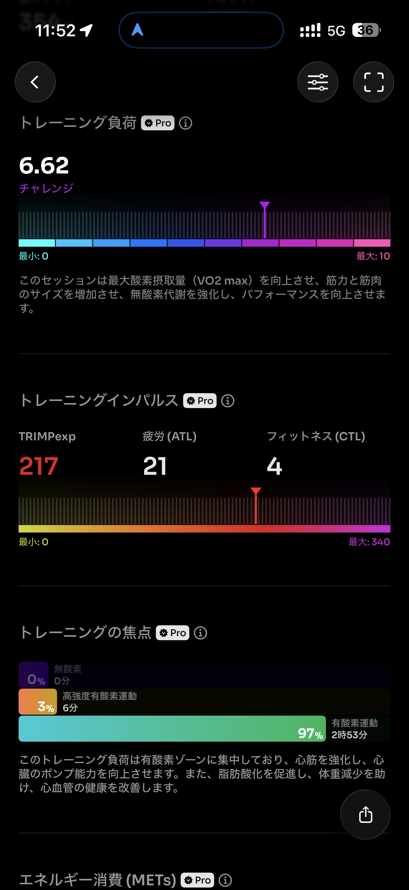
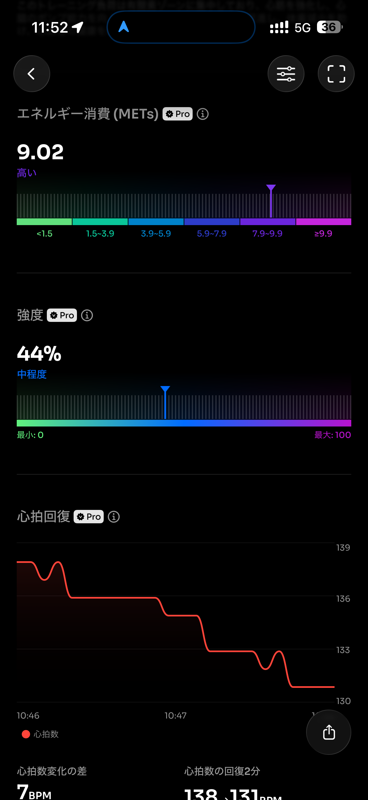
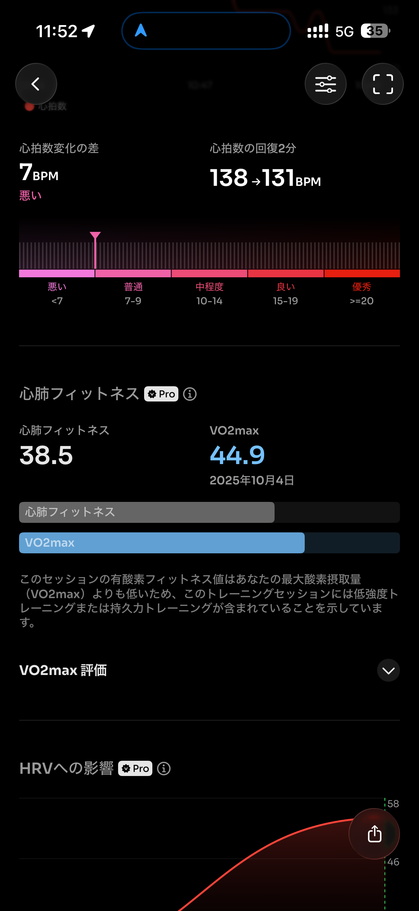
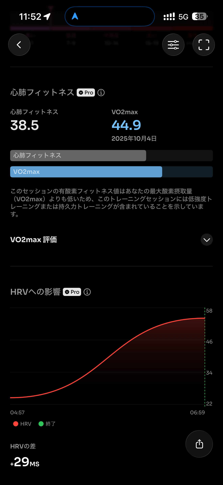

- 距離：25.83km
- 時間：02:44:03
- 平均心拍数：147
- 時間帯：7:47~10:46
- 天候：曇り
- コース：多摩川河川敷（丸子橋折り返し）
- 補給：塩ジェル、アミノサウルス、俺は摂取す、スポーツ羊羹、水
- 睡眠：5時間46分
- 今日の目的：30kmラン
- コメント：足が攣りそうになったので断念。

## 📝 コーチコメント：
安定した25km走でフルに向けた土台はバッチリ、攣りそうな時に止めた判断も最高でした！

## 📸 写真一覧

