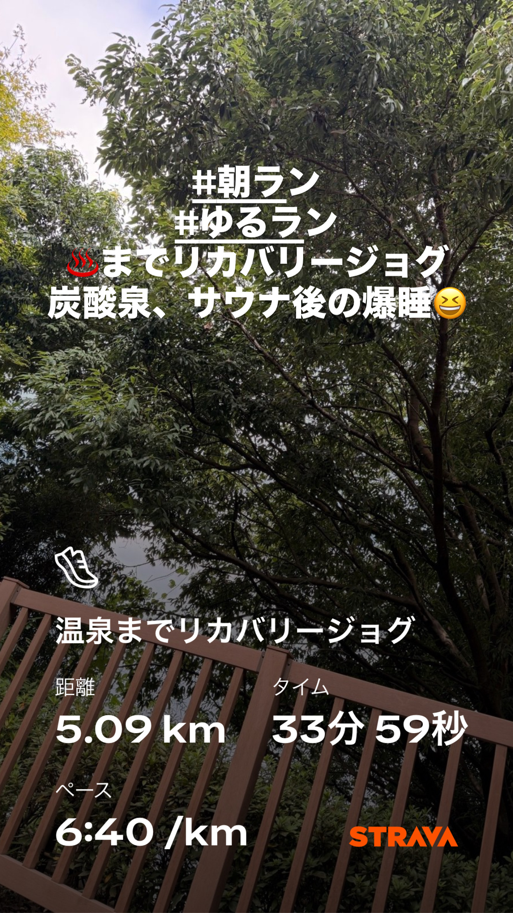
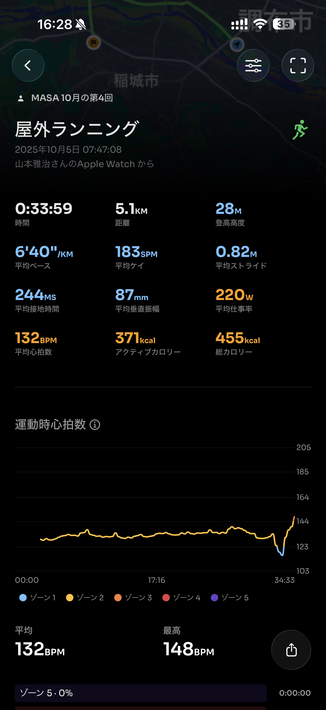
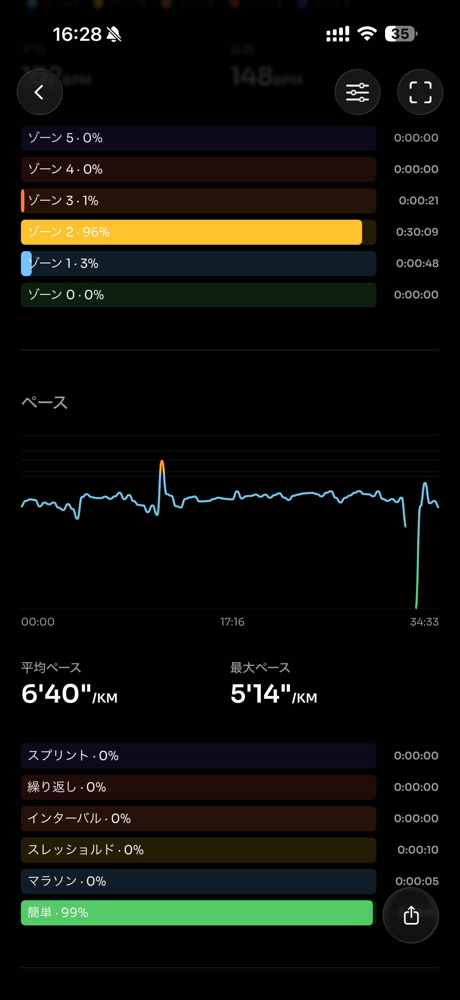
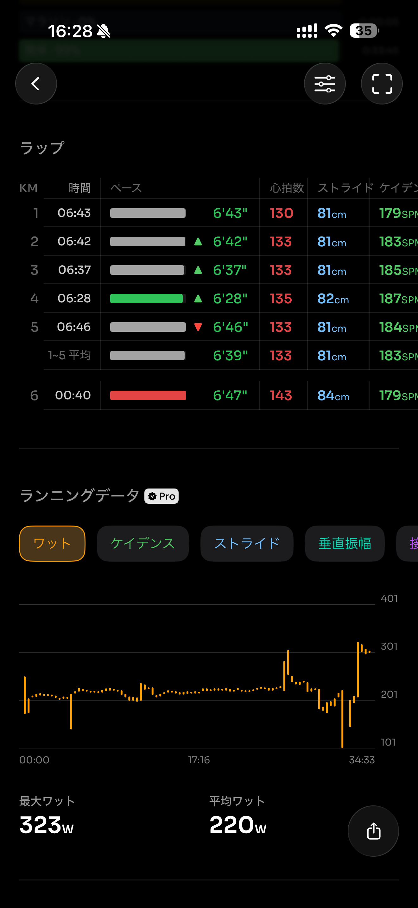
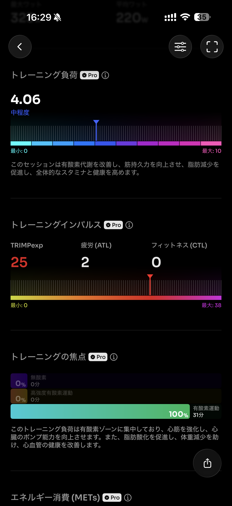
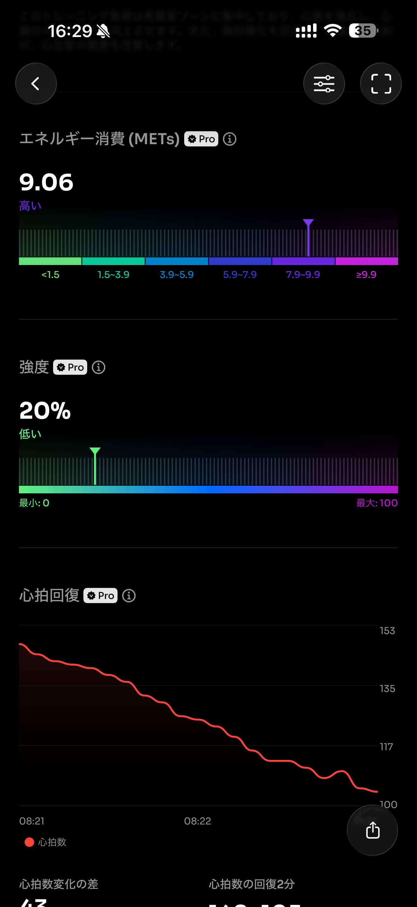
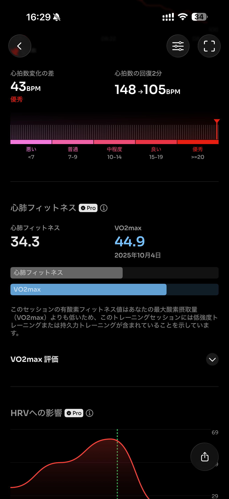
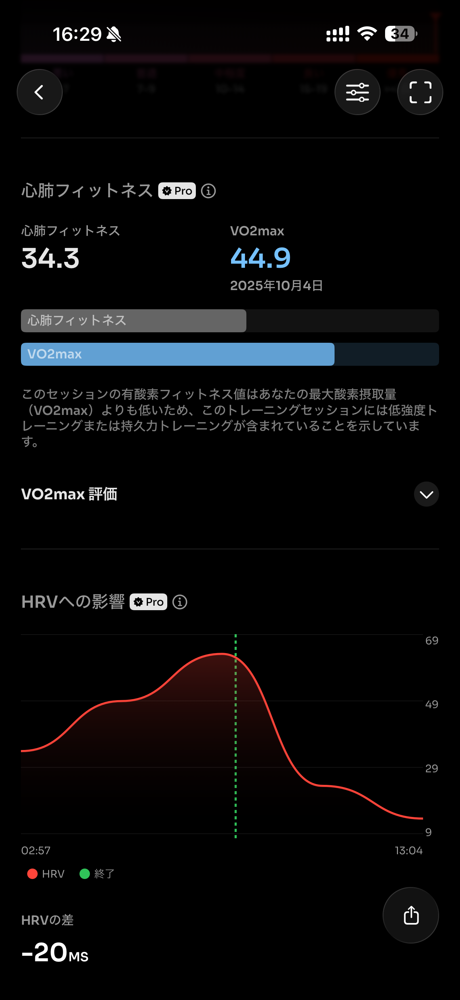

- 距離：5.09km
- 時間：00:33:59
- 平均心拍数：133
- 時間帯：7:47~8:21
- 天候：晴れ
- コース：多摩川→季乃彩
- 補給：なし
- 睡眠：6時間29分
- 今日の目的：リカバリージョグ
- コメント：温泉で癒される

## 📝 コーチコメント：
温泉までのリカバリージョグ、完璧です！低強度ゾーンで心拍も安定し、心拍回復も優秀（2分で−43bpm）という理想的なリカバリーラン。疲労抜きしながら心肺の調子も整っていて、横浜へ向けた調整として申し分なしです👏

## 📸 写真一覧

