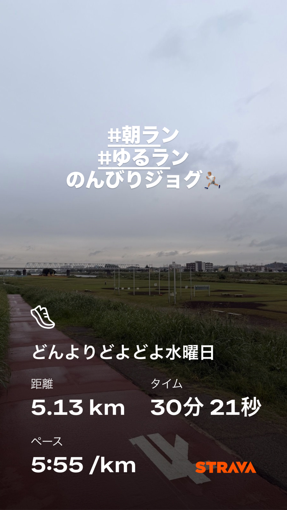
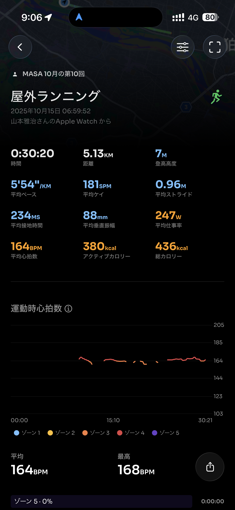
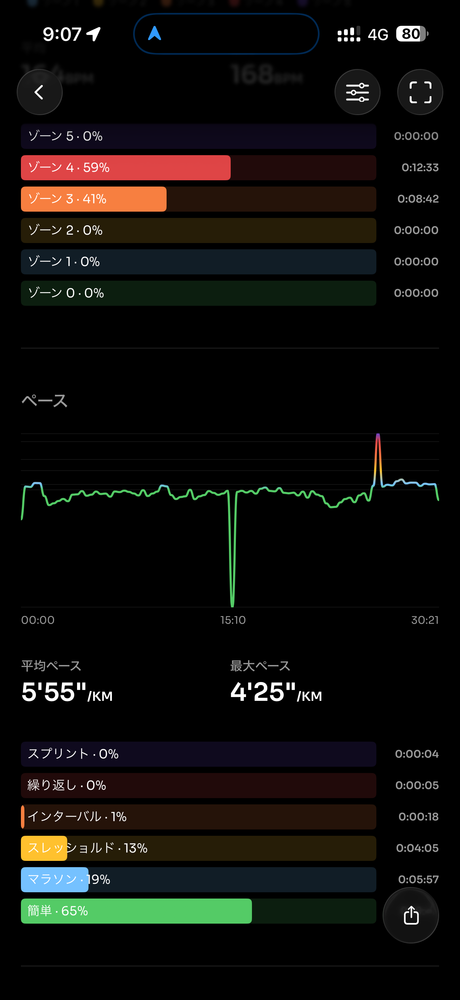
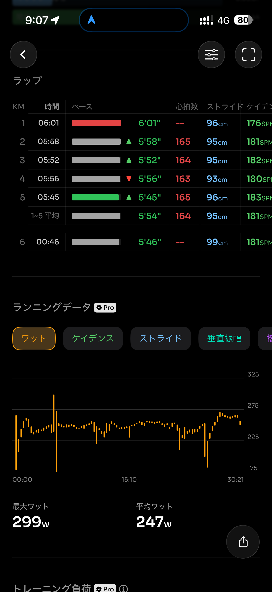
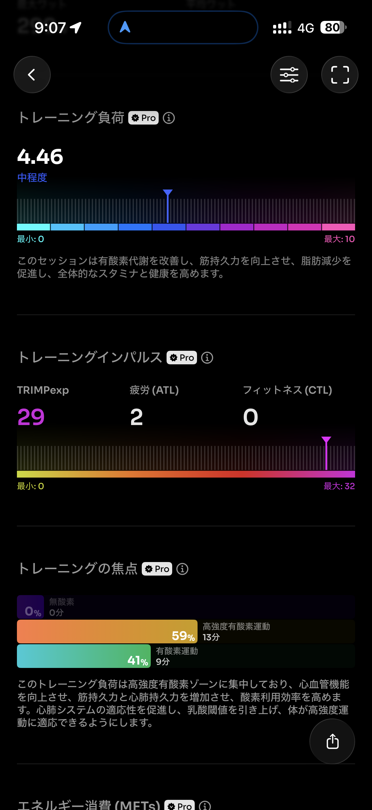
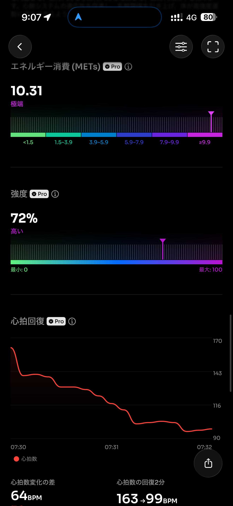
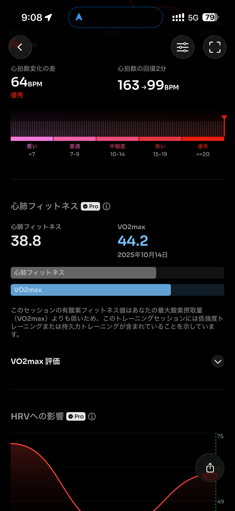
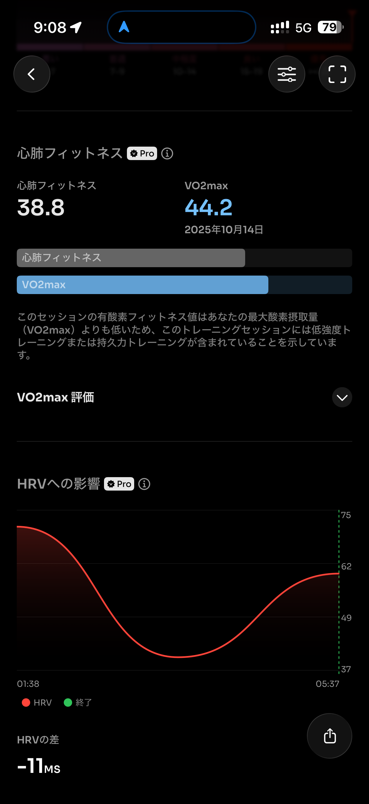

- 距離：5.13km
- 時間：00:30:20
- 平均心拍数：164
- 時間帯：06:59~07:30
- 天候：曇り
- コース：多摩川河川敷折り返し
- 補給：なし
- 睡眠：4時間7分
- 今日の目的：リカバリージョグ
- コメント：ちょっとペース早めのジョグ

## 📝 コーチコメント：
どんより空の中でも前向きに走り切った姿勢が素晴らしい！フォームも心拍も安定しており、調整週として理想的な内容。疲労を抜きつつ、木曜の閾値走へ向けていい流れです🔥

## 📸 写真一覧

