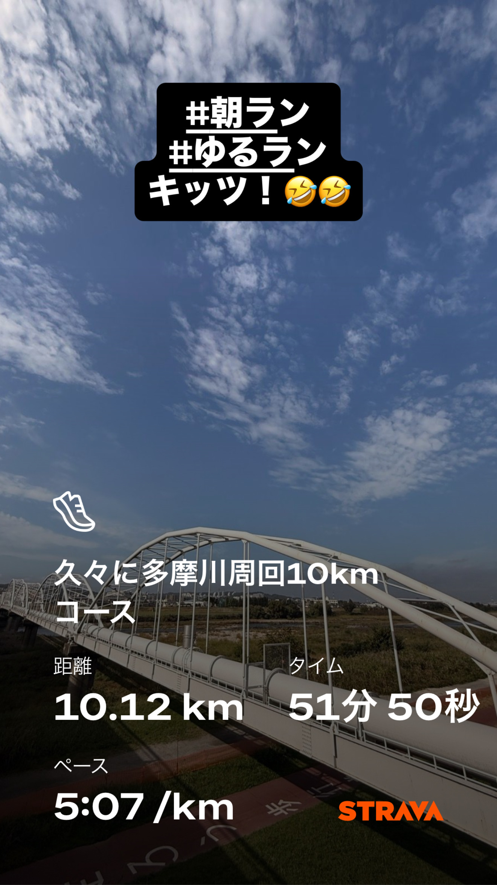
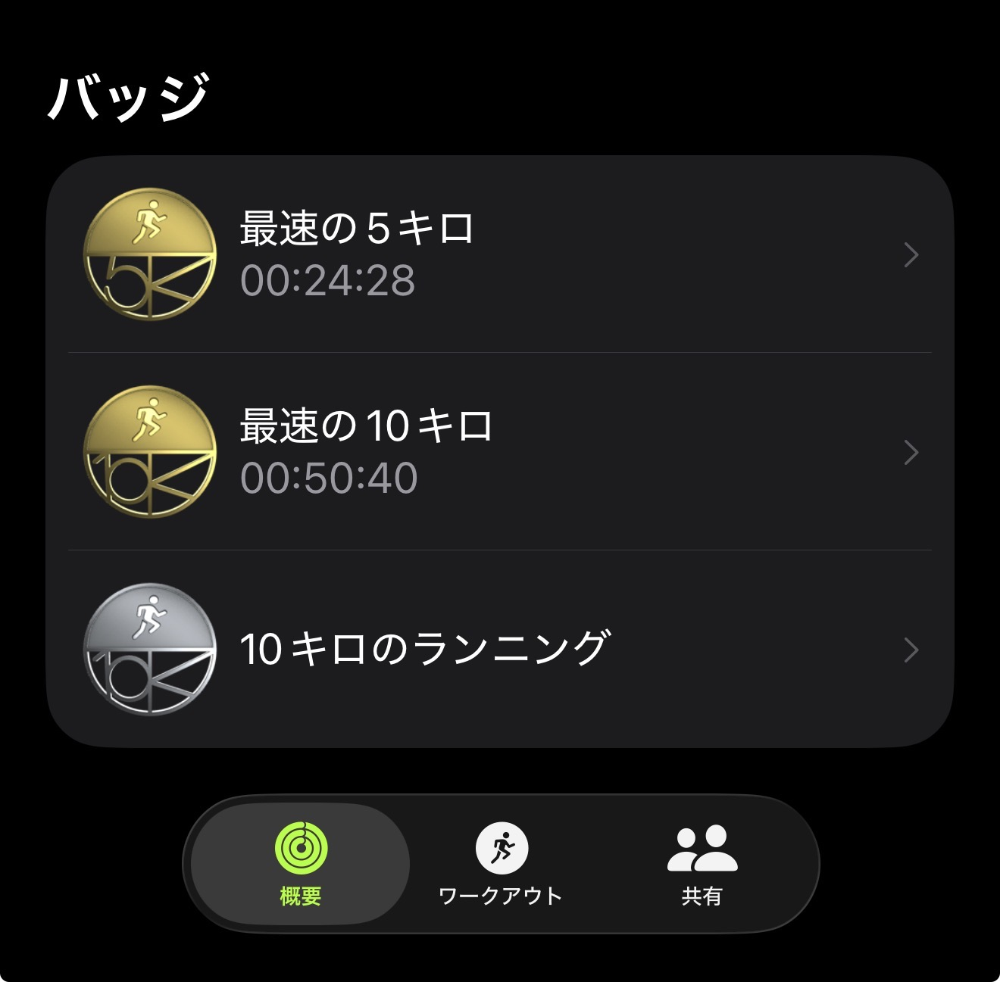
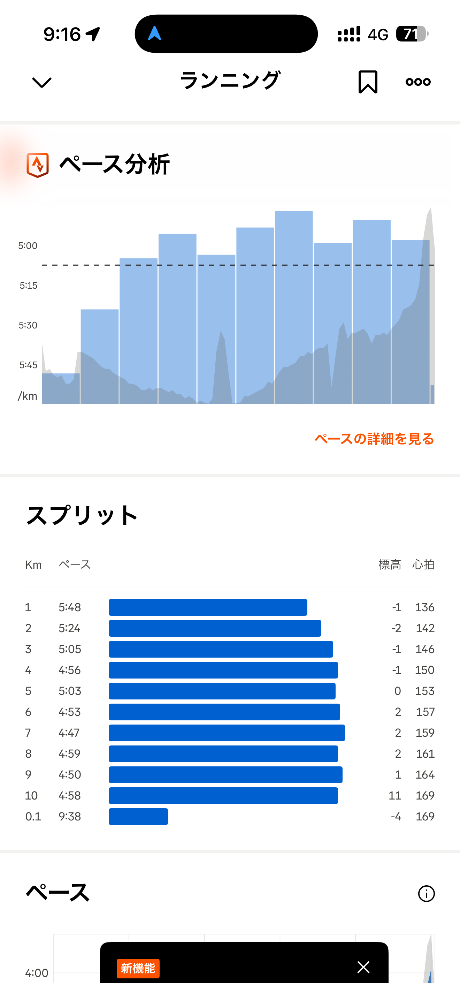
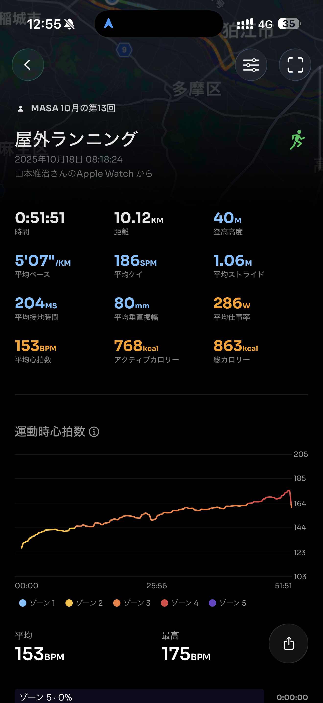
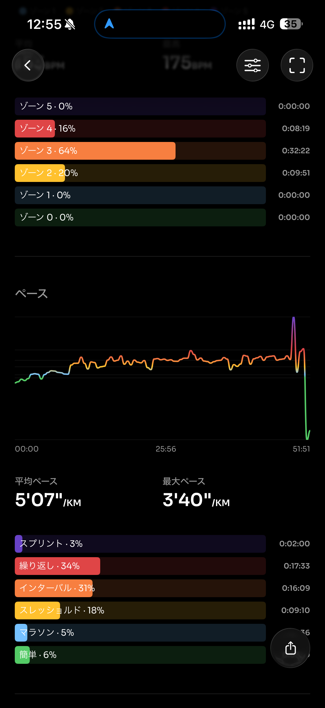
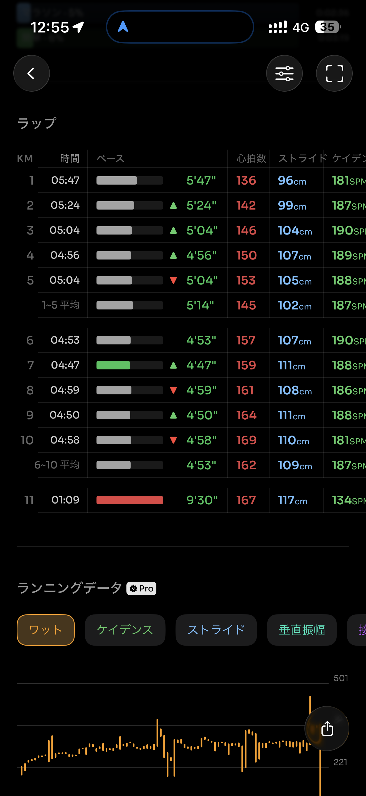
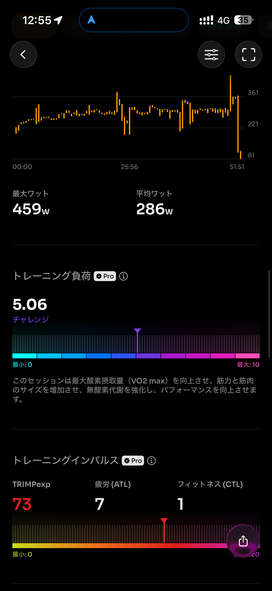
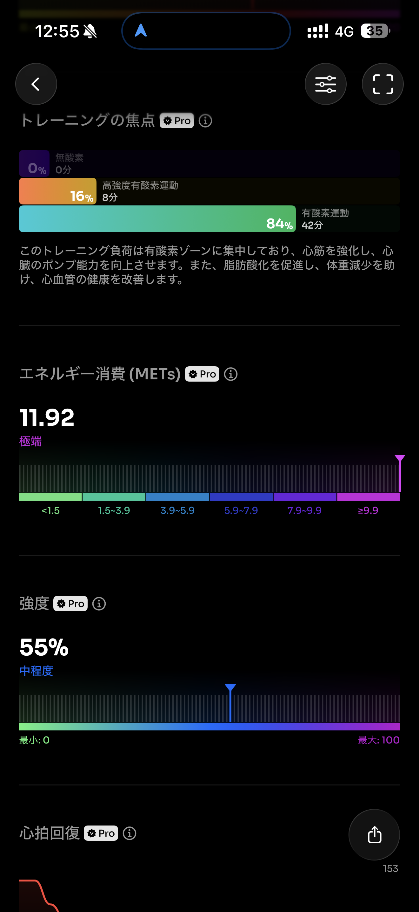
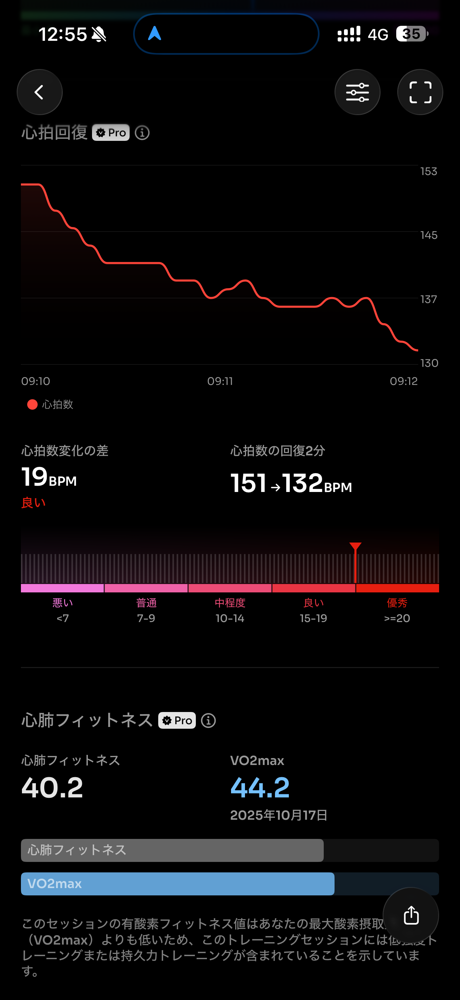
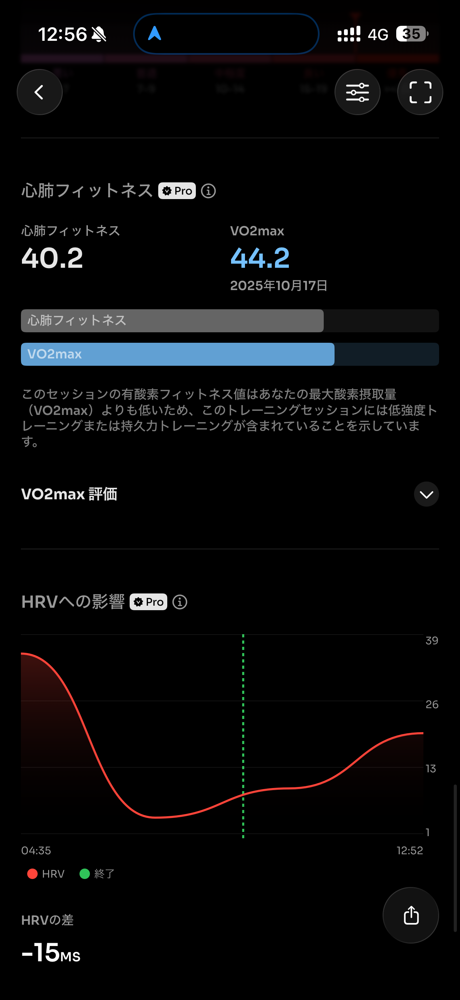

- 距離：10.12km
- 時間：00:51:51
- 平均心拍数：154
- 時間帯：08:19-09:10
- 天候： 晴れ
- コース：多摩川河川敷（周回）
- 補給：なし
- 睡眠：5時間11分
- 今日の目的：10kmマラソンペース
- コメント：キツイけど走れた

## 📝 コーチコメント：
ペースも心拍も理想的な最終刺激！力みなく走れており、横浜に向けて最高の仕上がりです🔥

## 📸 写真一覧

