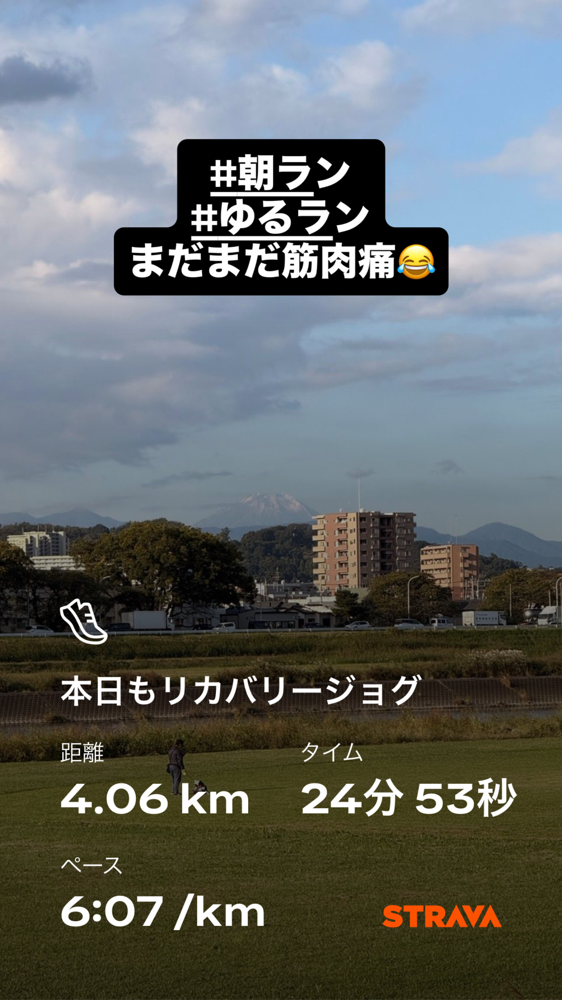
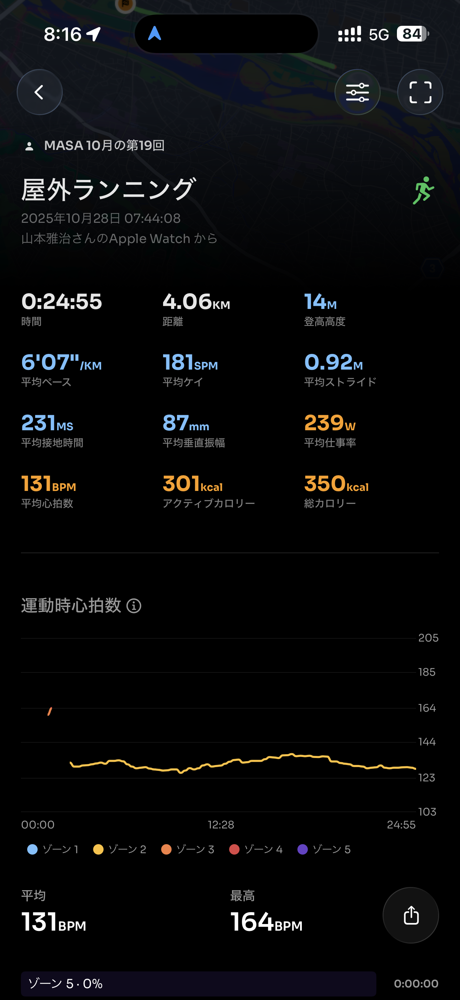
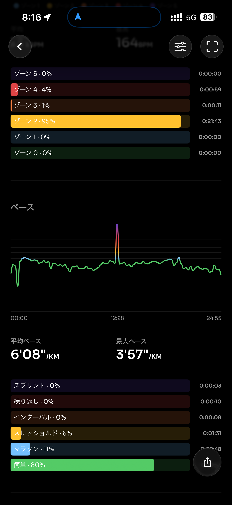
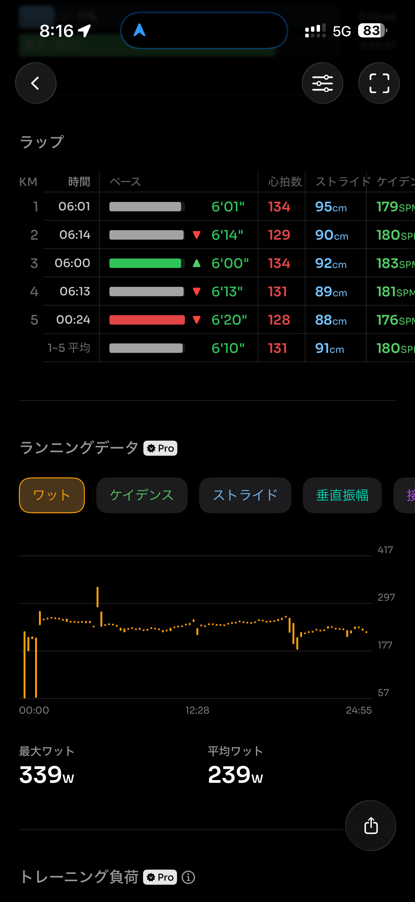
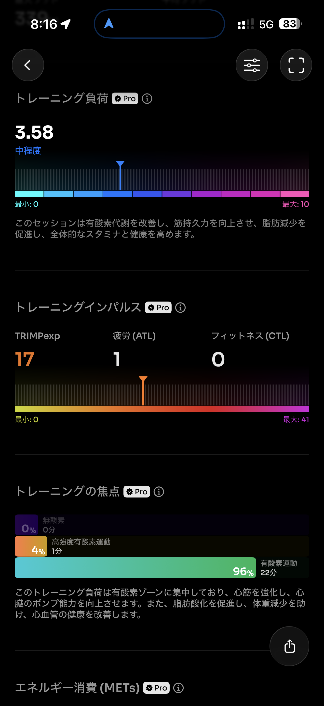
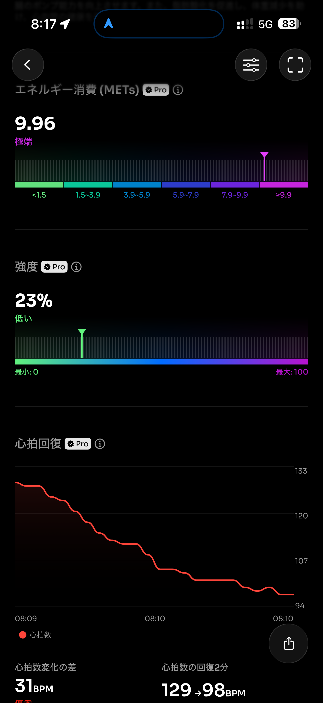
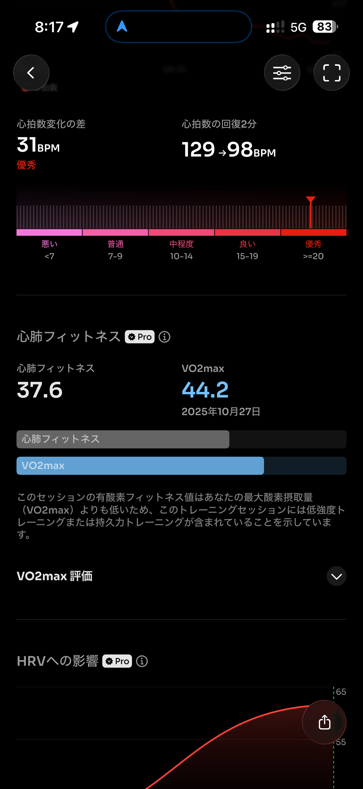
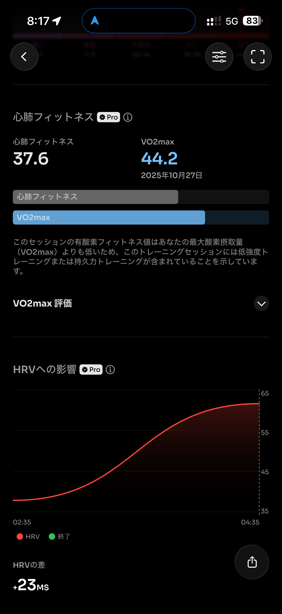
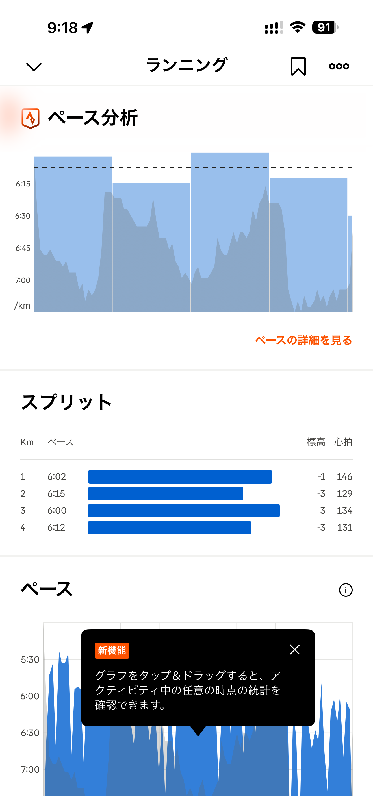

- 距離：4.06km
- 時間：00:24:55
- 平均心拍数：133
- 時間帯：7:44~8:09
- 天候：晴れ
- コース：多摩川河川敷
- 補給：なし
- 睡眠：6時間5分
- 今日の目的：リカバリージョグ
- コメント：まだまだ筋肉痛

## 📝 コーチコメント：
横浜マラソンの疲労を抜きつつ、しっかり血流を促すナイスラン！
筋肉痛が残る中でも、ペースを抑えて“動きの再起動”ができています。
特にストライドが90cm台で安定しているのは◎。まだ脚に余白を残した走り方ができています。

## 📸 写真一覧

