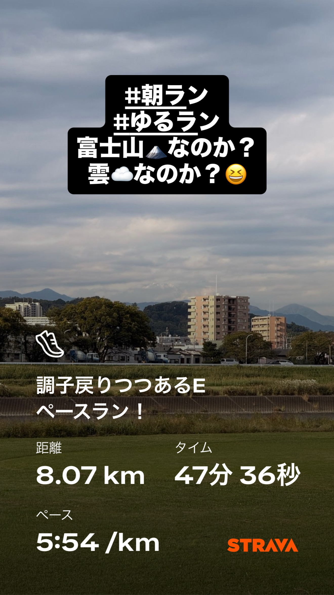
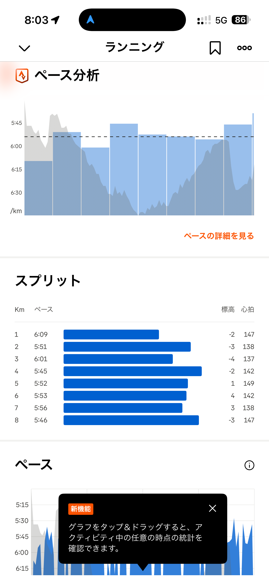
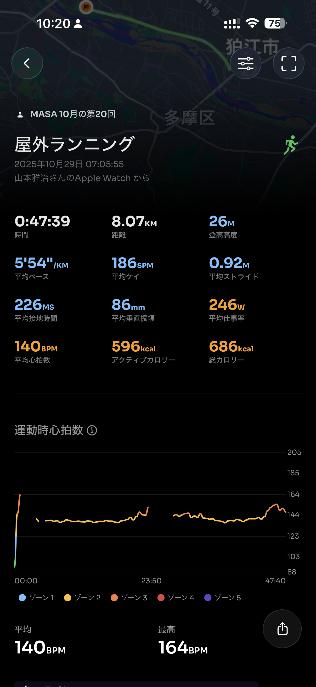
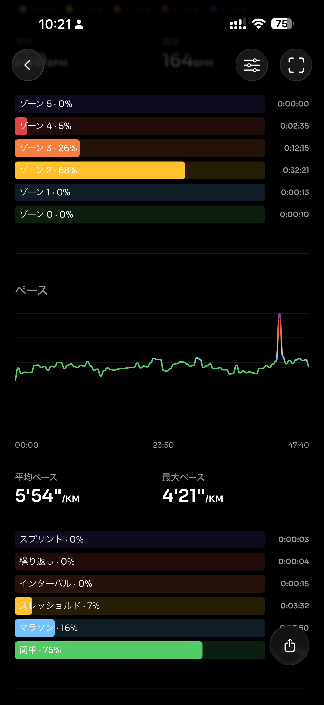
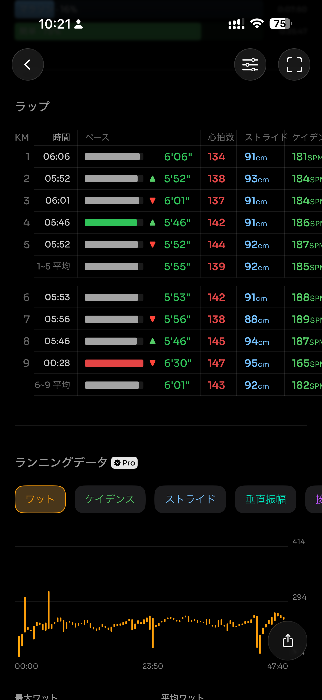
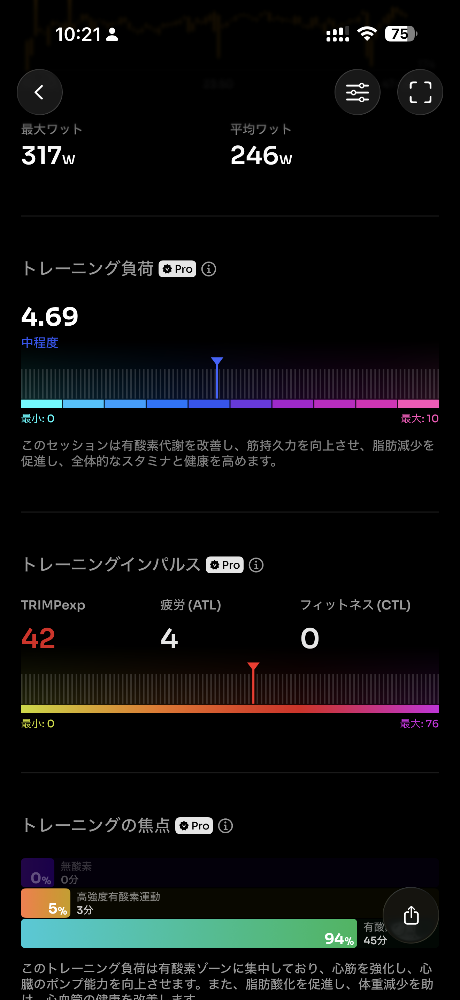
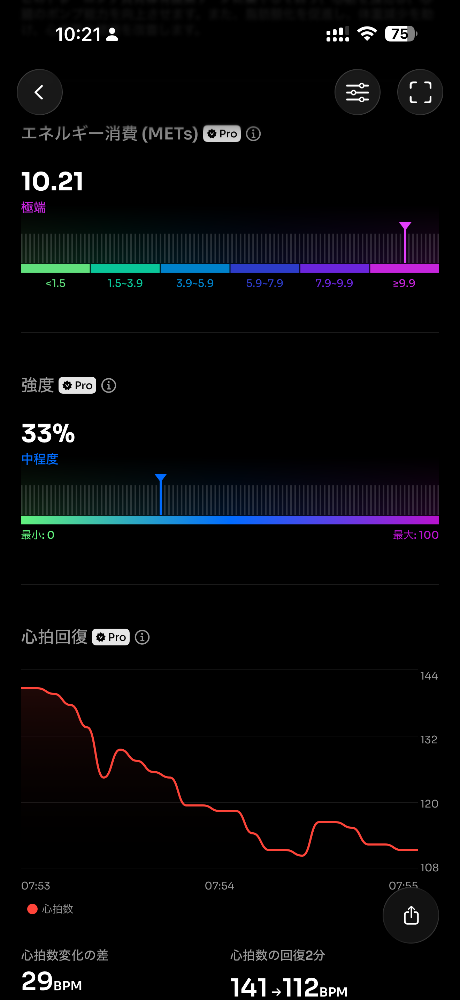
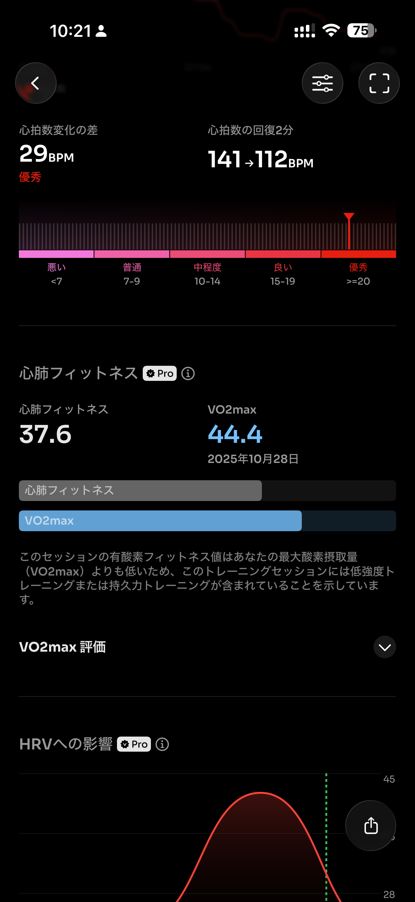
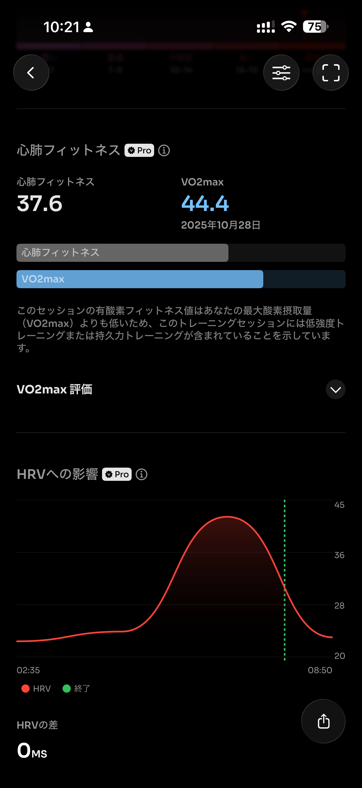
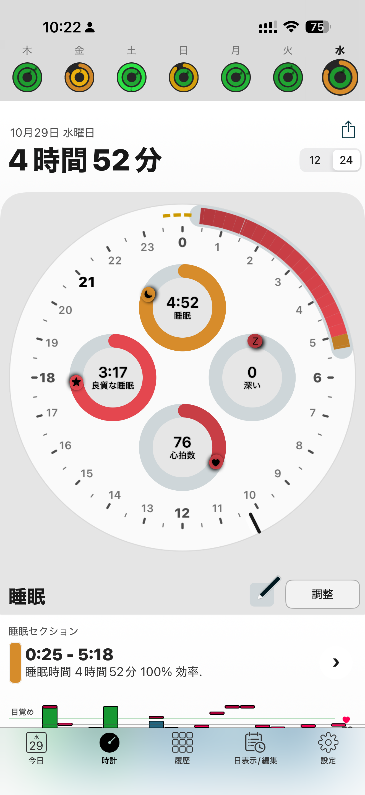

- 距離：8.07km
- 時間：00:47:39
- 平均心拍数：141
- 時間帯：7:05~7:53
- 天候：晴れ
- コース：多摩川河川敷
- 補給：なし
- 睡眠：4時間52分
- 今日の目的：Eペースラン
- コメント：だいぶ張りも落ち着いてきた。

## 📝 コーチコメント：
「フォームとリズムの安定が戻りつつある、理想的なEペース走。」
ペース・ピッチ・ストライドのバランスが良く、心拍も低く抑えられています。
特にラスト2kmで自然にビルドアップできているのは、持久筋と心肺の安定化が進んでいる証拠。
今週はこのE走を軸に、週末に向けてMペース（5:30/km前後）の刺激走を1本入れるとベストです。

## 📸 写真一覧

