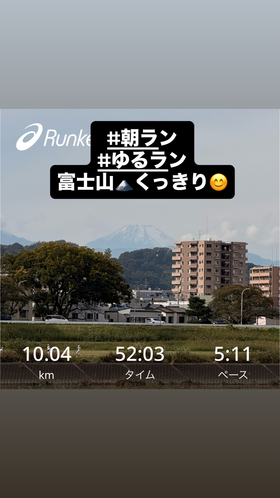
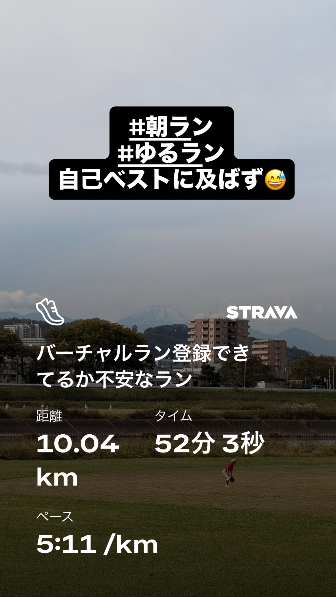
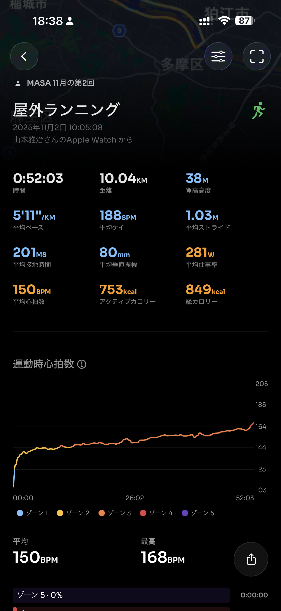
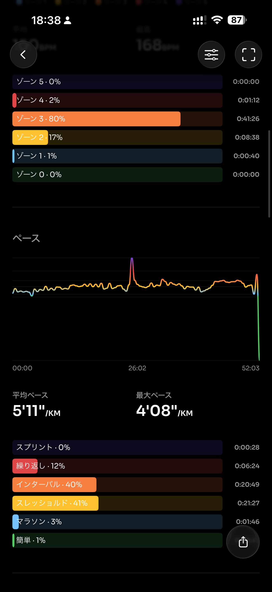
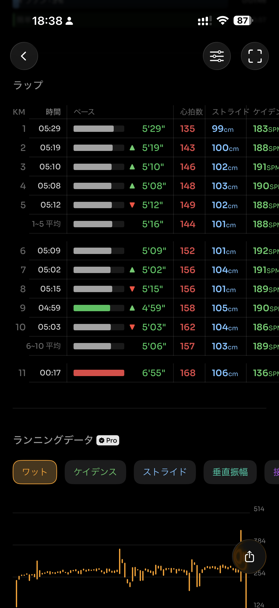
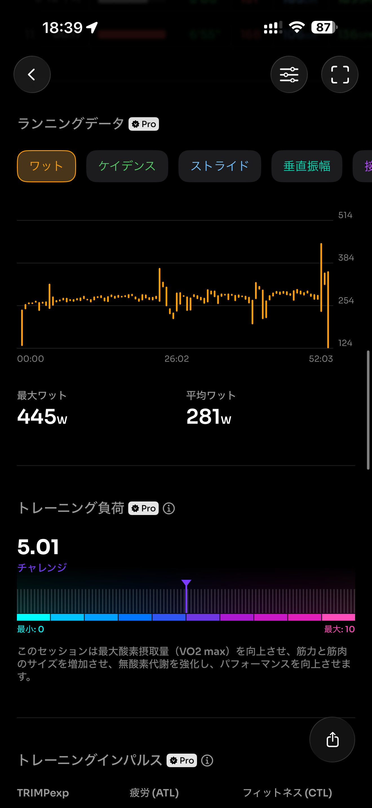
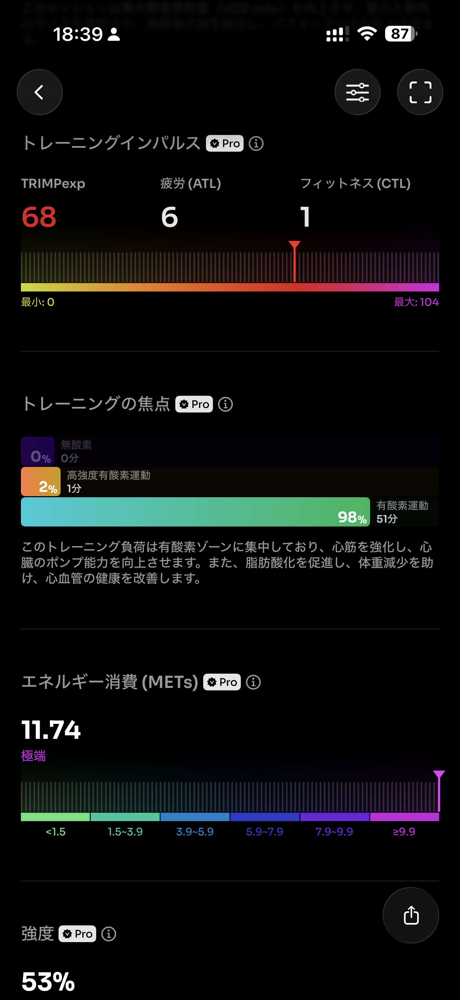
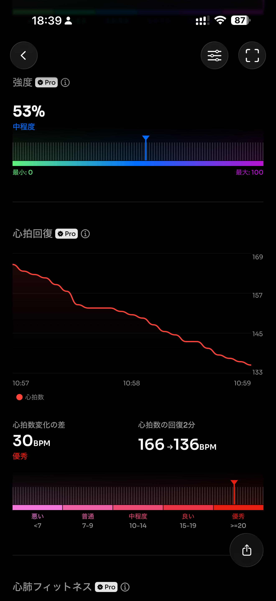
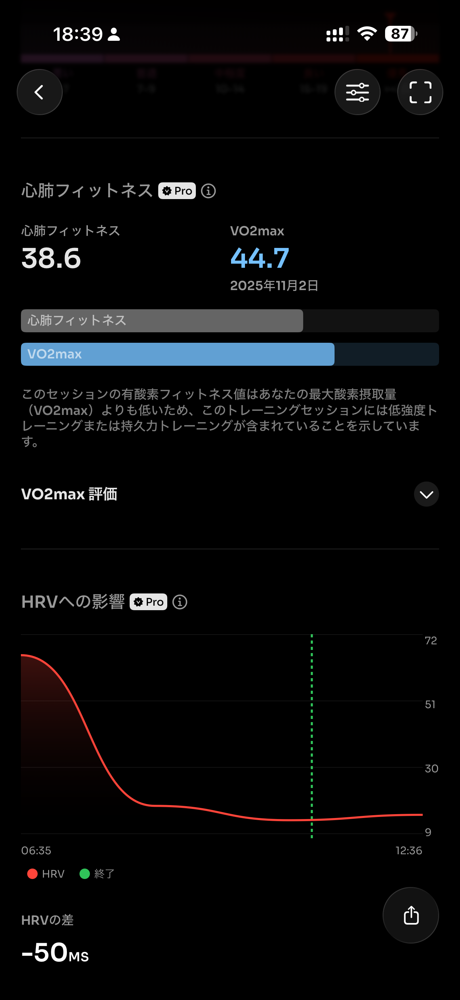
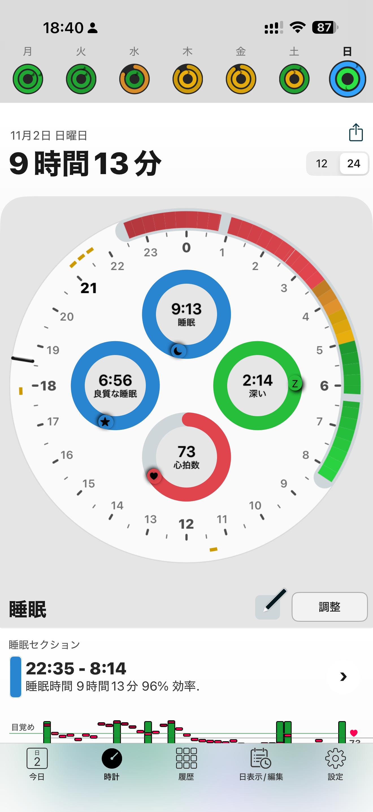

- 距離：10.04km
- 時間：00:52:03
- 平均心拍数：150
- 時間帯：10:05~10:57
- 天候：晴れ
- コース：多摩川河川敷（周回コース）
- 補給：なし（朝ジェル）
- 睡眠：9時間13分
- 今日の目的：バーチャルラン10km
- コメント：まずまずかな

## 📝 コーチコメント：
この走り、かなり完成度が高いです。
横浜マラソン後の疲労が完全に抜け、**テンポ走として最適な負荷（トレーニング負荷5.01）**になっています。
ペース配分・フォーム安定・心拍のバランスが取れていて、「今の持久＋スピードの交差点」にいる状態です。

## 📸 写真一覧

