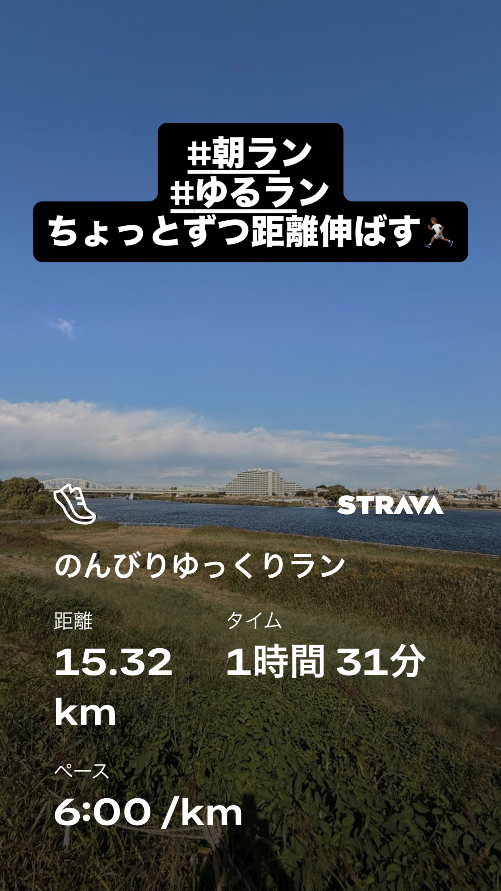
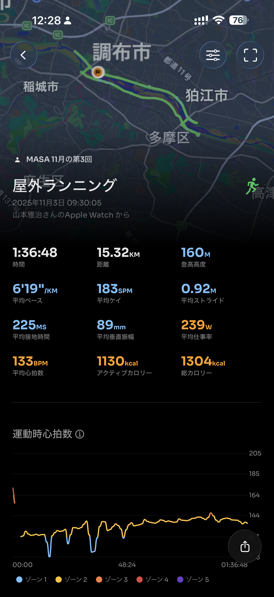
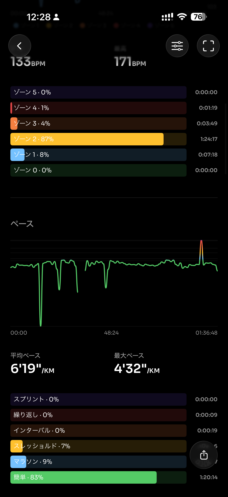
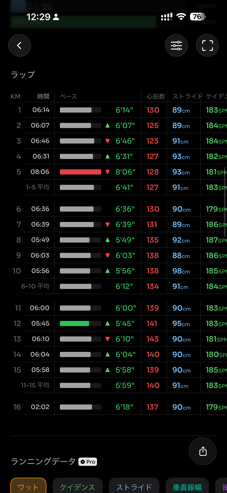
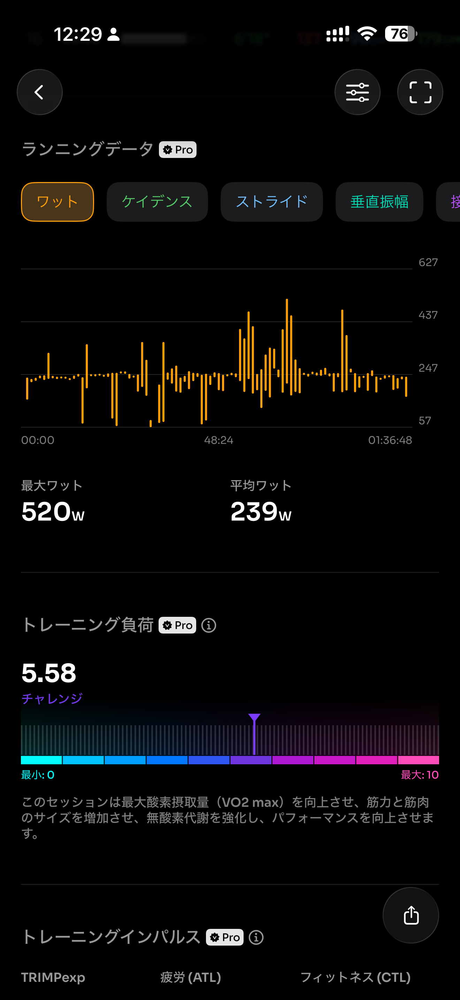
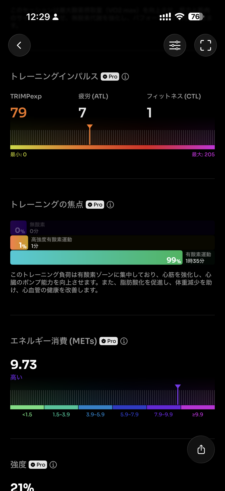
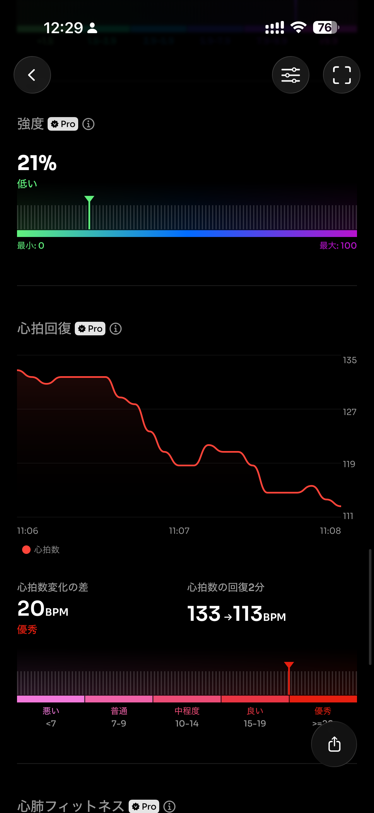
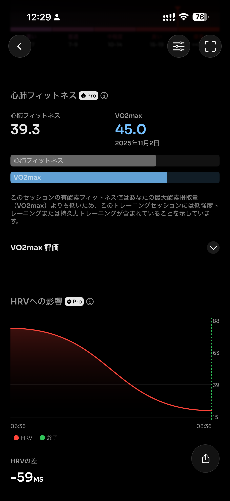
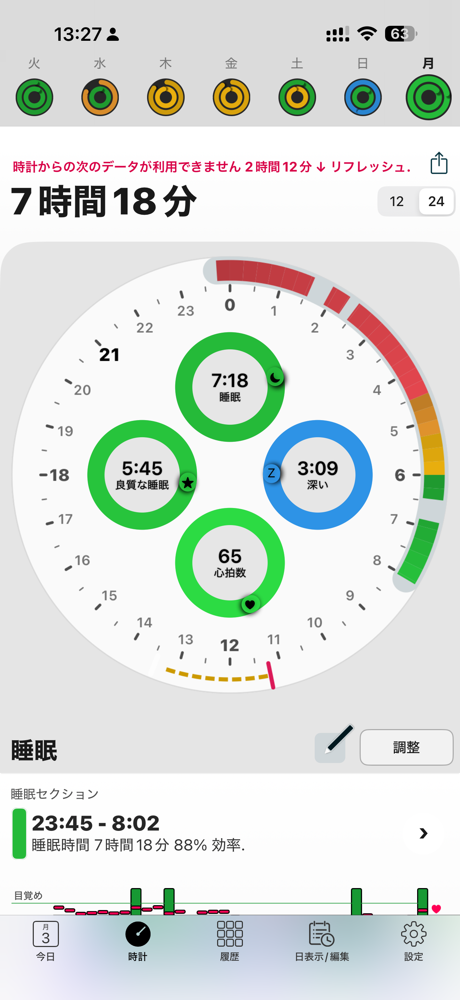

- 距離：15.32km
- 時間：01:36:48
- 平均心拍数：134
- 時間帯：9:30~11:06
- 天候：晴れ
- コース：多摩川河川敷（二ヶ領宿河原堰いったり、狛江行ったり）
- 補給：スポーツ羊羹
- 睡眠：7時間18分
- 今日の目的：15km走る
- コメント：まー、走れた。

## 📝 コーチコメント：
「ちょっとずつ距離伸ばす」まさにそのペース感でOKです。
ピーク明けのフェーズでいちばん大切なのは「脚に刺激を入れながらも、無理せず距離を積む」こと。
今日のランは**負荷5.58（チャレンジ）**で、トレーニング負荷曲線のど真ん中。
心拍も安定、VO₂maxも維持、これ以上ない“回復兼ビルド”走でした。

## 📸 写真一覧

