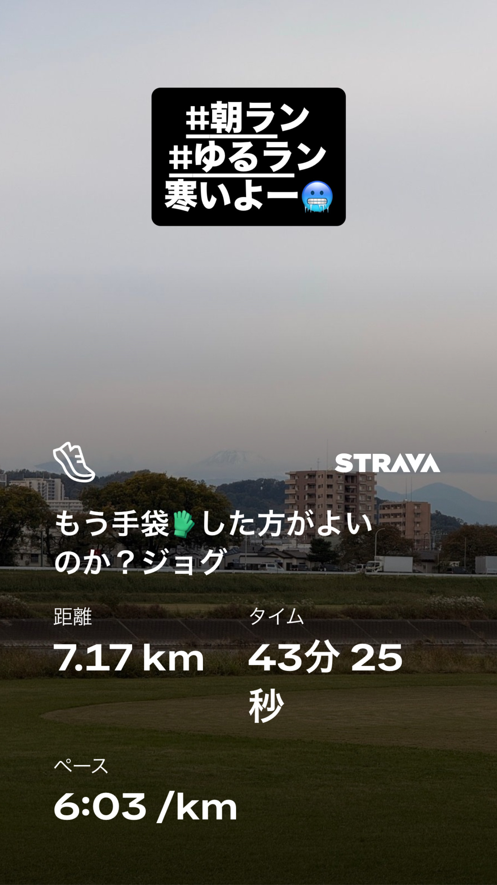
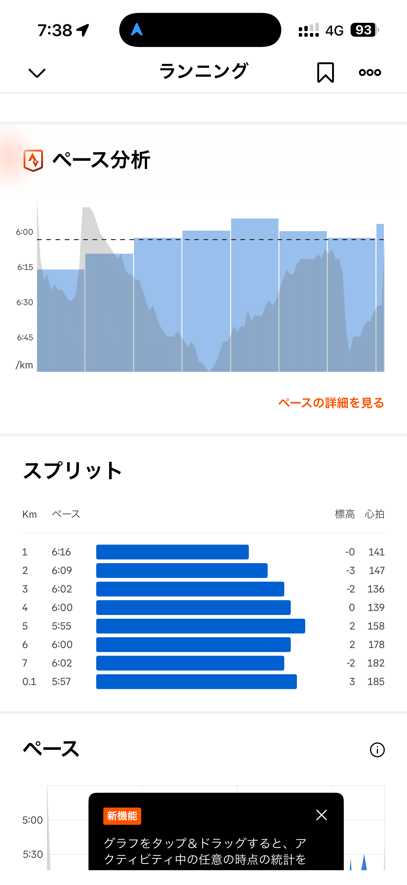
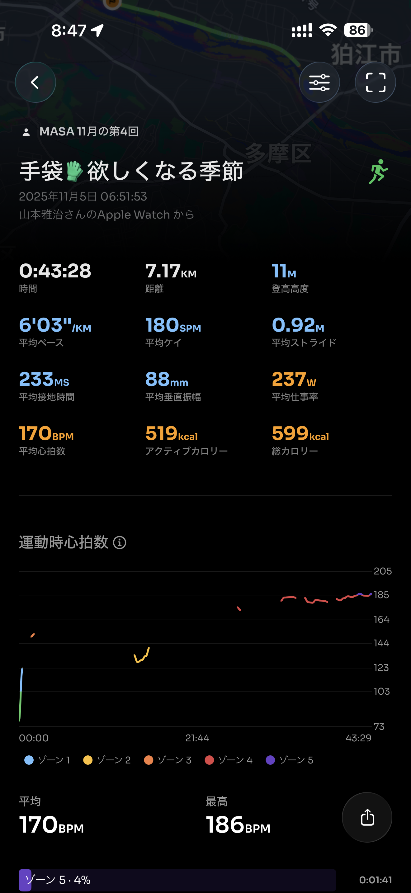
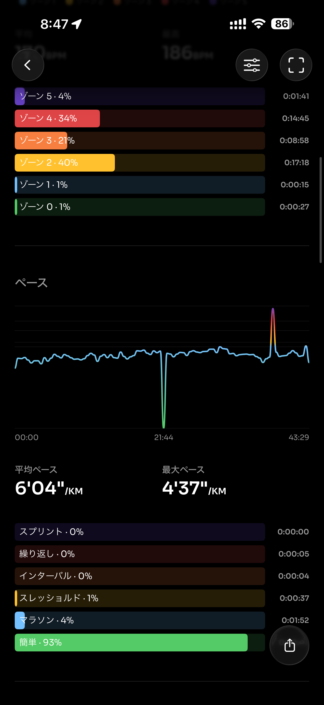
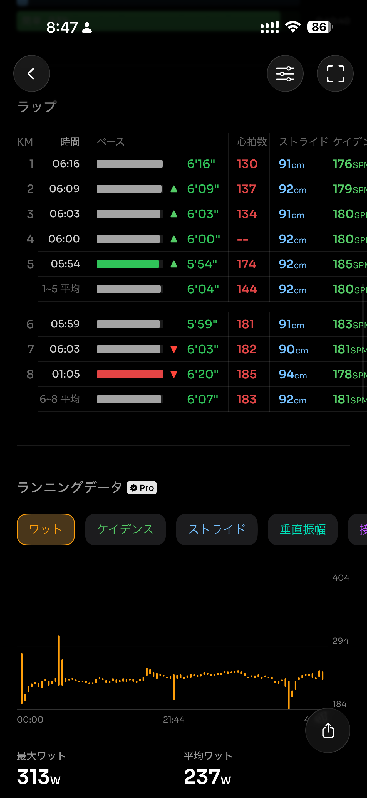
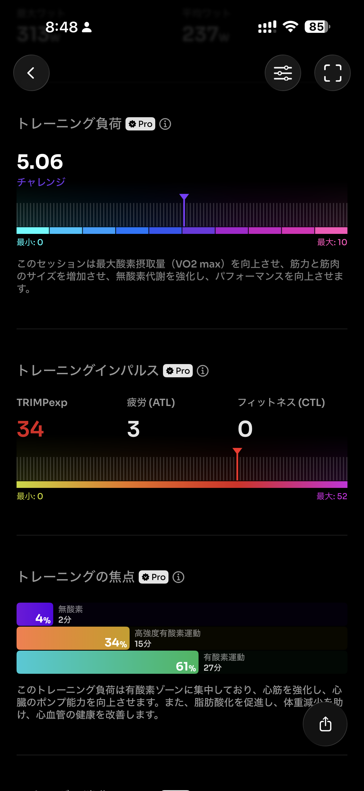
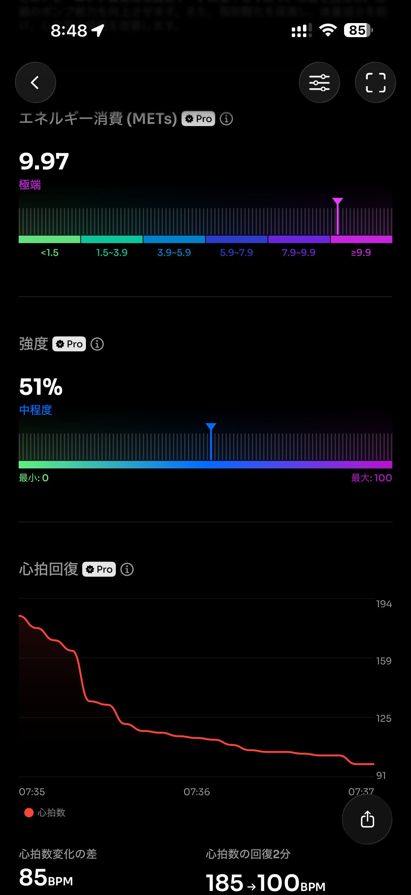
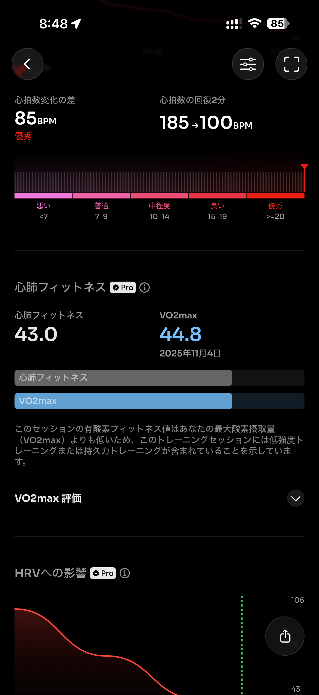
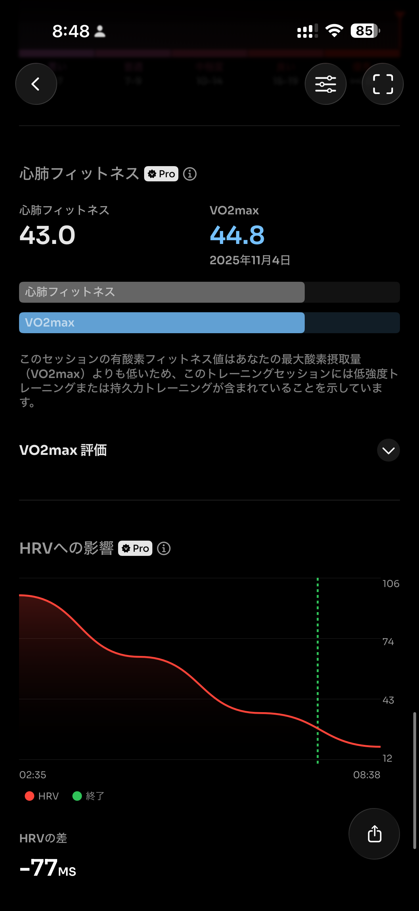
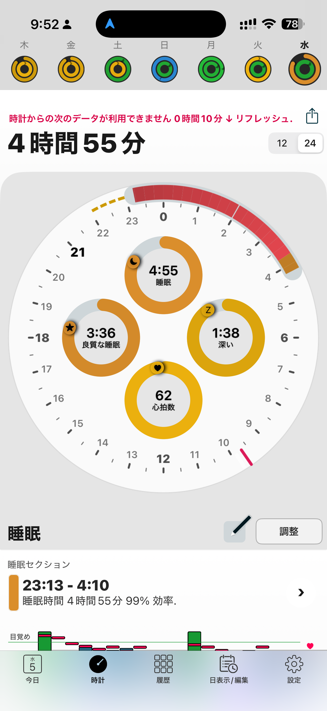

- 距離：7.17km
- 時間：00:43:28
- 平均心拍数：163
- 時間帯：6:51~7:35
- 天候：曇り
- コース：多摩川河川敷
- 補給：朝ジェル
- 睡眠：4時間55分
- 今日の目的：リカバリージョグ
- コメント：心拍数だけ上がってちょっと心配

## 📝 コーチコメント：
フォーム安定・VO₂max維持で上出来です。睡眠不足の影響で心拍が上がっただけなので問題なし。

## 📸 写真一覧

