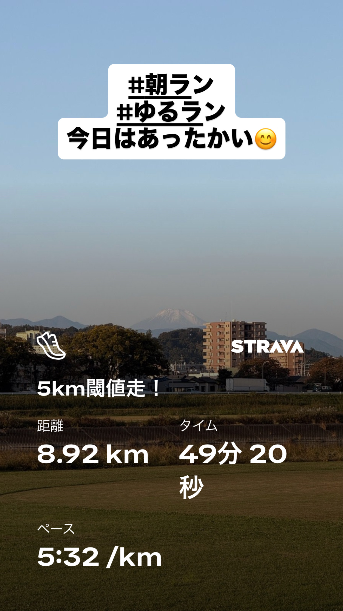
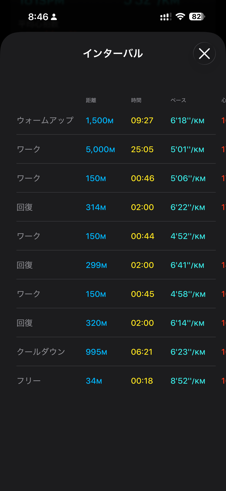
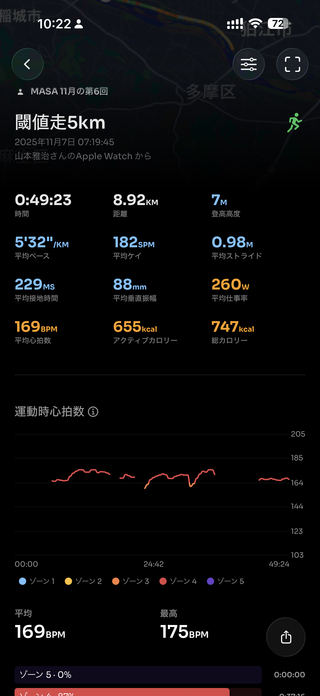
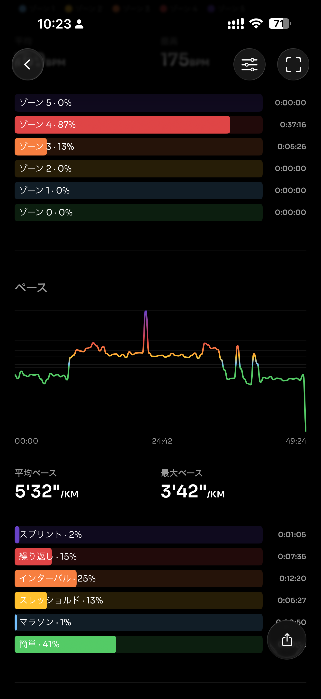
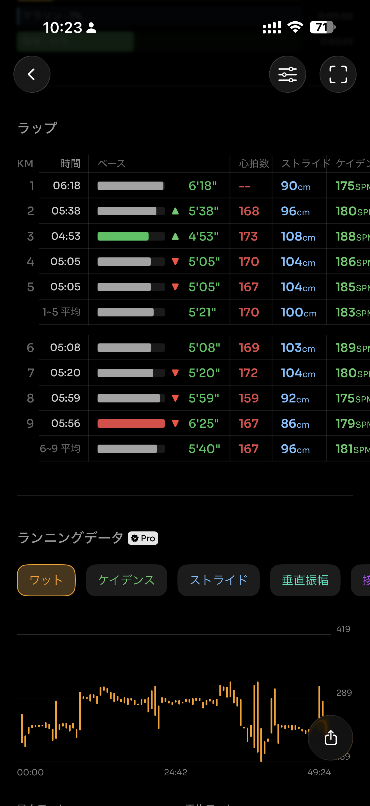
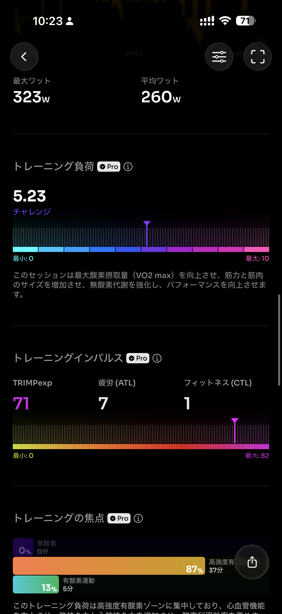
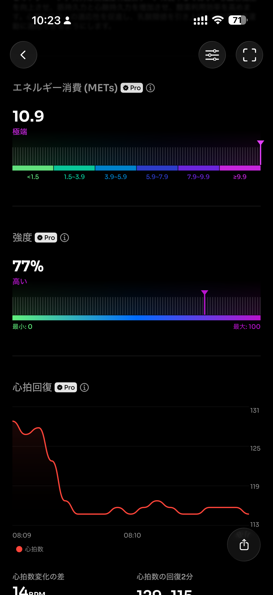
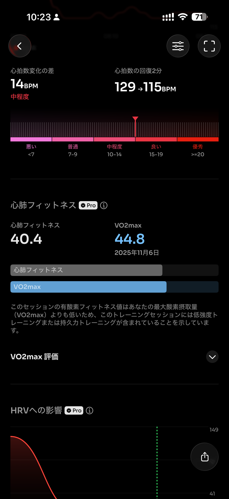
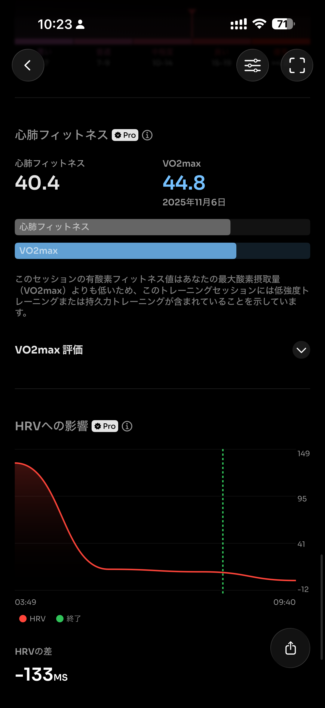
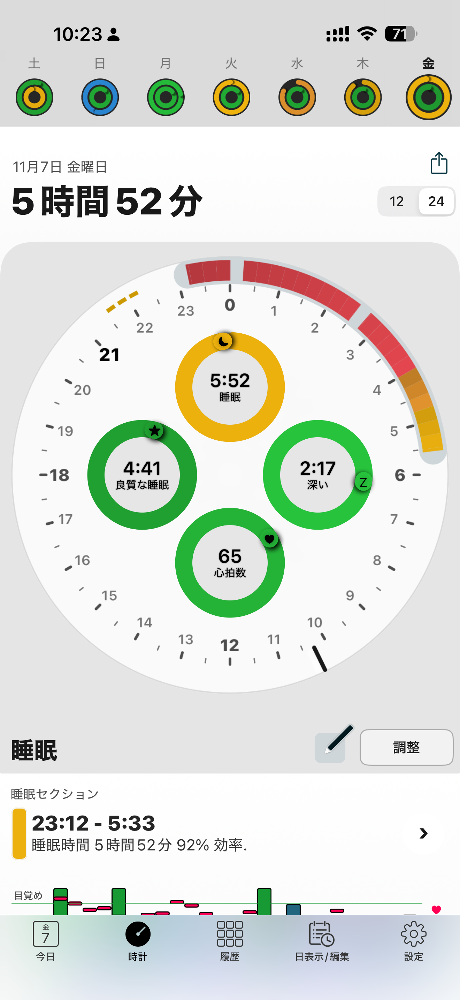

- 距離：8.92km
- 時間：00:49:23
- 平均心拍数：168
- 時間帯：7:19~8:09
- 天候：晴れ
- コース：多摩川河川敷（折り返し）
- 補給：朝ジェル
- 睡眠：5時間52分
- 今日の目的：閾値走
- コメント：うまくできたぜ閾値走

## 📝 コーチコメント：
閾値走がキレていて、とても良いスピード持久力の刺激になりました！流しも丁寧でフォームの質が上がっています。

## 📸 写真一覧

