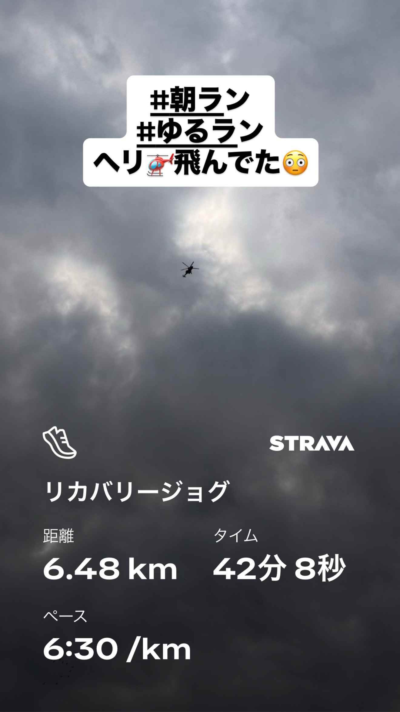
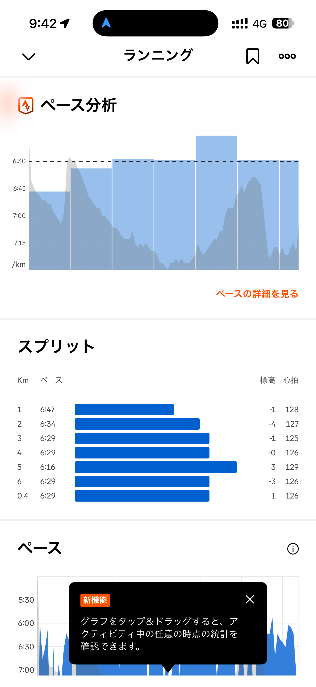
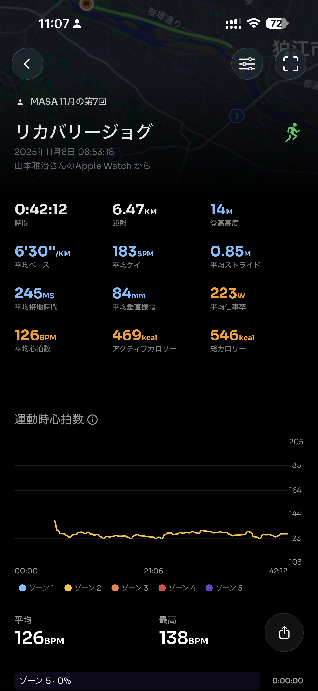
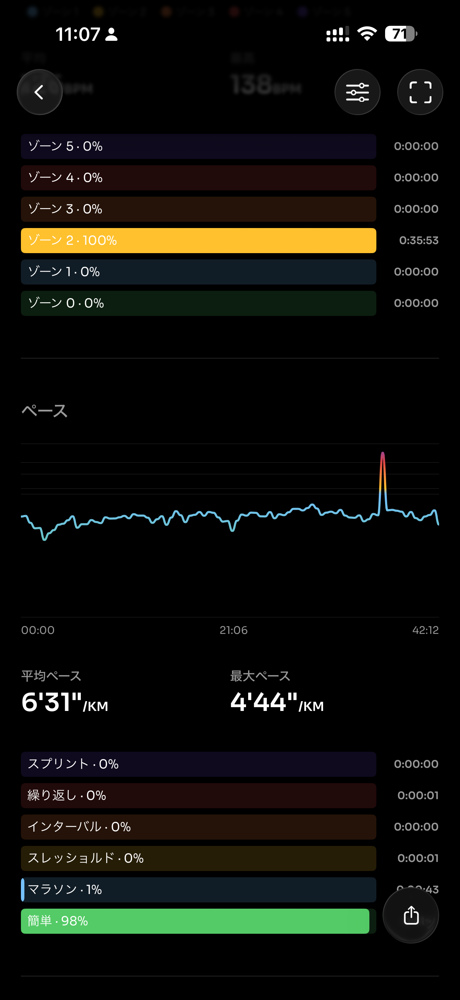
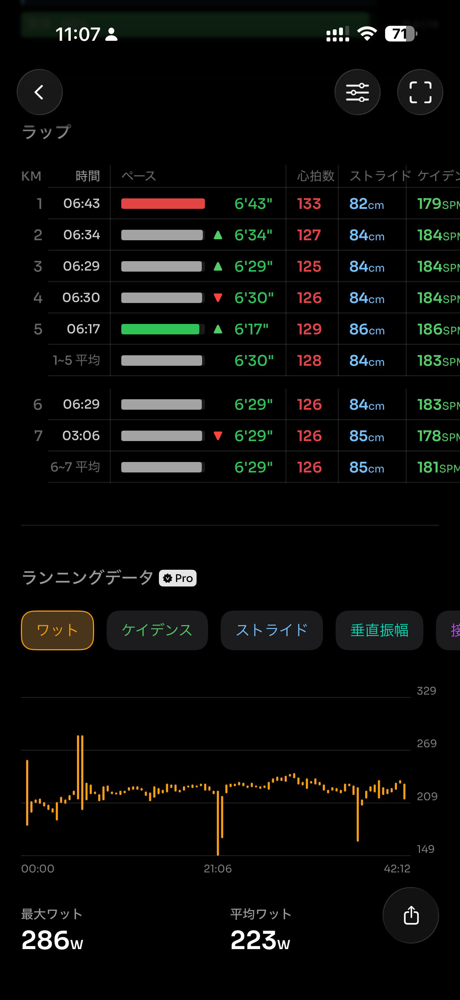
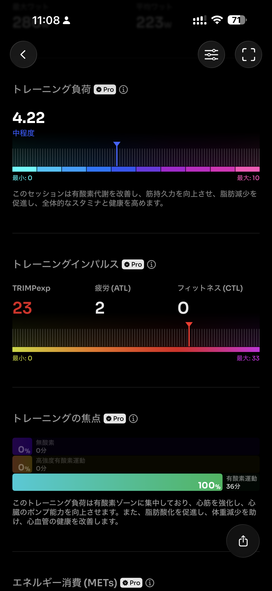
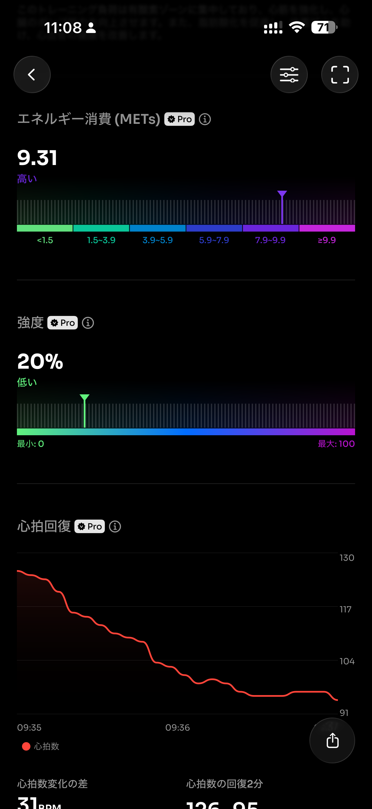
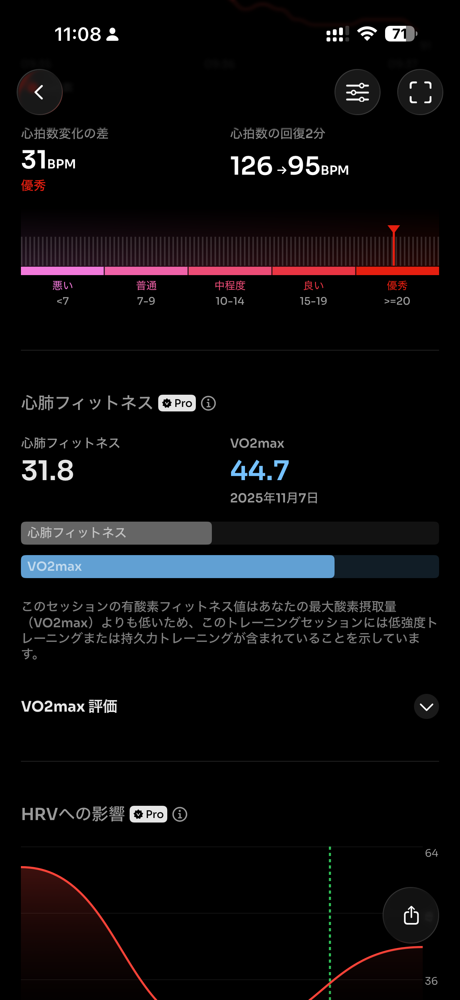
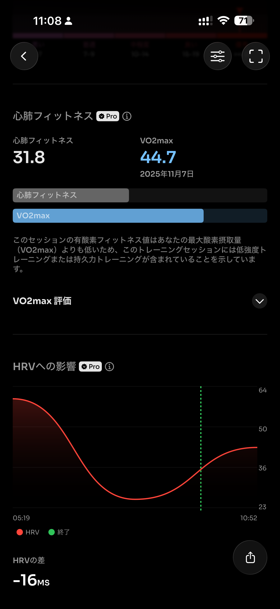
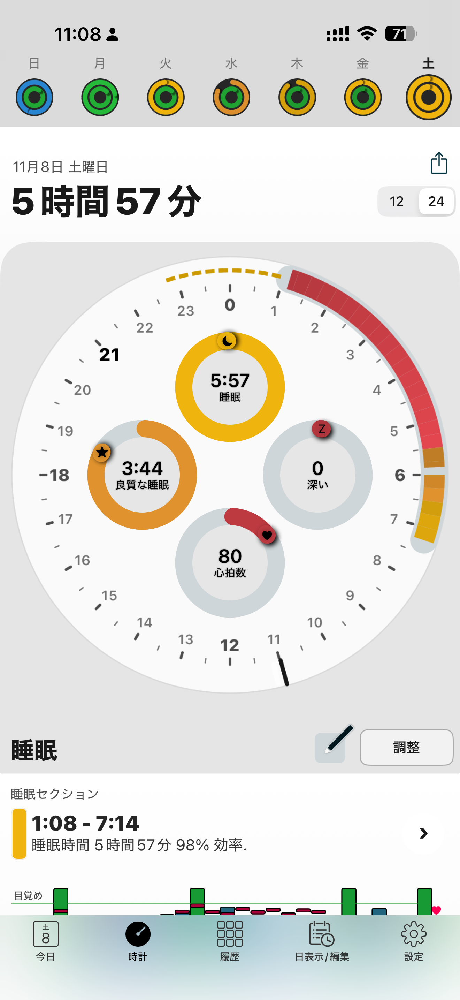

- 距離：6.47km
- 時間：00:42:12
- 平均心拍数：127
- 時間帯：8:53~9:35
- 天候：曇りのち晴れ
- コース：多摩川河川敷（折り返し）
- 補給：なし（朝ジェル）
- 睡眠：5時間57分
- 今日の目的：リカバリージョグ
- コメント：リカバリージョグ

## 📝 コーチコメント：
落とすところはしっかり落としていてすごく良い。明日の判断材料としても十分なナイスリカバリー。

## 📸 写真一覧

