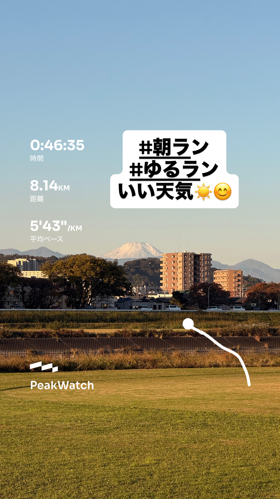
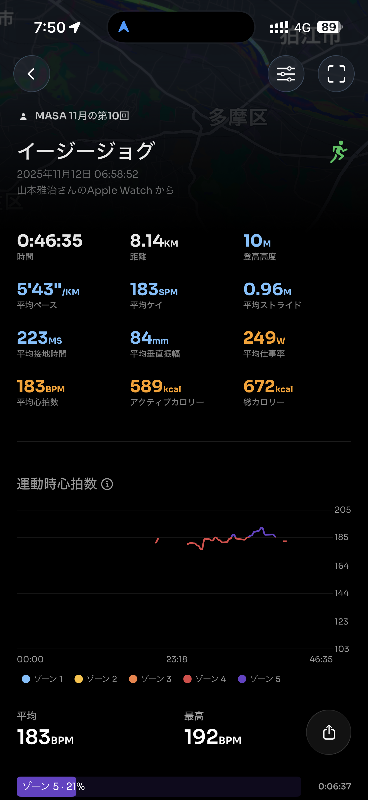
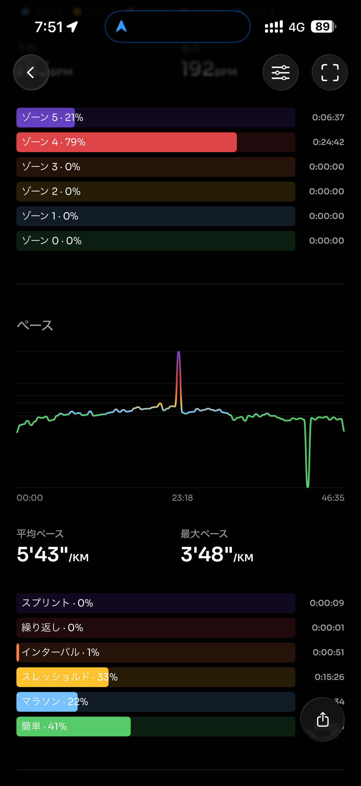
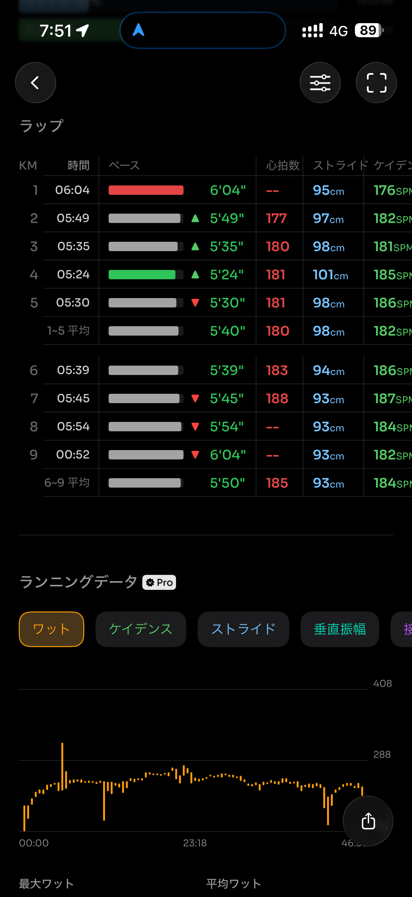
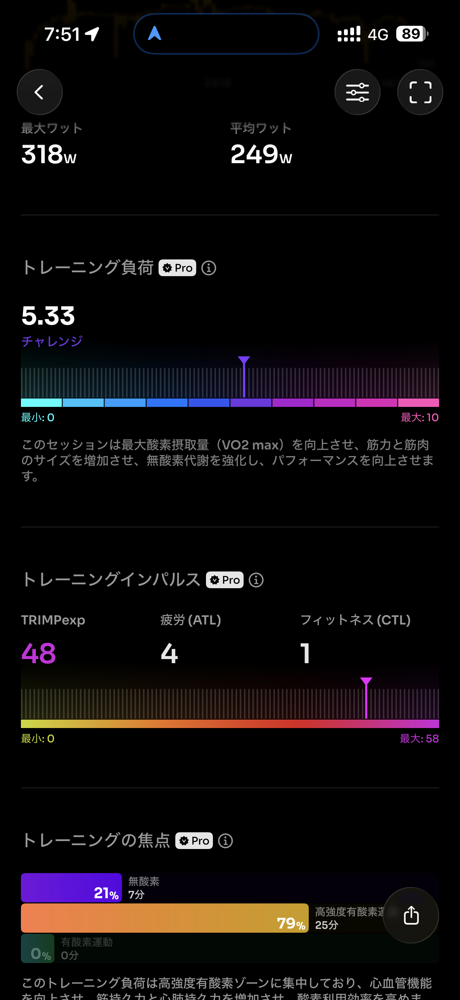
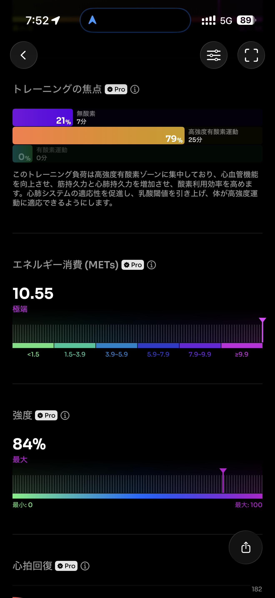
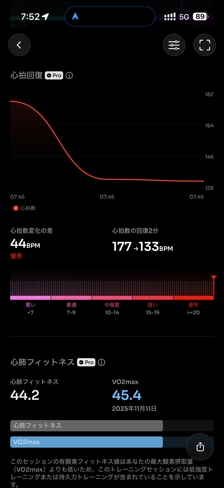
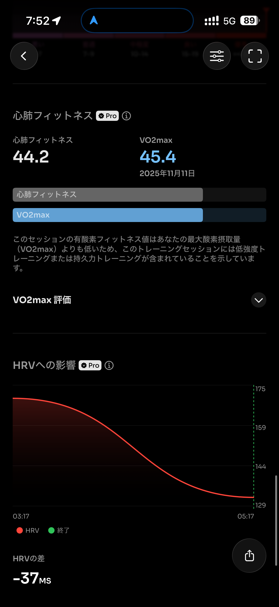
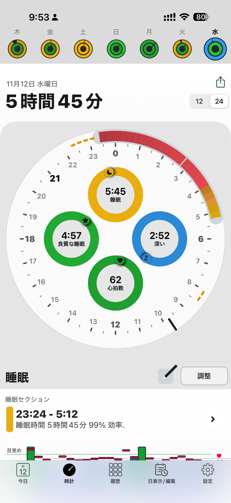

- 距離：8.14km
- 時間：00:46:35
- 平均心拍数：183
- 時間帯：6:58~7:45
- 天候：晴れ
- コース：多摩川河川敷（折り返し）
- 補給：朝ジェル
- 睡眠：5時間45分
- 今日の目的：イージージョグ
- コメント：天気気持ちよかった

## 📝 コーチコメント：
E〜Mペースの中間でリズム良く走れており、フォームも安定。心拍回復も優秀で、持久力・効率ともに上向きです。

## 📸 写真一覧

