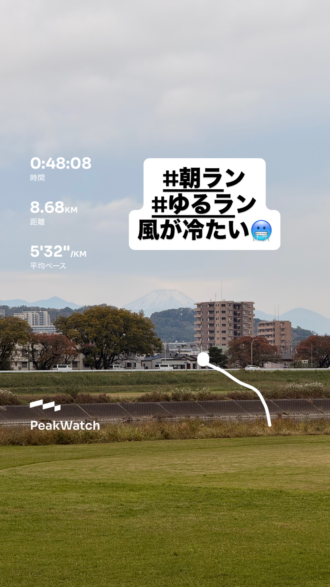
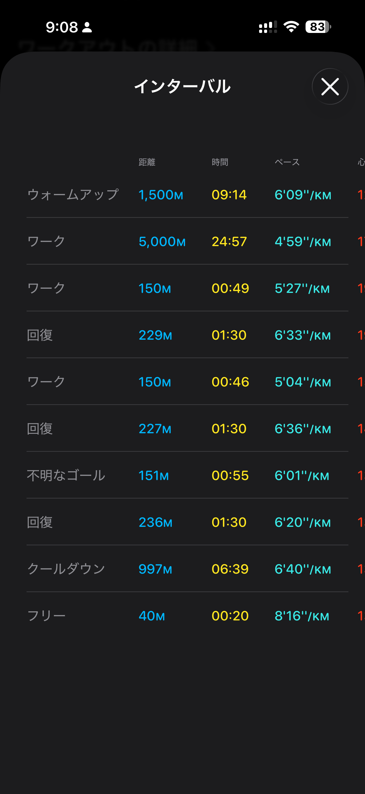
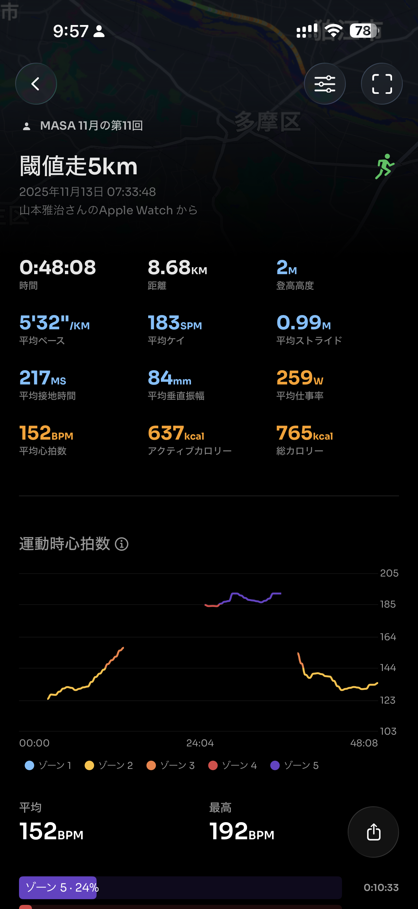
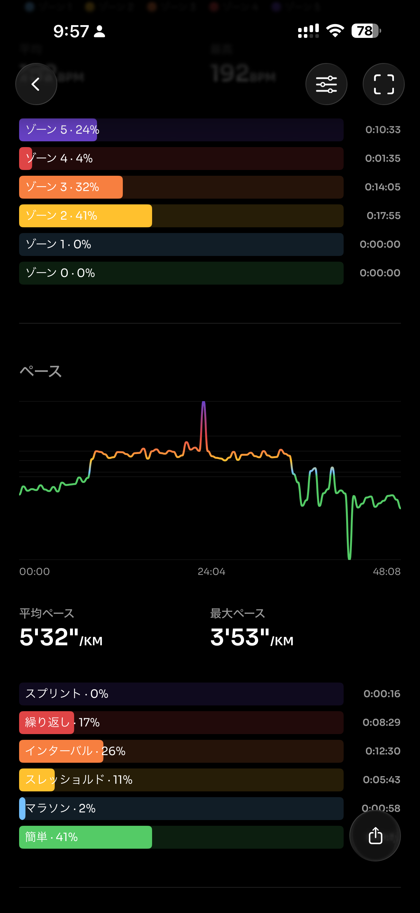
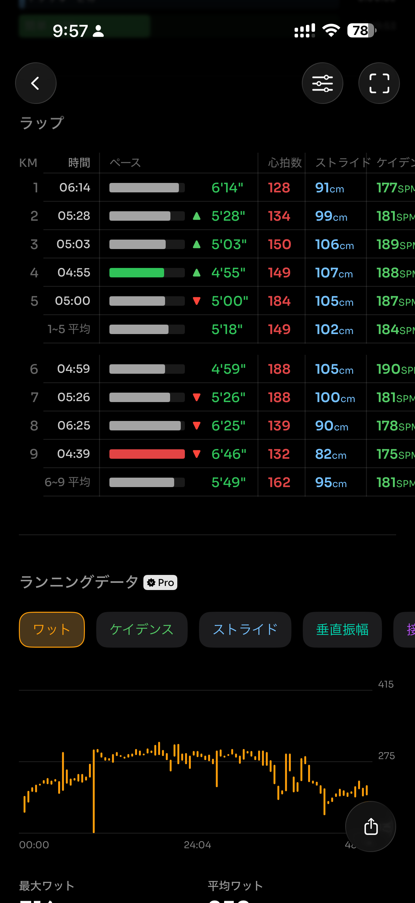
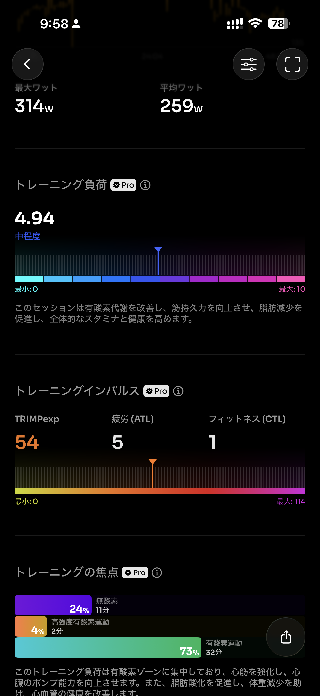
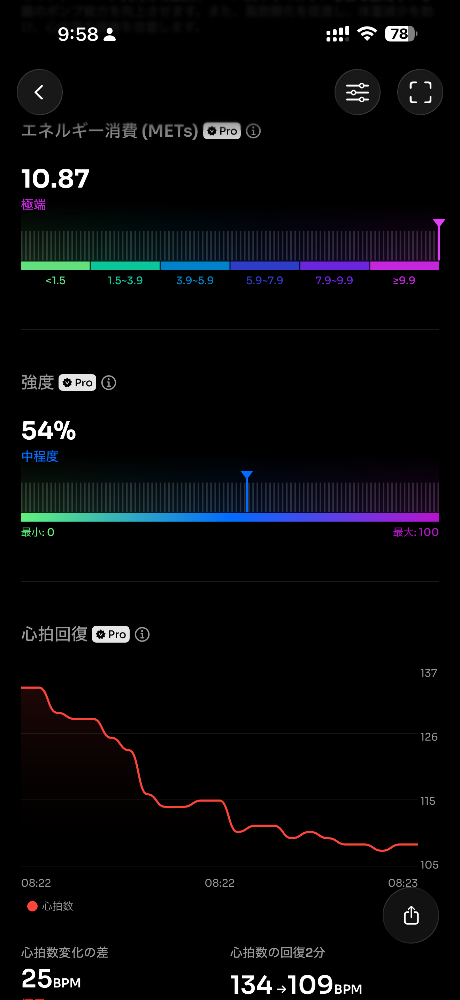
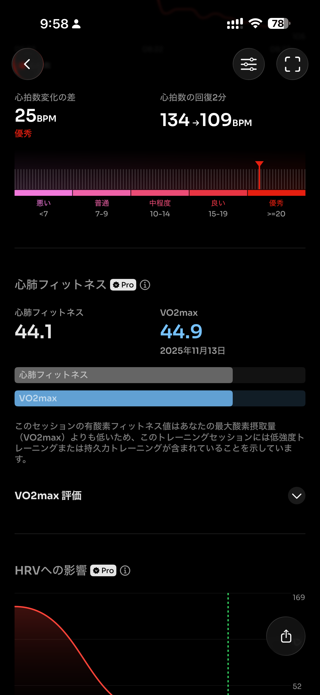
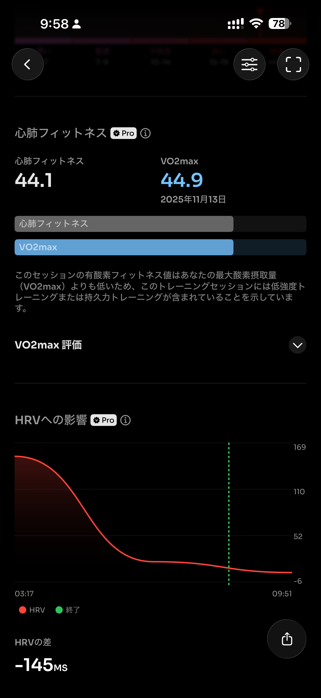
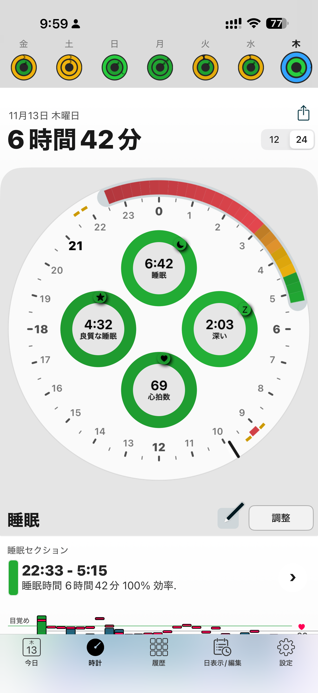

- 距離：8.68km
- 時間：00:48:08
- 平均心拍数：153
- 時間帯：7:33~8:21
- 天候：曇り
- コース：多摩川河川敷（折り返し）
- 補給：朝ジェル
- 睡眠：6時間42分
- 今日の目的：閾値走
- コメント：キロ5分切れたよ！

## 📝 コーチコメント：
序盤からリズム良く入り、最後までペース維持が見事。VO₂max向上と心肺の持久力アップにつながる理想的な閾値走です。

## 📸 写真一覧

