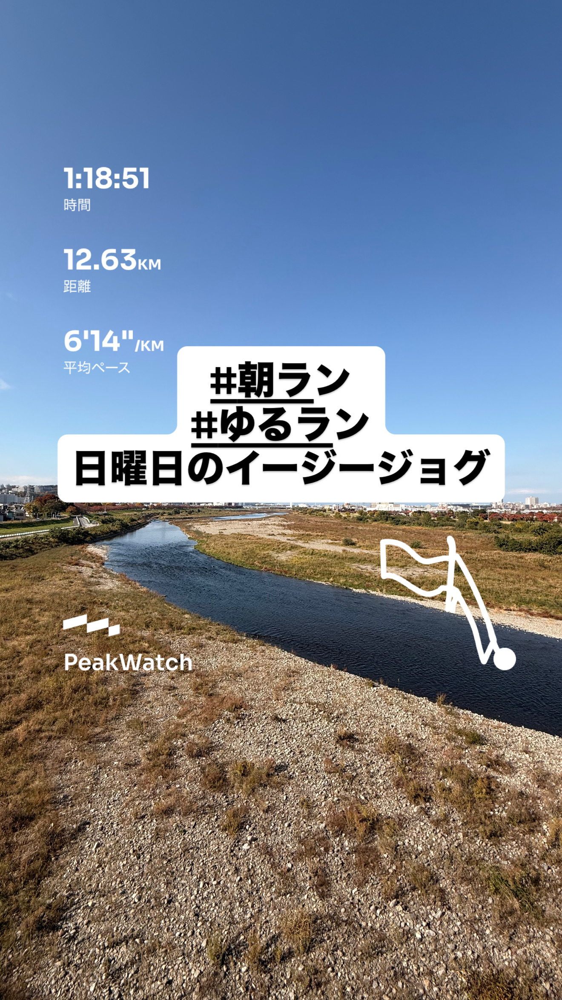
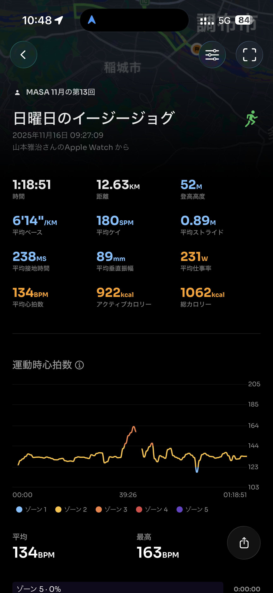
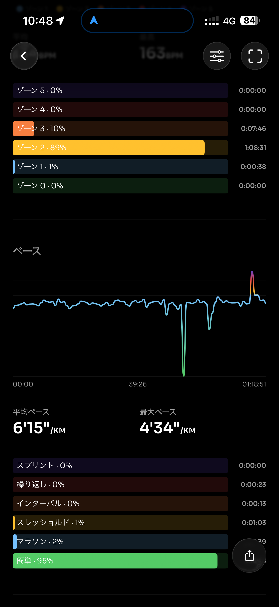
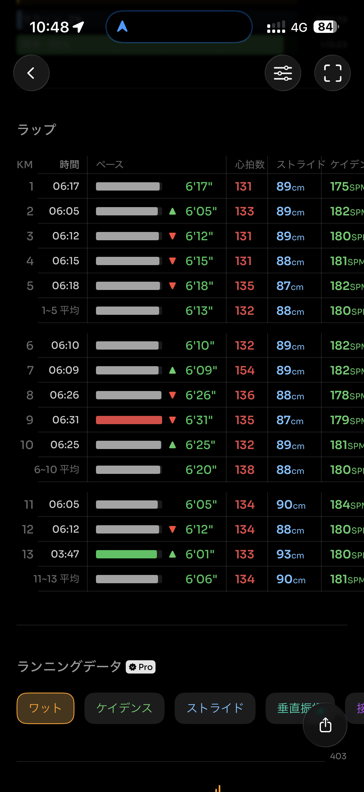
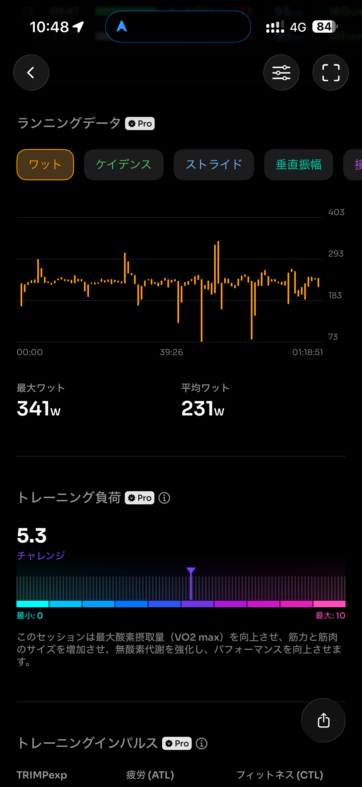
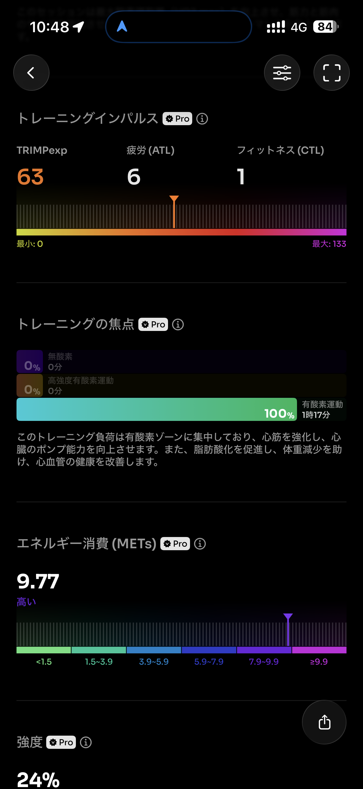
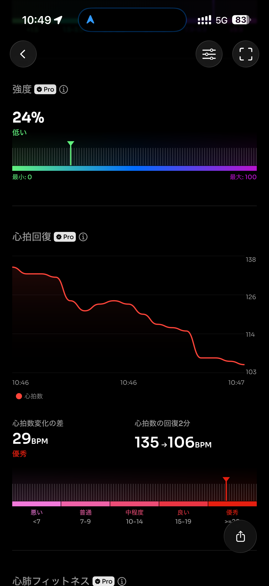
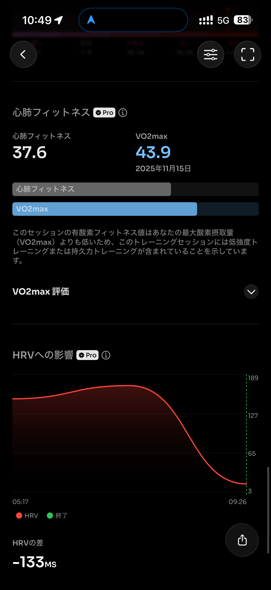
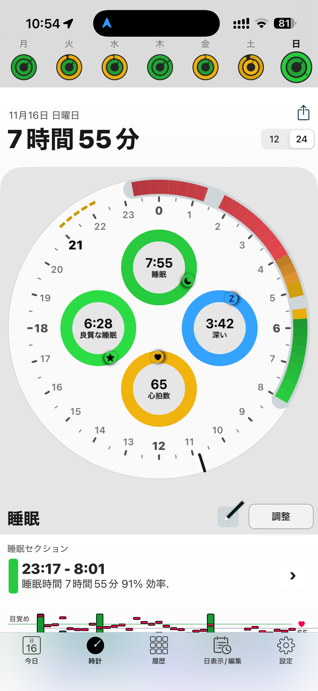

- 距離：12.63km
- 時間：01:18:51
- 平均心拍数：134
- 時間帯：9:27~10:46
- 天候：晴れ
- コース：多摩川河川敷（是政方面、稲城大橋往復）
- 補給：朝ジェル
- 睡眠：7時間55分
- 今日の目的：イージージョグ
- コメント：ちゃんとイージージョグ

## 📝 コーチコメント：
今日は完璧なイージージョグ！心拍も安定していて、30km前の調整として理想的な走りだったよ。

## 📸 写真一覧

