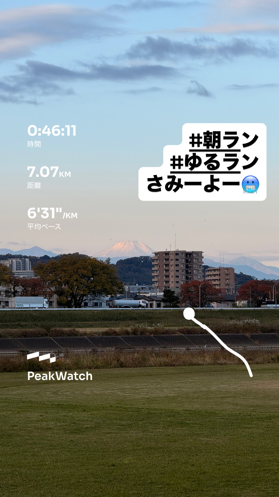
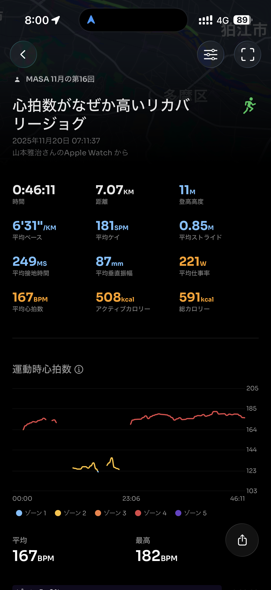
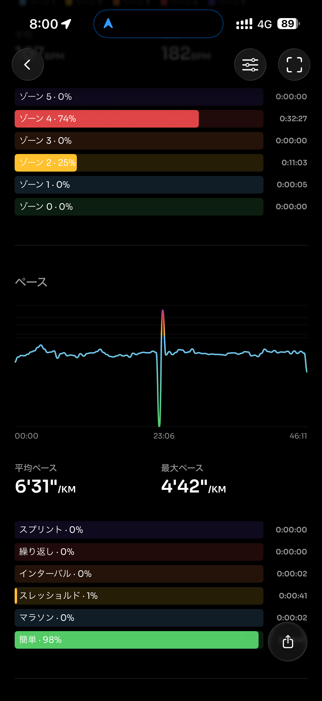
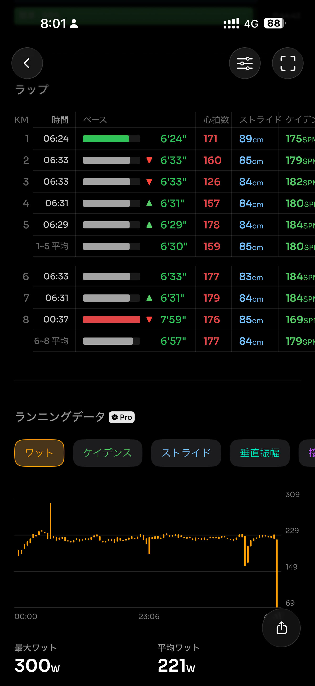
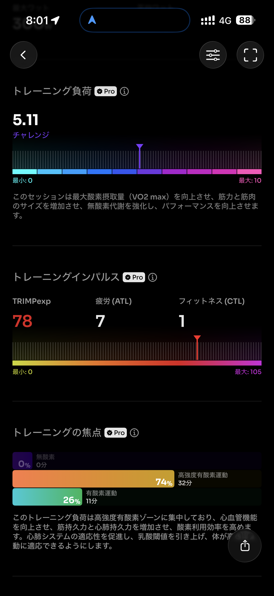
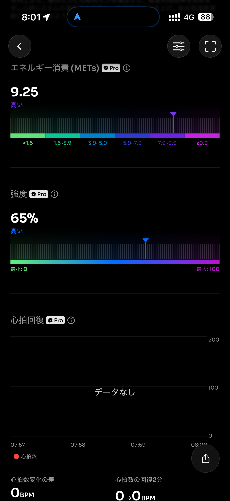
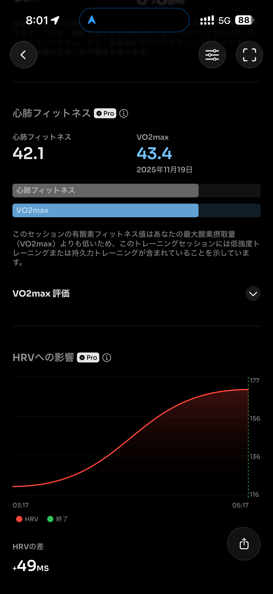
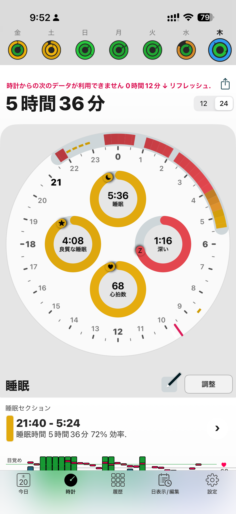

- 距離：7.07km
- 時間：00:46:11
- 平均心拍数：165
- 時間帯：7:11~7:57
- 天候：晴れ
- コース：多摩川河川敷（折り返し）
- 補給：なし
- 睡眠：5時間36分
- 今日の目的：リカバリージョグ
- コメント：手首冷たすぎたのか？心拍数が異常値

## 📝 コーチコメント：
リズムは非常に良く、実質的には軽いEラン。心拍は誤計測なので気にしないでOK、脚の疲労は十分抜けています。

## 📸 写真一覧

