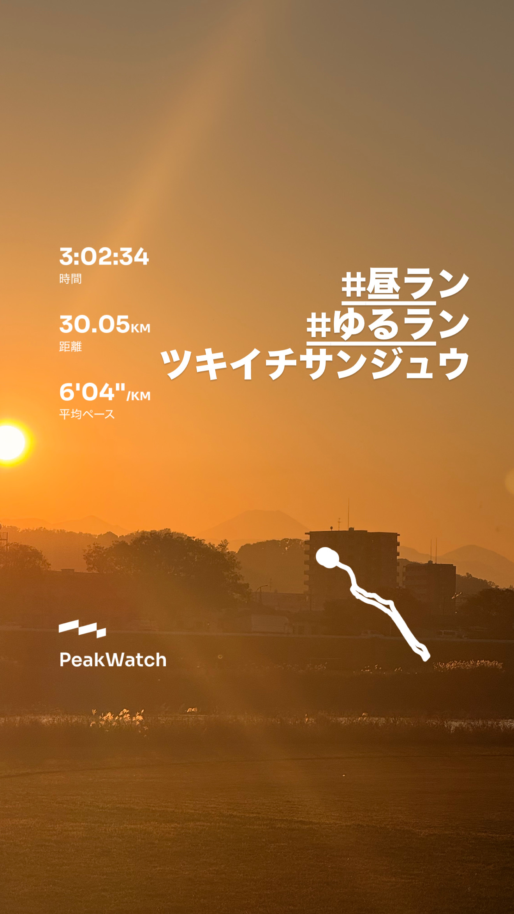
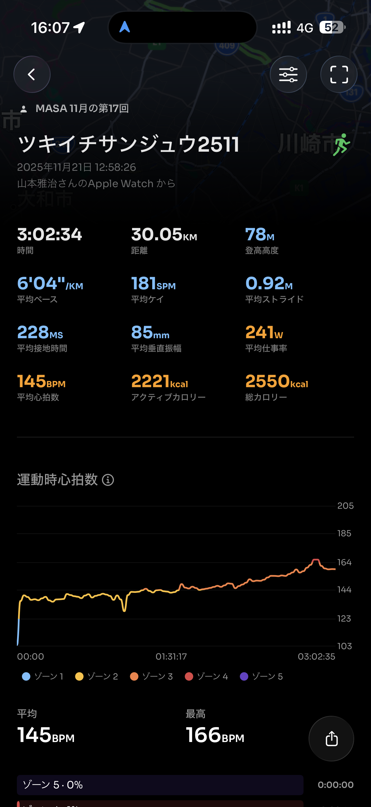
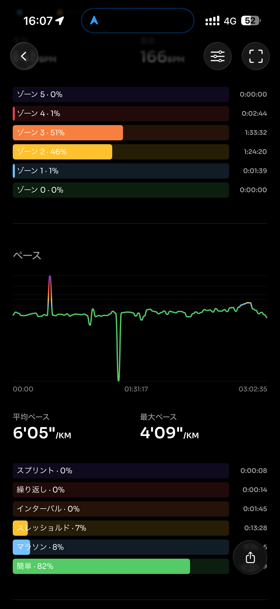
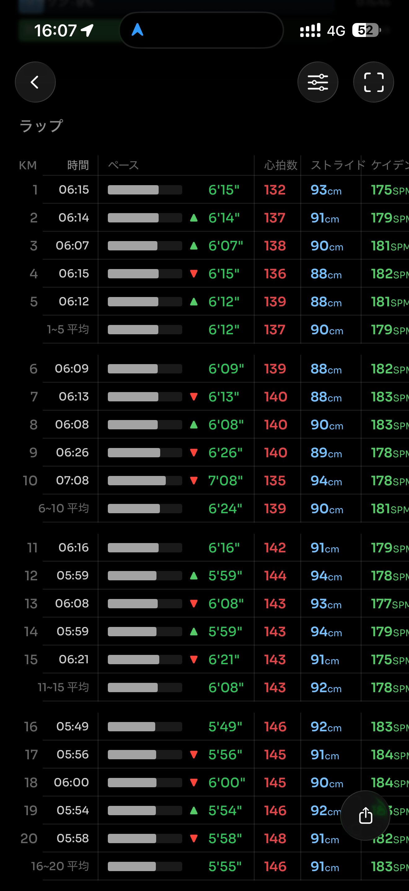
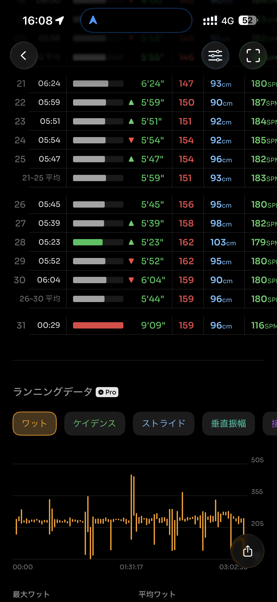
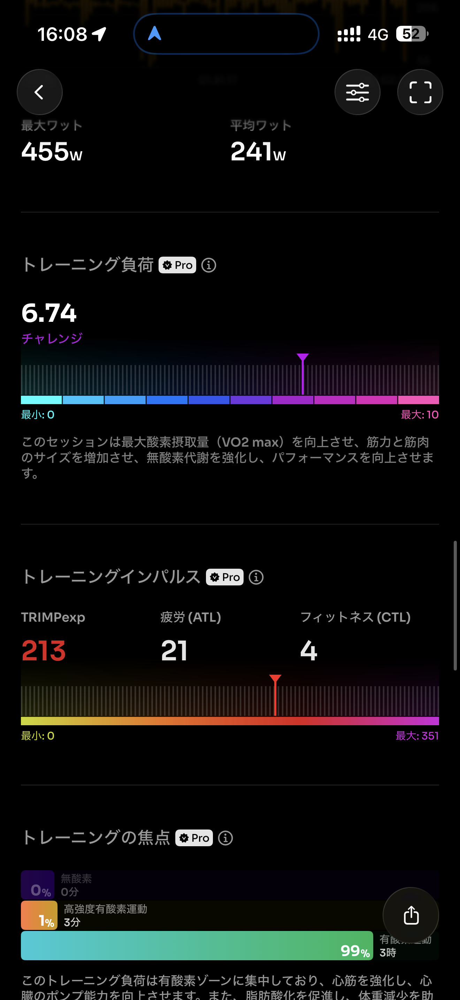
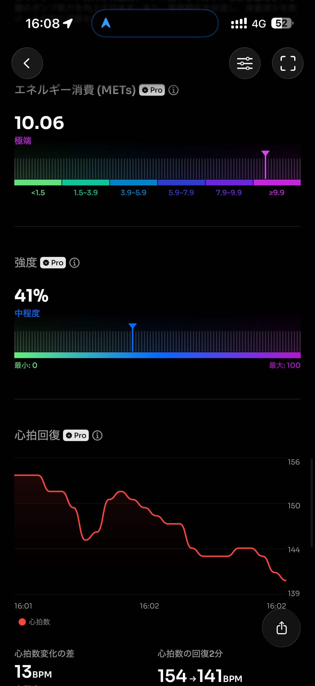
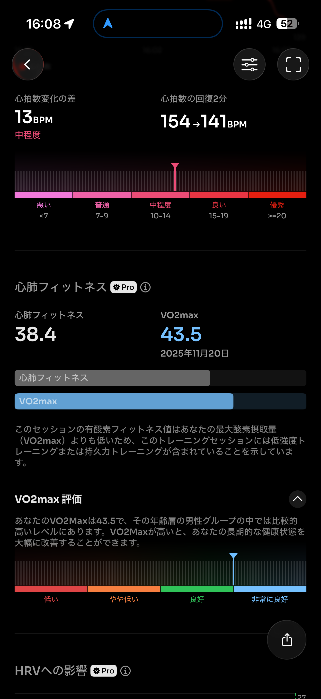
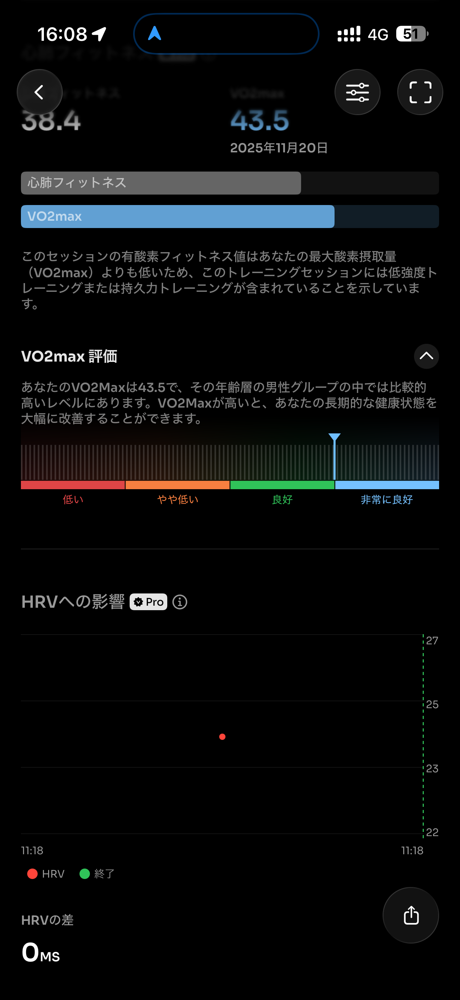
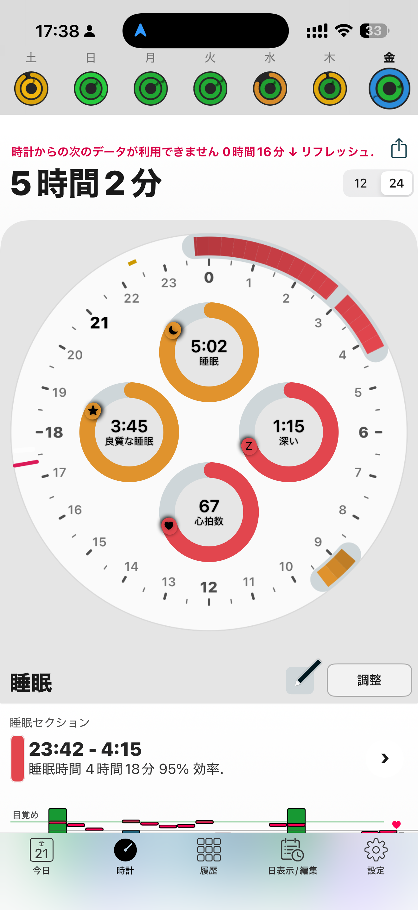

- 距離：30.05km
- 時間：03:02:34
- 平均心拍数：146
- 時間帯：12:58~16:01
- 天候：晴れ
- コース：多摩川河川敷（丸子橋周回）
- 補給：ジェル2つ
- 睡眠：5時間2分
- 今日の目的：30km走
- コメント：疲れたーーー

## 📝 コーチコメント：
後半までフォームが安定していて、心拍も暴れず、最後少し上げてもキレが残っていたのは強さの証拠。

## 📸 写真一覧

