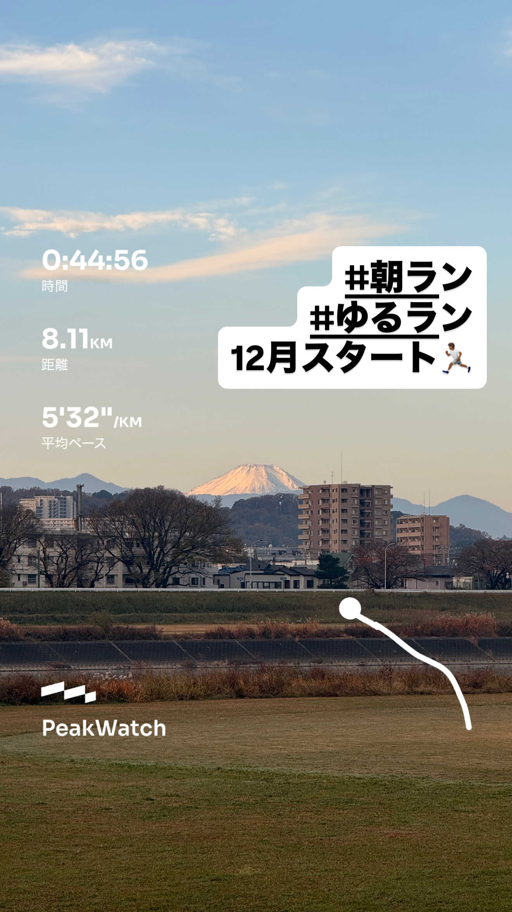
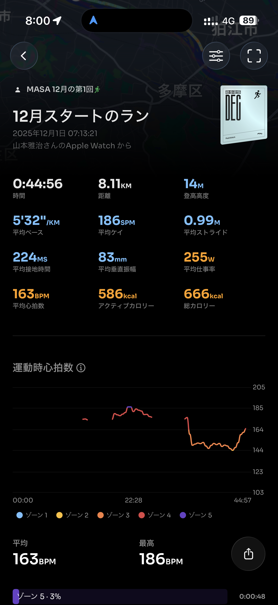
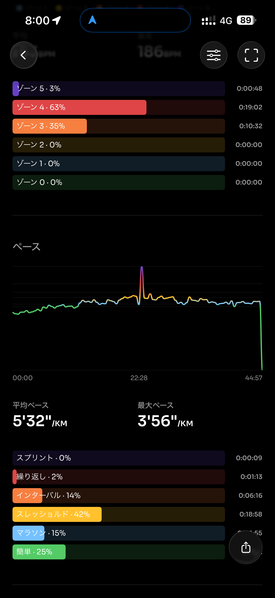
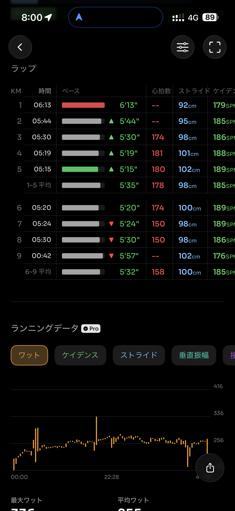
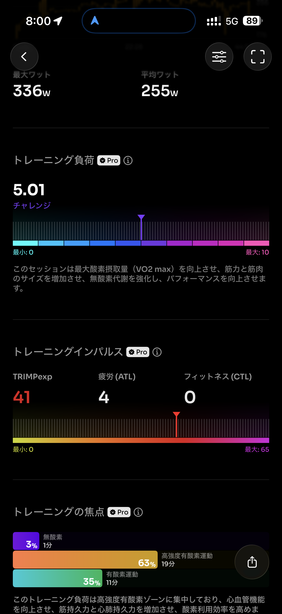
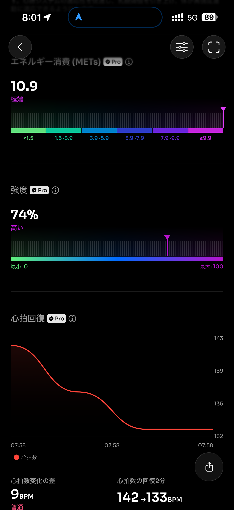
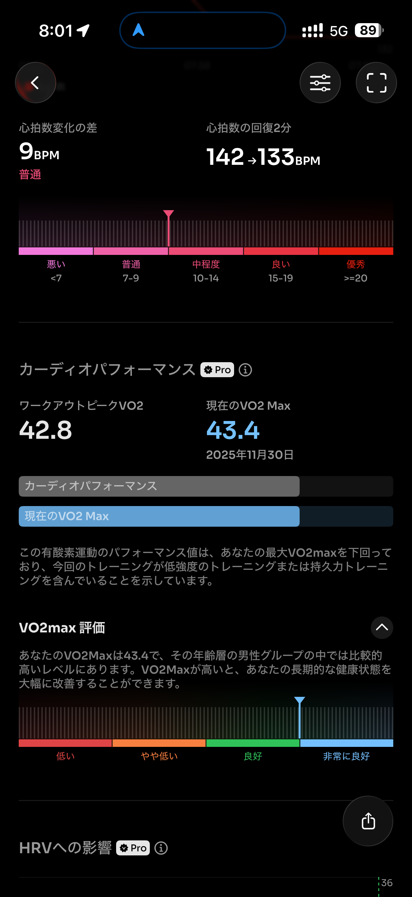
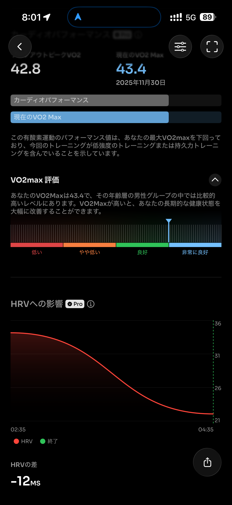
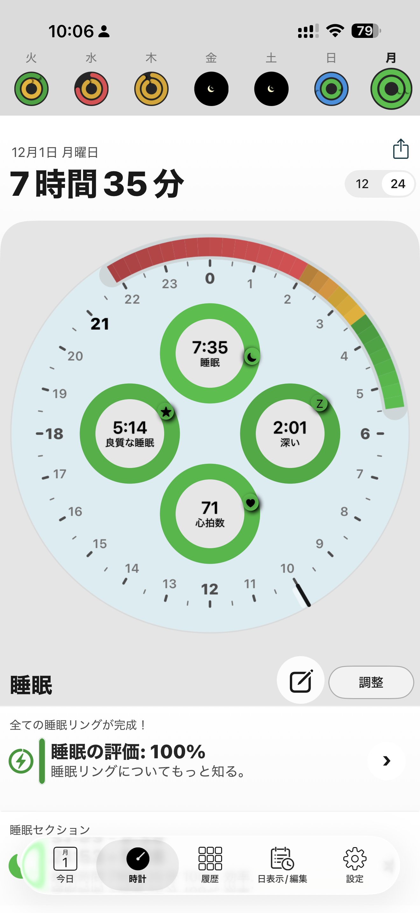

- 距離：8.1km
- 時間：00:44:56
- 平均心拍数：165
- 時間帯：7:13~7:58
- 天候：晴れ
- コース：多摩川河川敷（折り返し）
- 補給：朝ジェル
- 睡眠：8時間5分
- 今日の目的：イージージョグ
- コメント：結構走ったかも

## 📝 コーチコメント：
疲労が残るなかでもストライドとケイデンスが安定し、効率の良い動きができていた良い調整ラン。軽めでも質のある走りで、今週後半のスピード練習につながる内容でした。

## 📸 写真一覧

