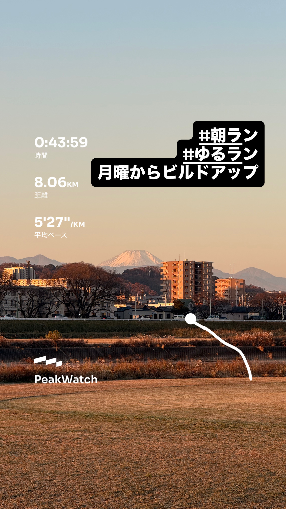
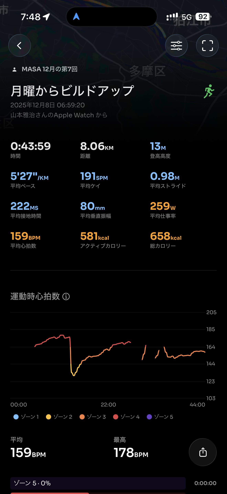
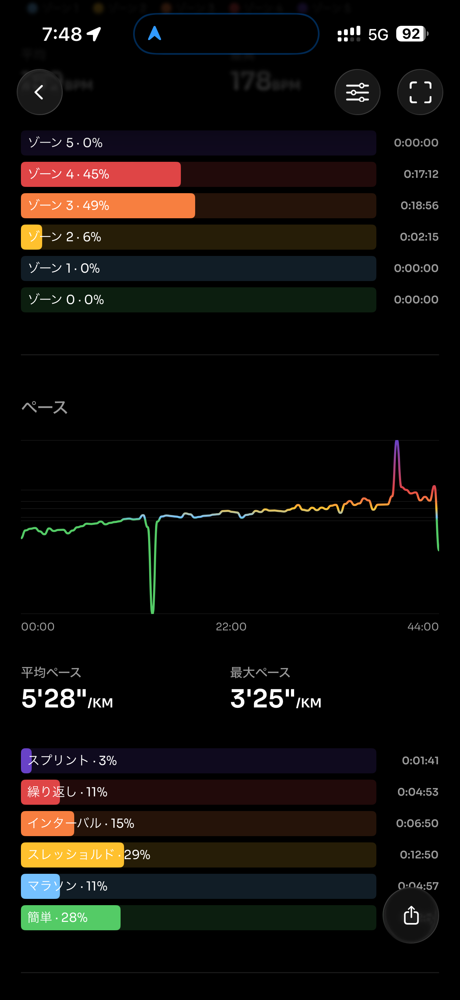
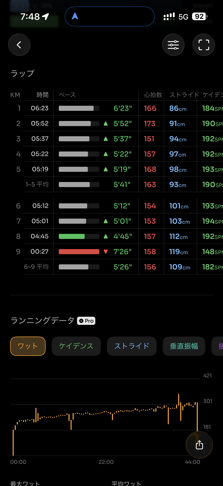
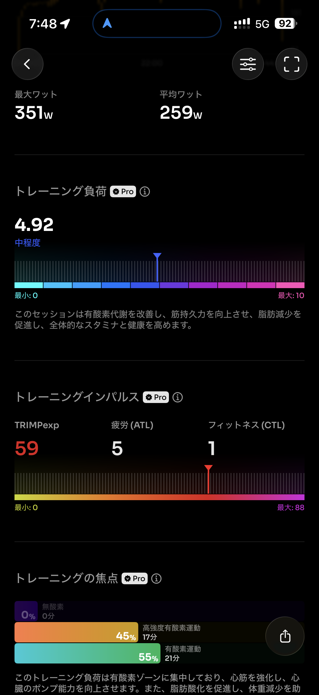
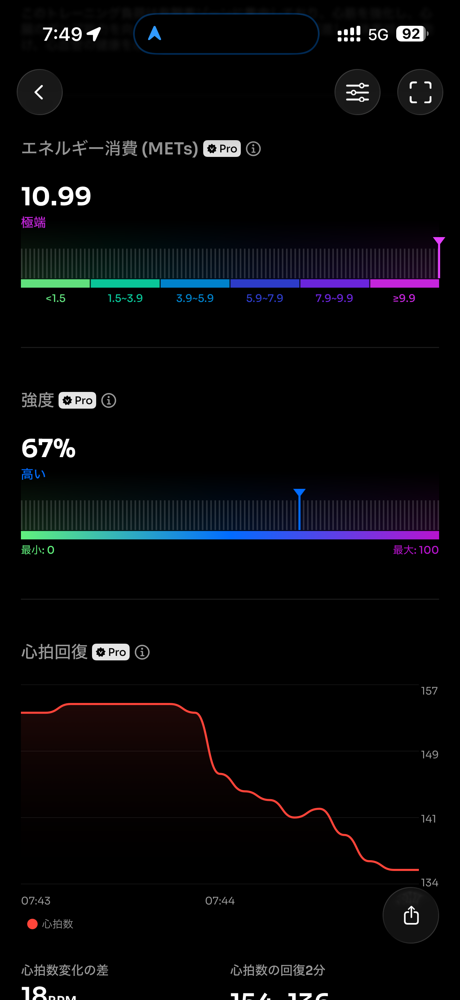
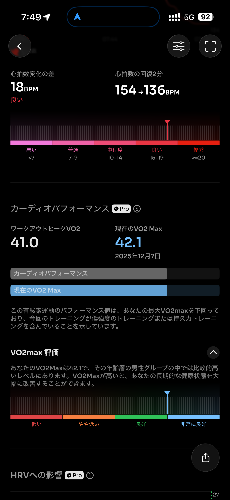
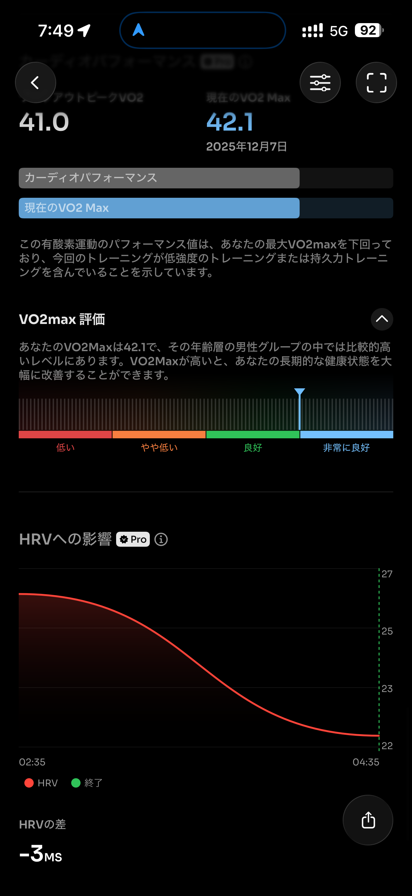
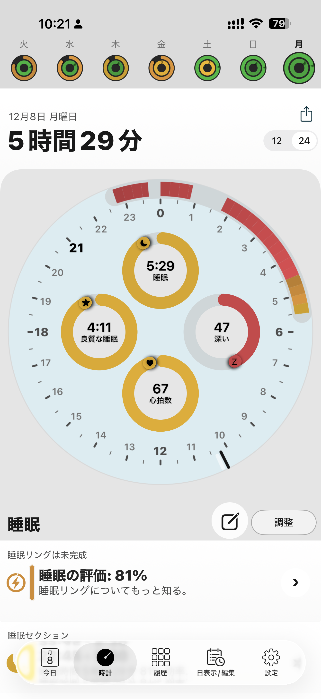

- 距離：8.06km
- 時間：00:43:59
- 平均心拍数：160
- 時間帯：6:59~7:43
- 天候：晴れ
- コース：多摩川河川敷（折り返し）
- 補給：朝ジェル
- 睡眠：5時間29分
- 今日の目的：ペース走
- コメント：ビルドアップ走になってしまったよ

## 📝 コーチコメント：
今日は自然なビルドアップで、心拍も安定した質の高い1本でした。
今の走力がしっかり底上げされています。

## 📸 写真一覧

