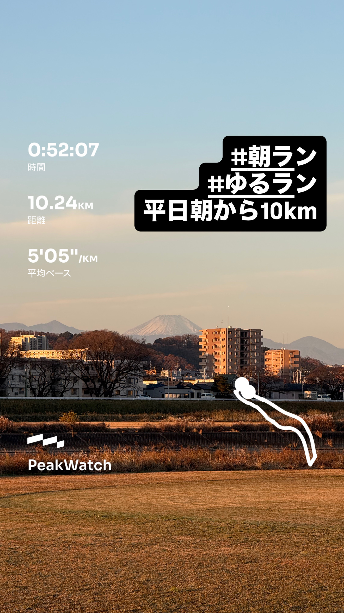
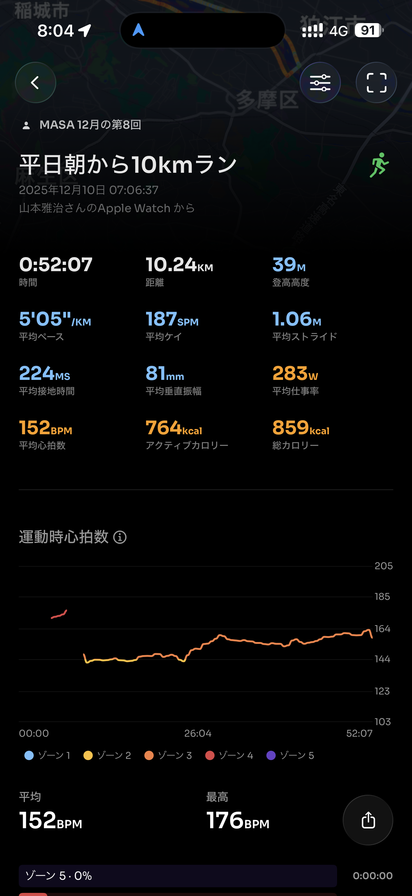
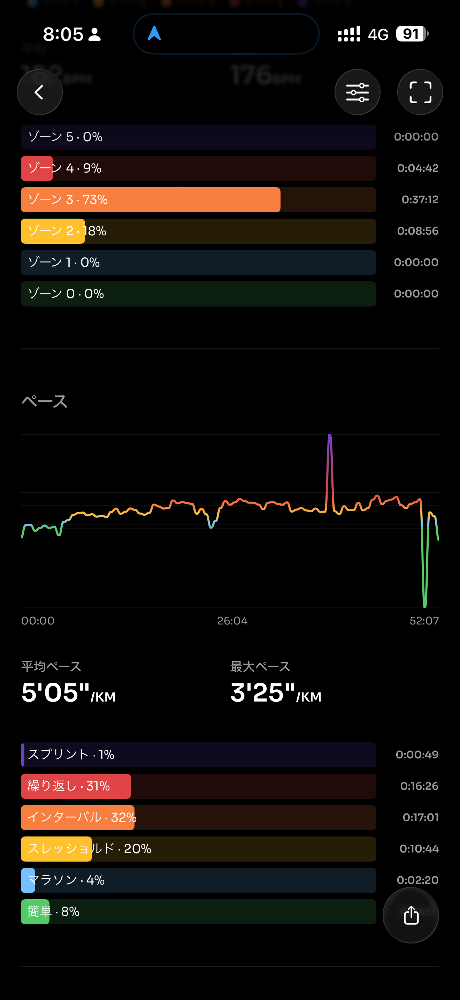
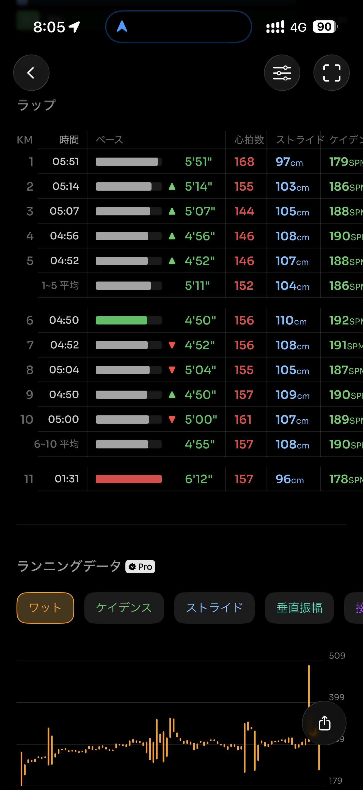
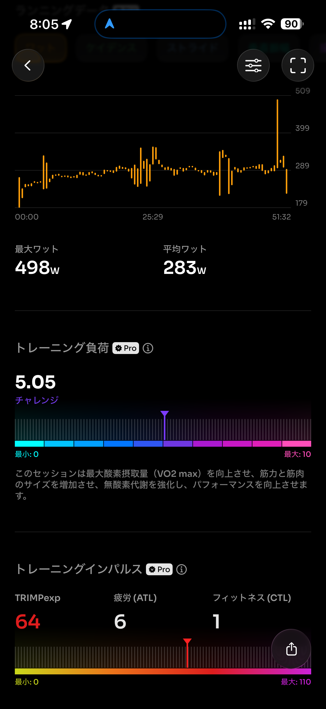
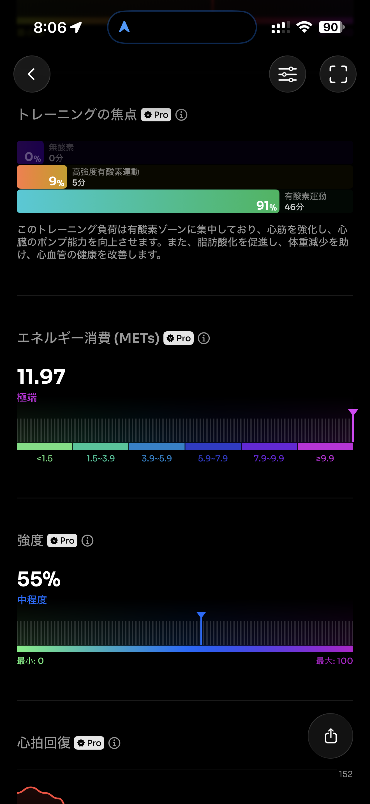
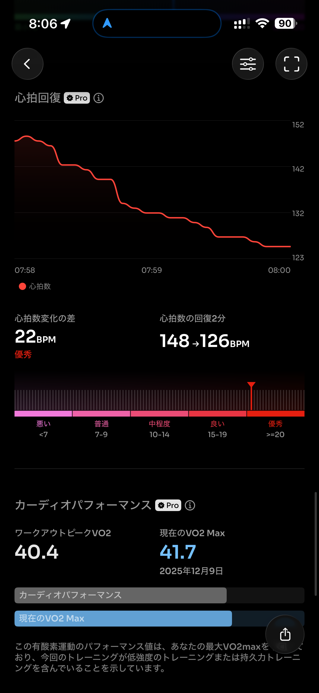
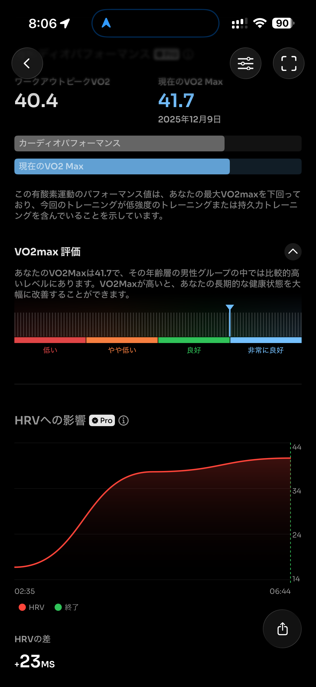
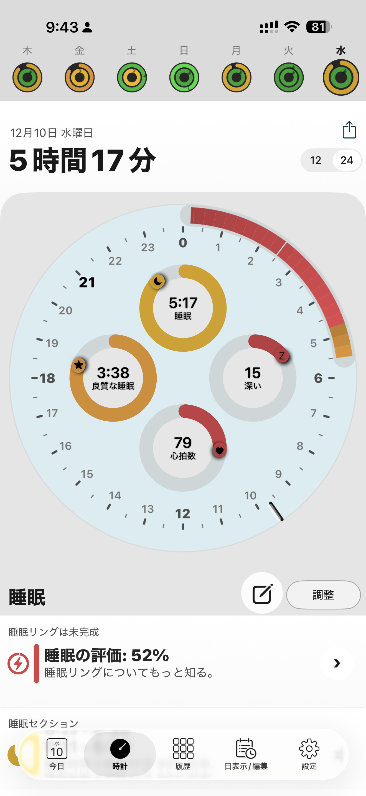

- 距離：10.24km
- 時間：00:52:07
- 平均心拍数：153
- 時間帯：7:06~7:58
- 天候：晴れ
- コース：多摩川河川敷（周回コース）
- 補給：朝ジェル
- 睡眠：5時間17分
- 今日の目的：10kmどこまで走れるか
- コメント：途中から4分台でたけど、最後はタレたなー

## 📝 コーチコメント：
ランオフ明けでもペース・心拍ともに安定していて、良い再始動の10kmでした。
疲労を溜めずにしっかり質を保てています。

## 📸 写真一覧

