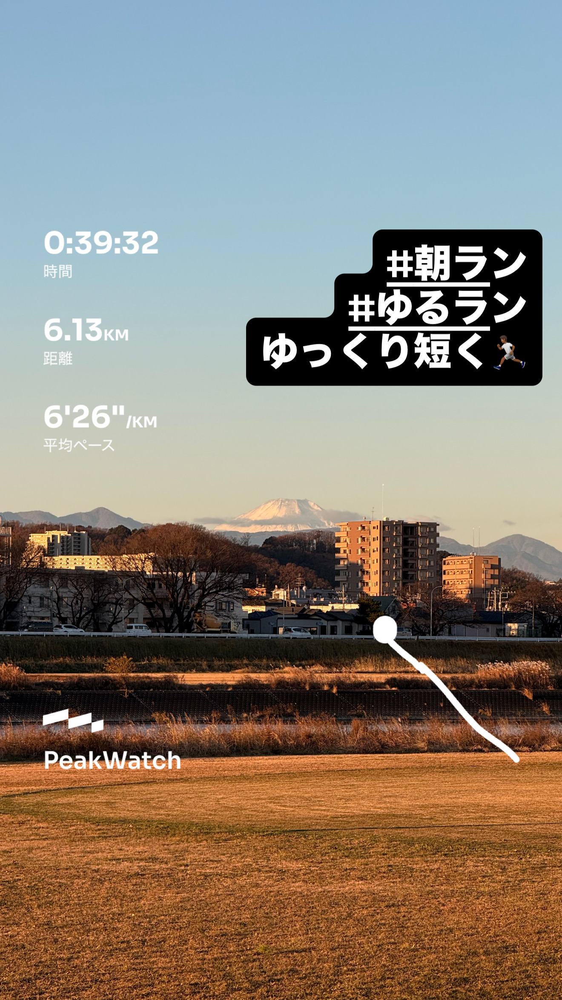
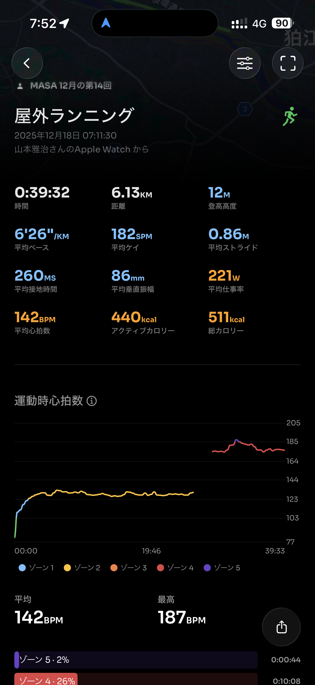
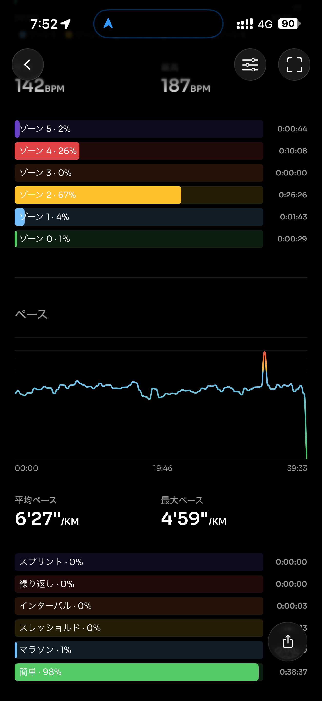
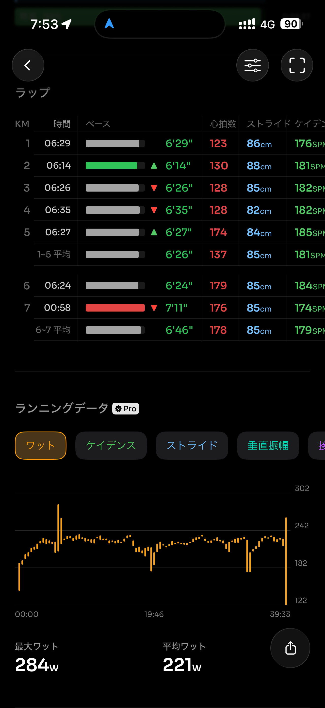
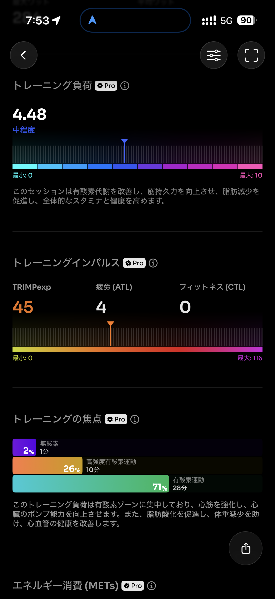
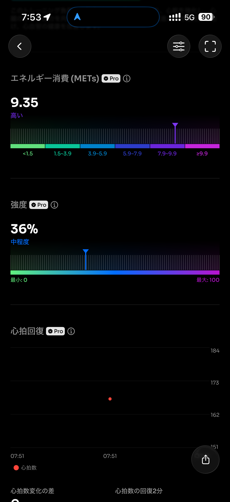
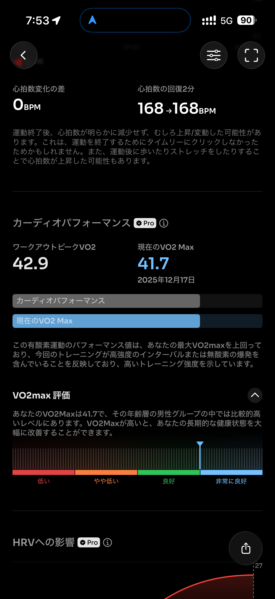
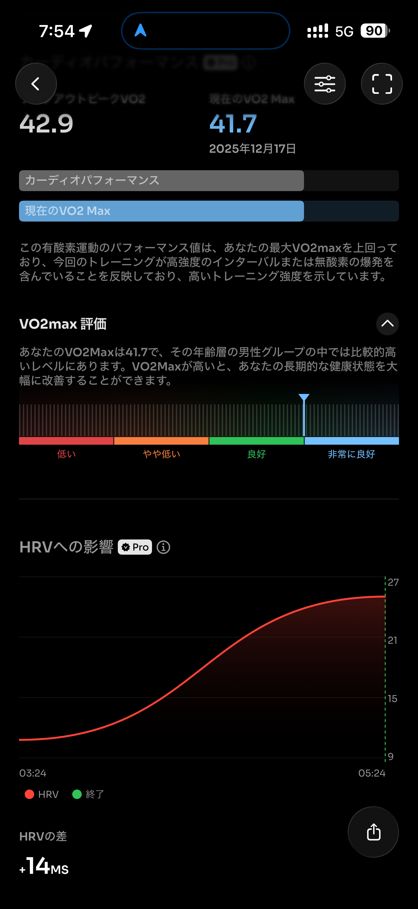
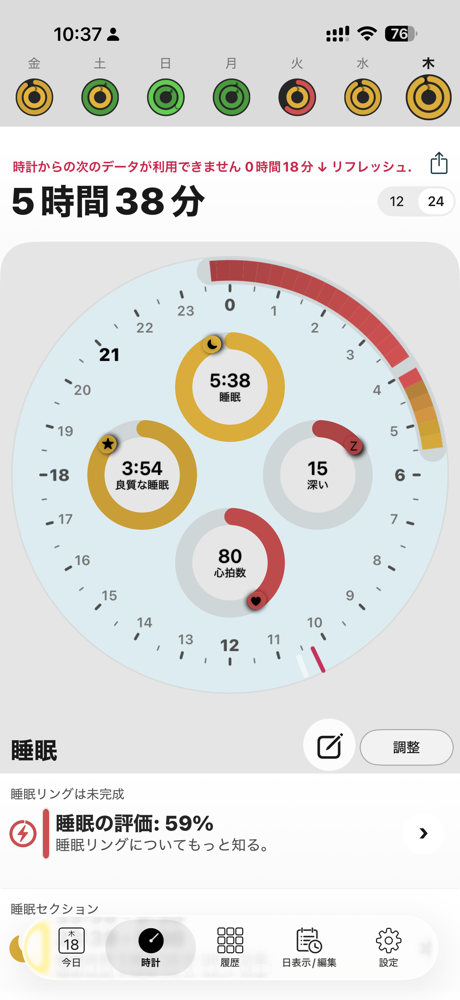

- 距離：6.13km
- 時間：00:39:32
- 平均心拍数：143
- 時間帯：7:11~7:51
- 天候：晴れ
- コース：多摩川河川敷（折り返し）
- 補給：朝ジェル
- 睡眠：5時間38分
- 今日の目的：リカバリージョグ
- コメント：前日スピードあげてしまったので今日はリカバリージョグ

## 📝 コーチコメント：
昨日の閾値走の疲労をちゃんと抜きながら、フォームを崩さず走れている非常に優秀なリカバリーラン。
土曜の30kmに向けて“最高の流れ”ができているよ。

## 📸 写真一覧

