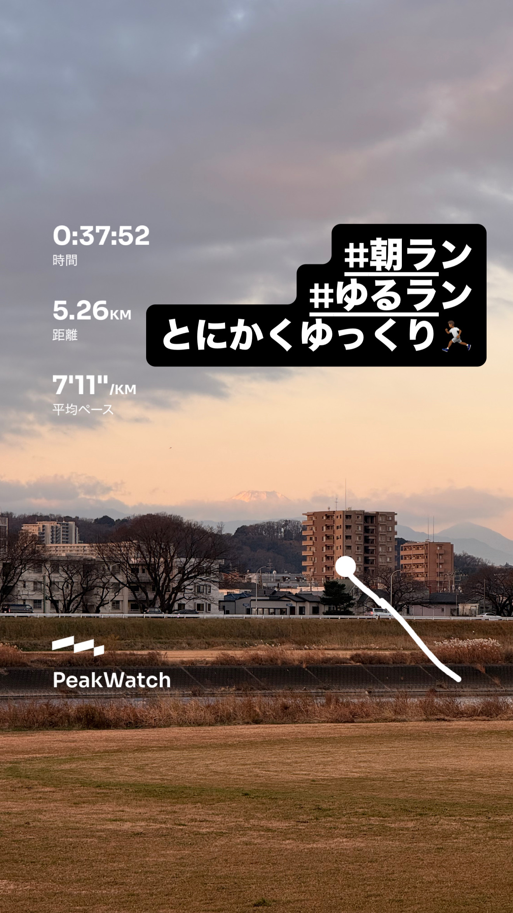
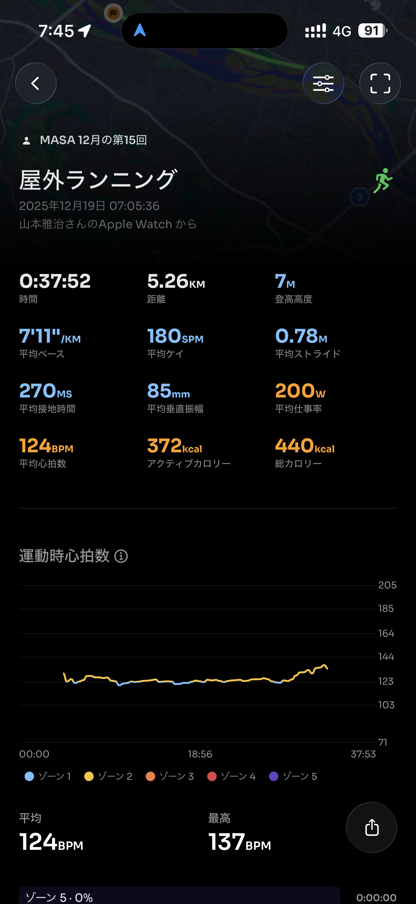
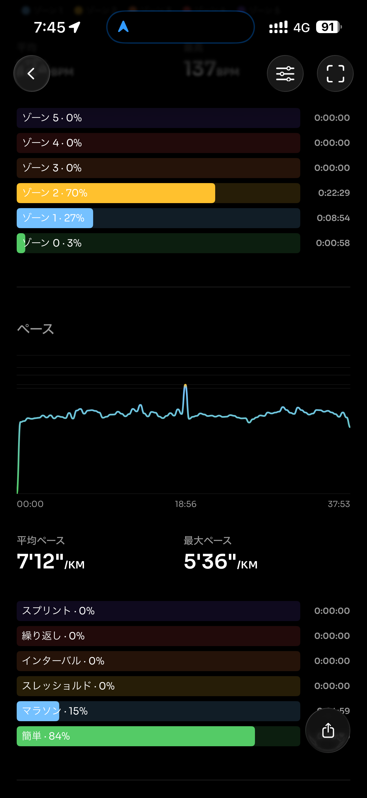
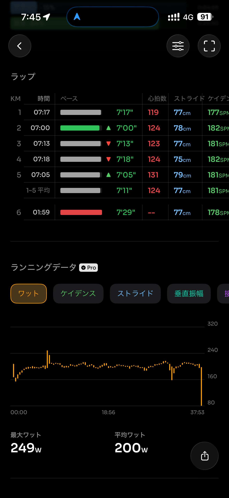
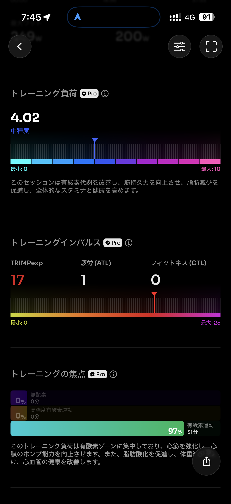
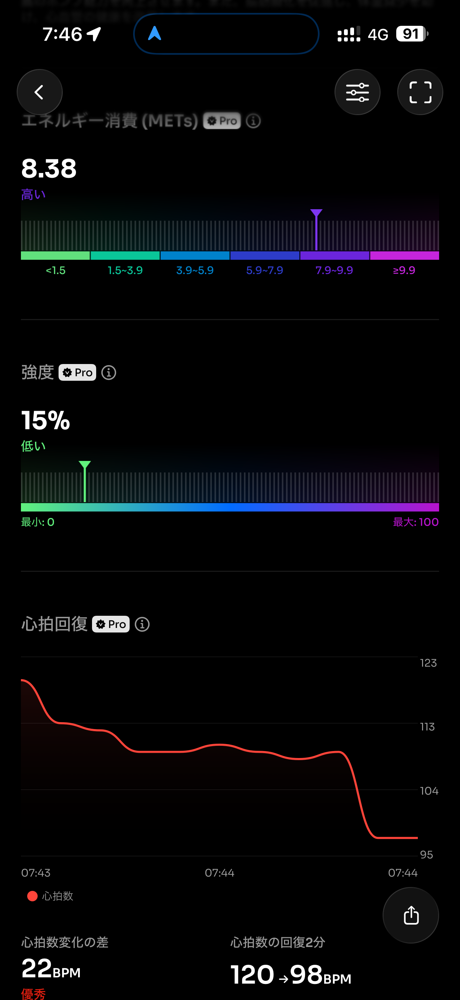
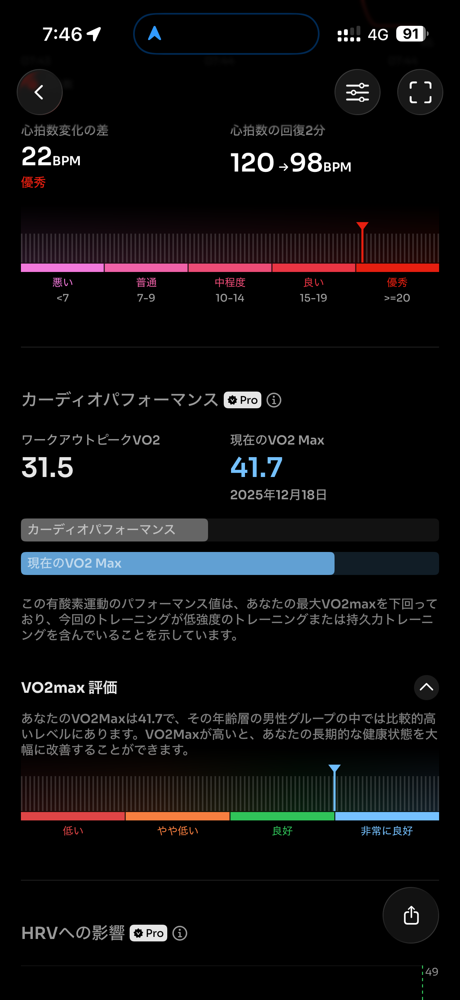
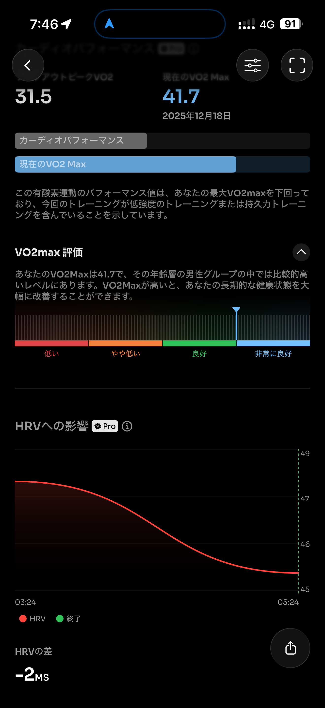
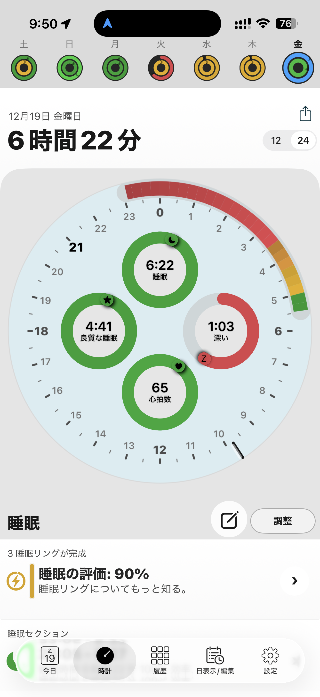

- 距離：5.26km
- 時間：00:37:52
- 平均心拍数：124
- 時間帯：7:05~7:43
- 天候：晴れ
- コース：多摩川河川敷（折り返し）
- 補給：朝ジェル
- 睡眠：6時間22分
- 今日の目的：超絶ゆるジョグ
- コメント：7分切らずに走れた。

## 📝 コーチコメント：
無理せず走りたい気持ちを満たしつつ、しっかりリカバリーにつなげた“賢い5km”だったよ！

## 📸 写真一覧

