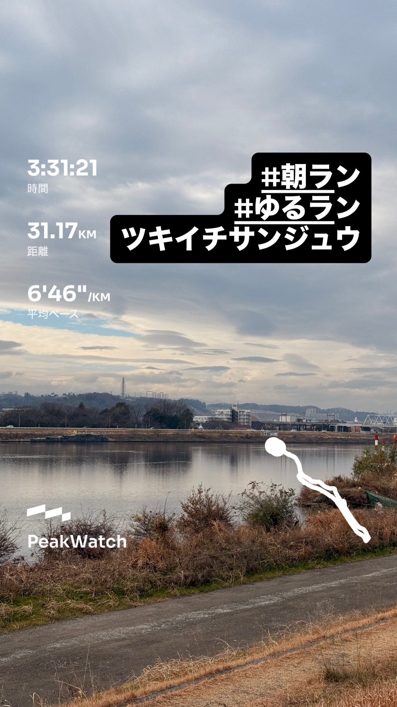
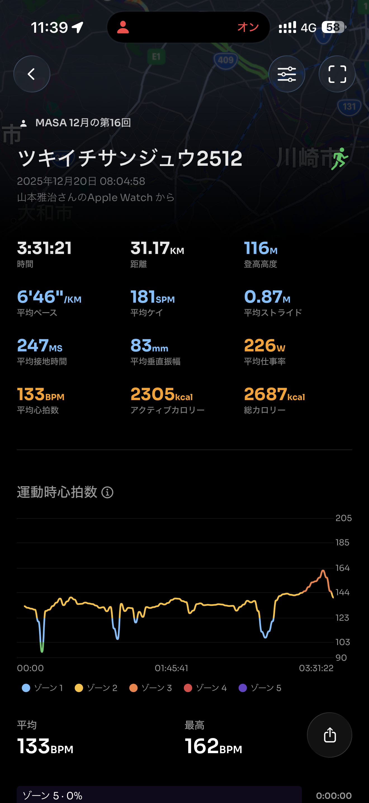
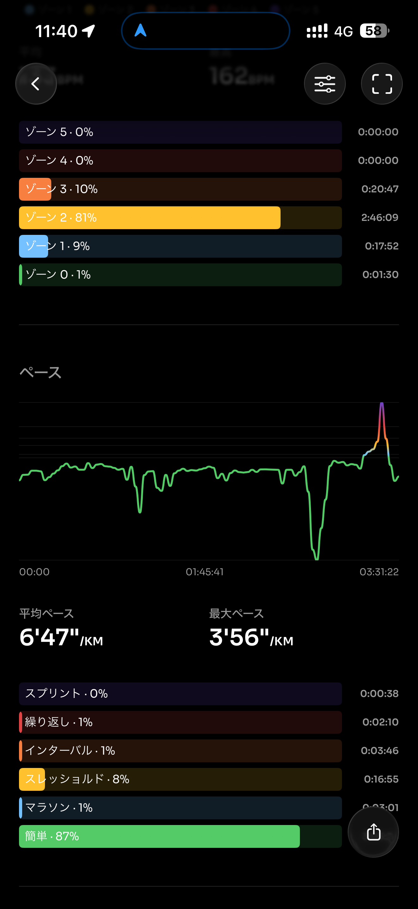
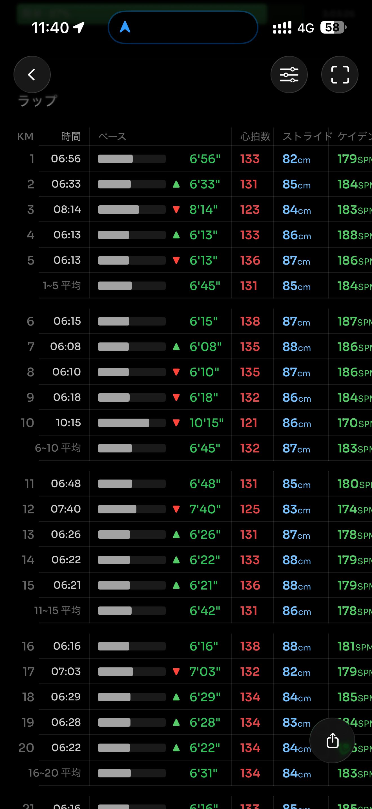
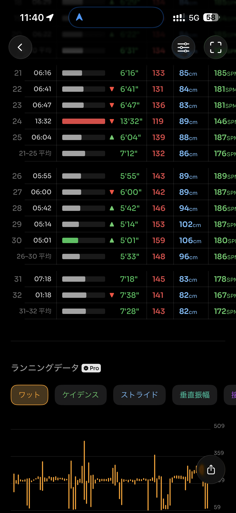
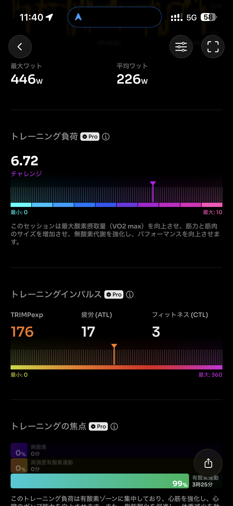
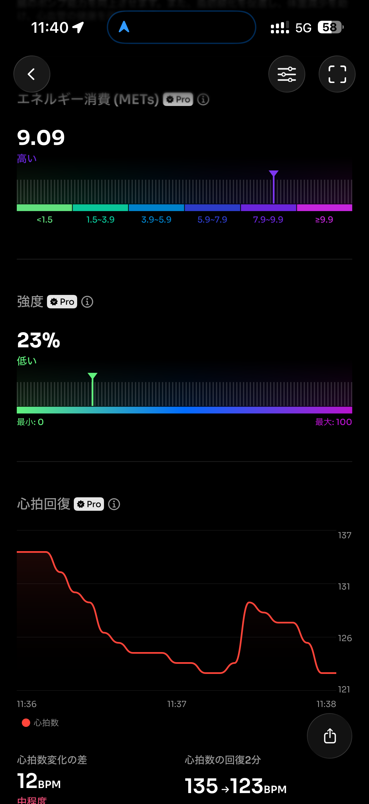
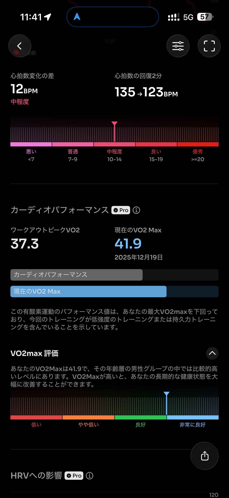
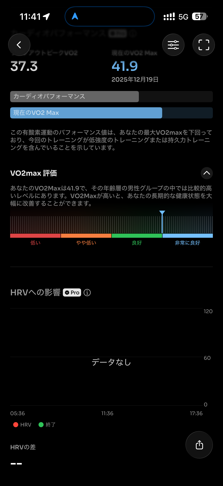
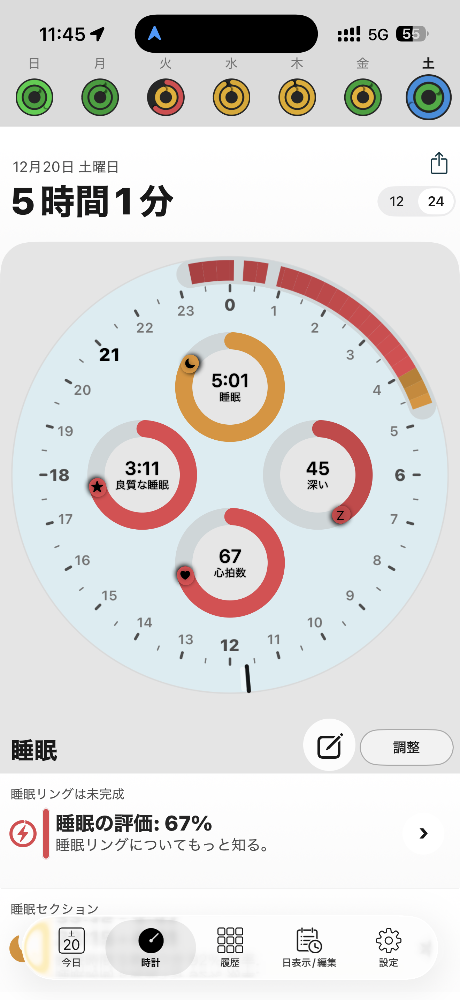

- 距離：31.17km
- 時間：03:31:21
- 平均心拍数：134
- 時間帯：8:04~11:36
- 天候：曇り（時々雨パラり）
- コース：多摩川河川敷（丸子橋折り返し）
- 補給：朝ジェル、バナナ、ラン中：ジェル2、プロテインバー2
- 睡眠：5時間1分
- 今日の目的：止まらずに30kmラン
- コメント：なんとか走れた。あと、腹が減るとダメらしいw

## 📝 コーチコメント：
終始ペースと心拍をコントロールできた、質の高いLSD。
30kmを崩れずに走り切れており、フルに向けた持久力の土台がしっかり積めています。

## 📸 写真一覧

