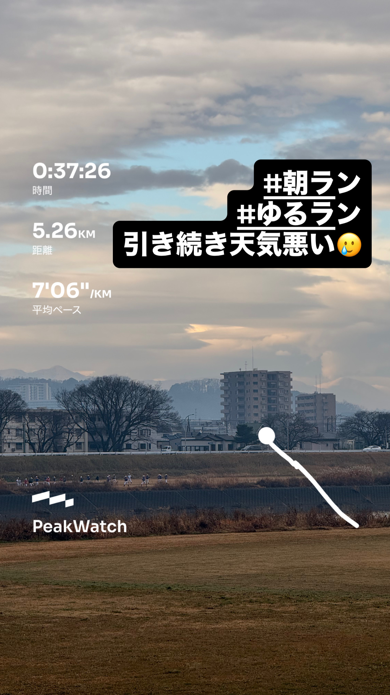
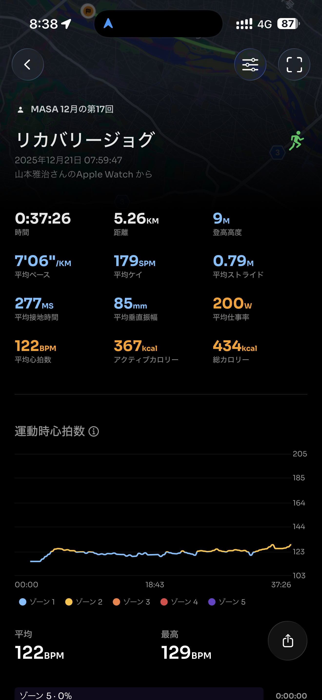
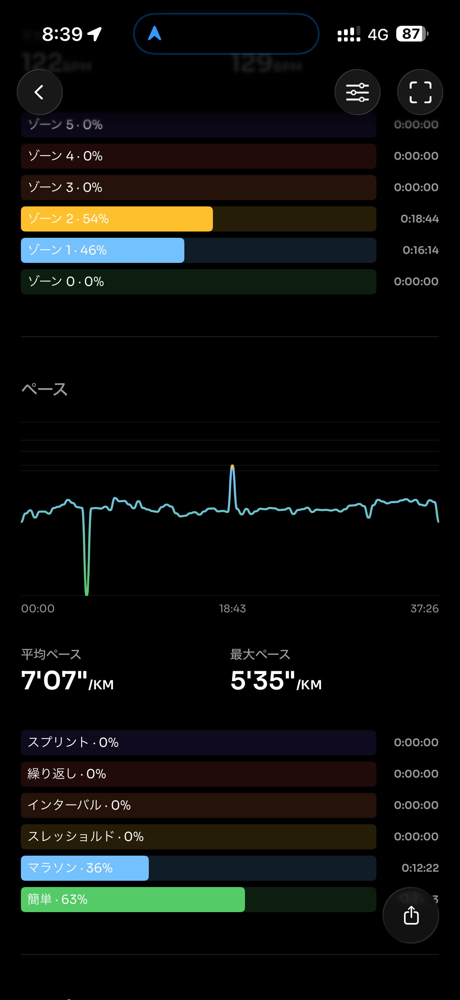
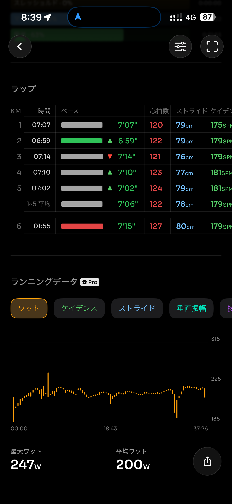
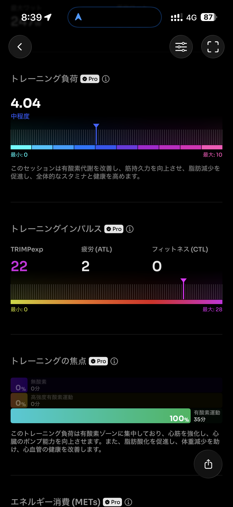
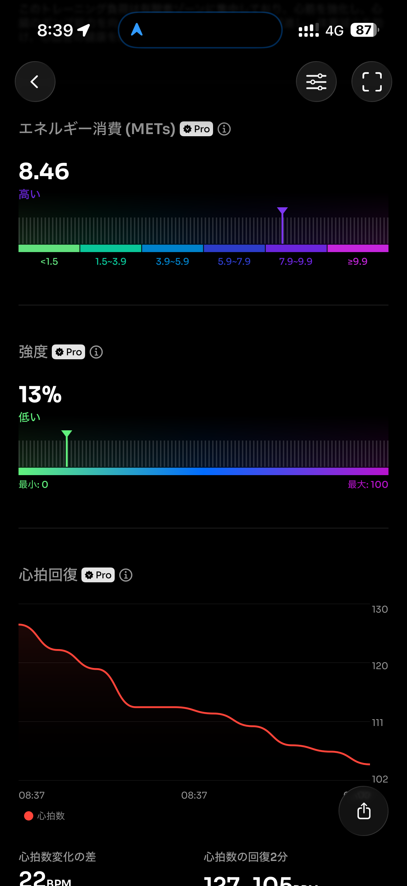
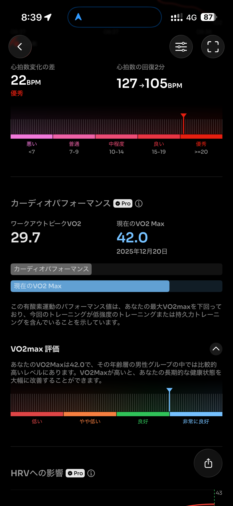
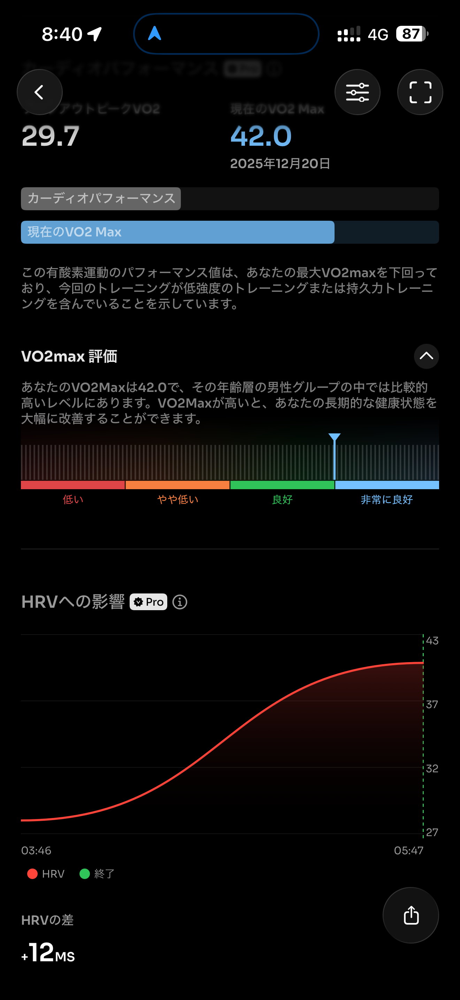
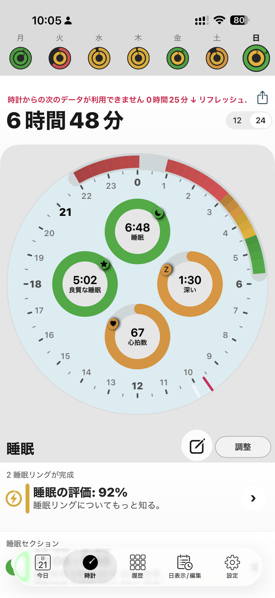

- 距離：5.26km
- 時間：00:37:26
- 平均心拍数：123
- 時間帯：7:59~8:37
- 天候：曇り
- コース：多摩川河川敷（折り返し）
- 補給：朝ジェル
- 睡眠：7時間38分
- 今日の目的：リカバリーラン
- コメント：まぁリカバリーラン

## 📝 コーチコメント：
30km走翌日として理想的なリカバリー。心拍をしっかり抑えたままフォームも安定しており、疲労を抜きつつ次につながる良いジョグです。

## 📸 写真一覧

