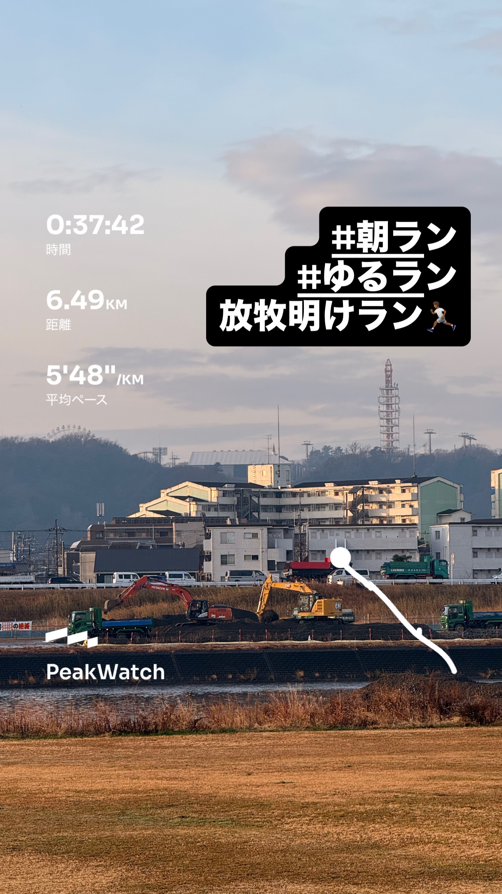
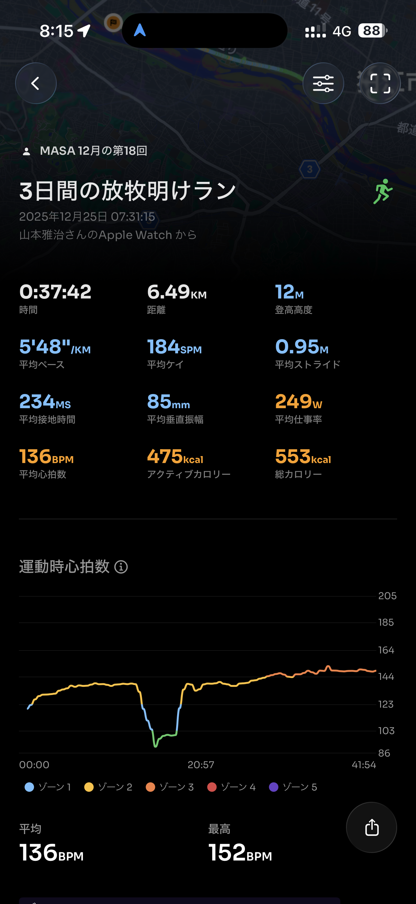
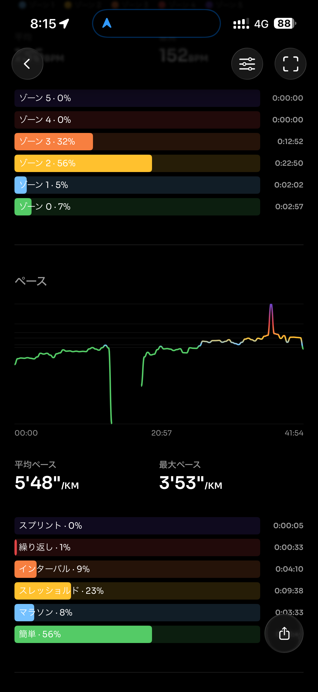
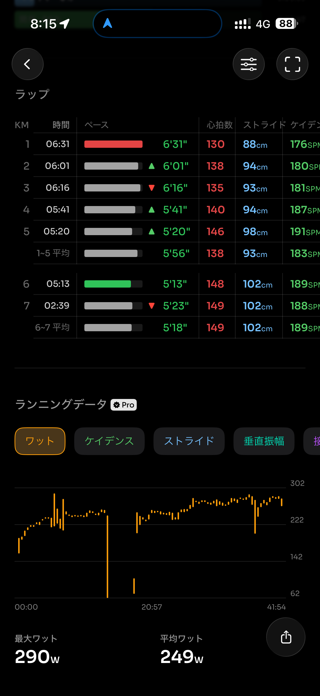
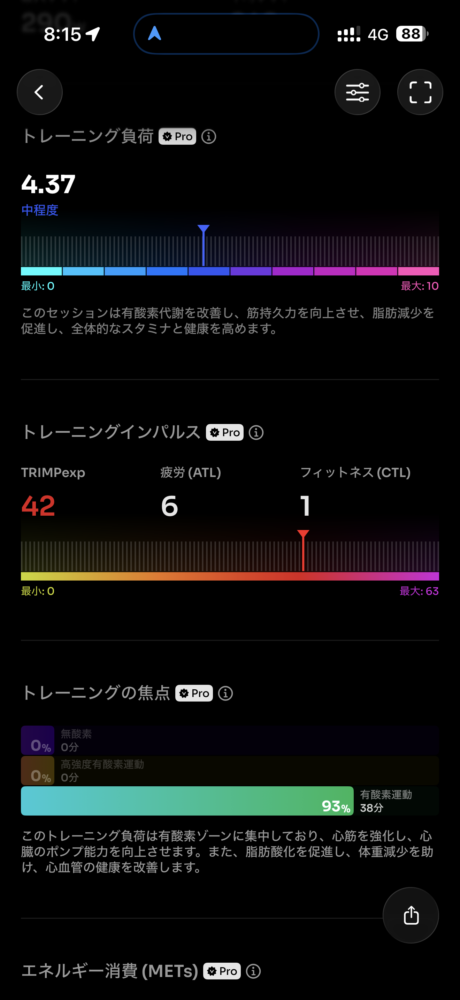
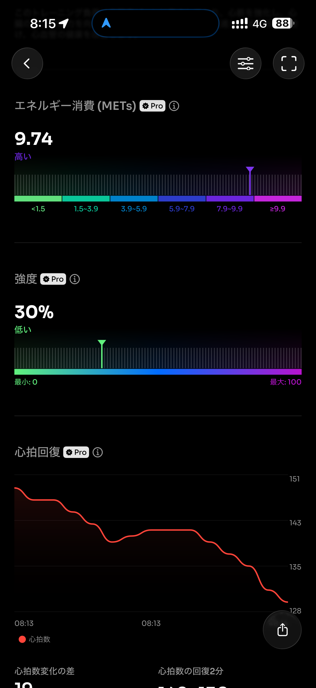
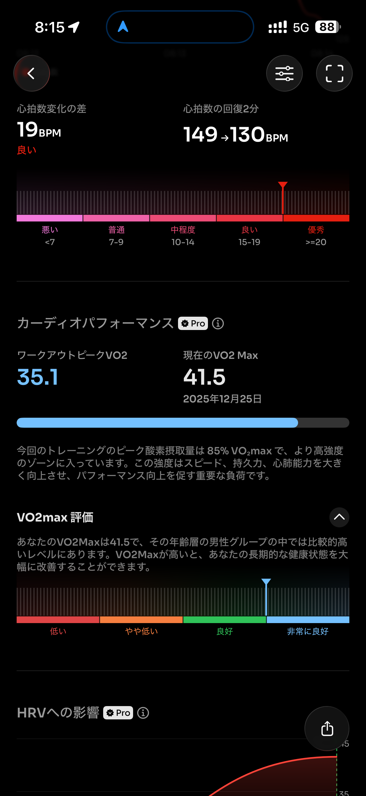
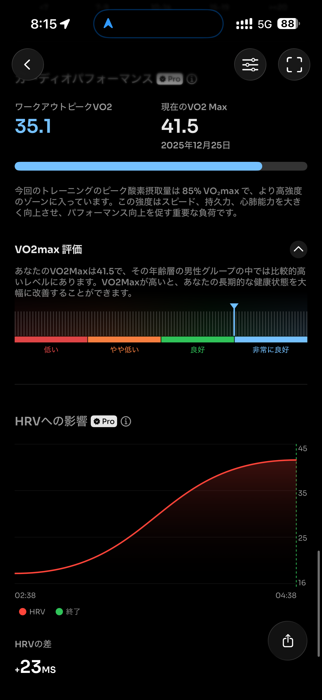
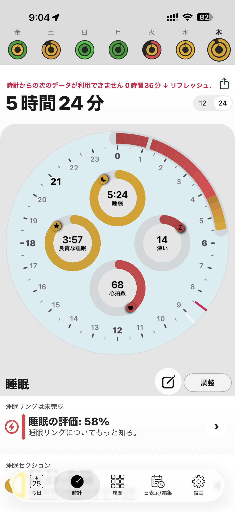

- 距離：6.49km
- 時間：00:37:42
- 平均心拍数：140
- 時間帯：7:31~8:13
- 天候：曇り
- コース：多摩川河川敷（折り返し）
- 補給：朝ジェル
- 睡眠：5時間24分
- 今日の目的：3日間休み明けのラン
- コメント：ぼちぼち走れた

## 📝 コーチコメント：
コントロールされたイージーランで、心拍・フォームともに安定。再始動として理想的な仕上がりで、明日の閾値走に良い流れを作れています。

## 📸 写真一覧

