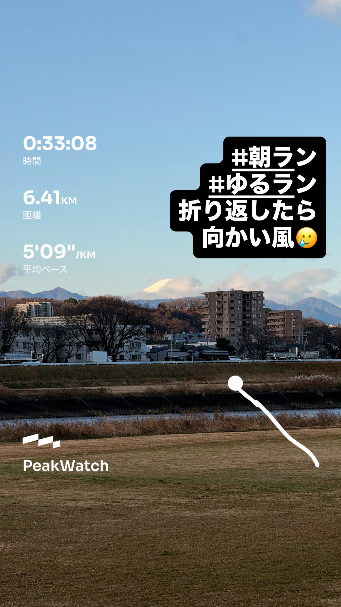
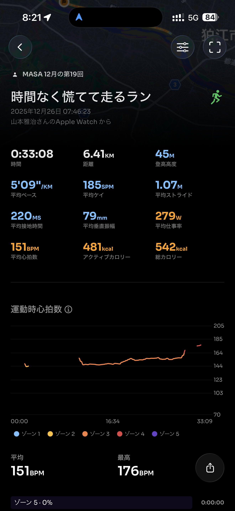
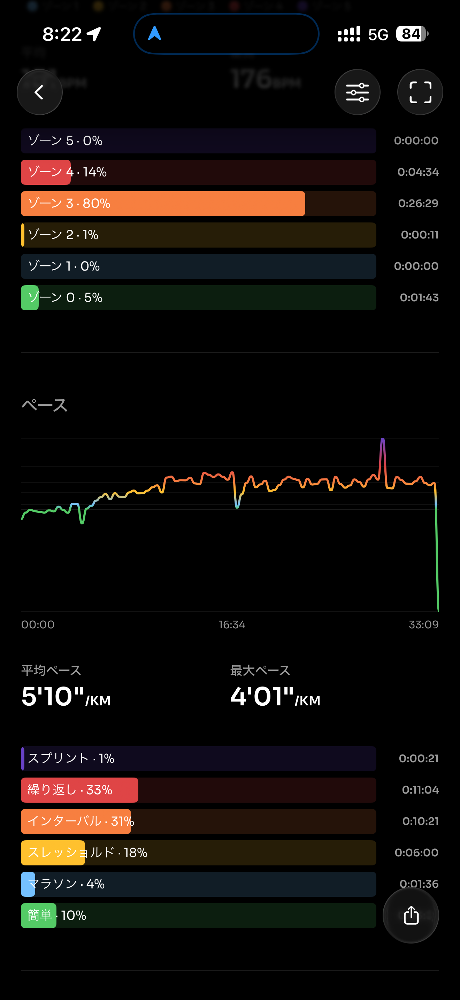
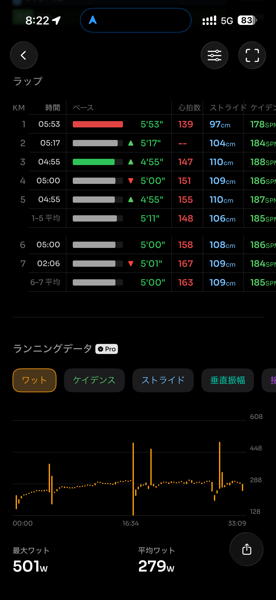
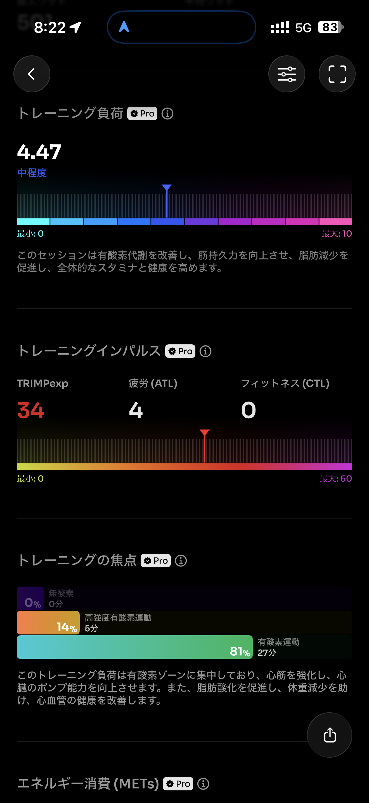
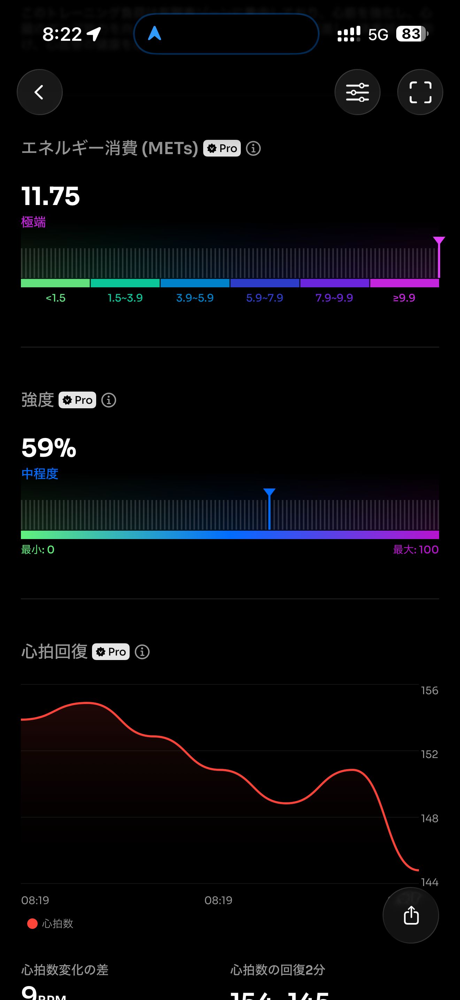
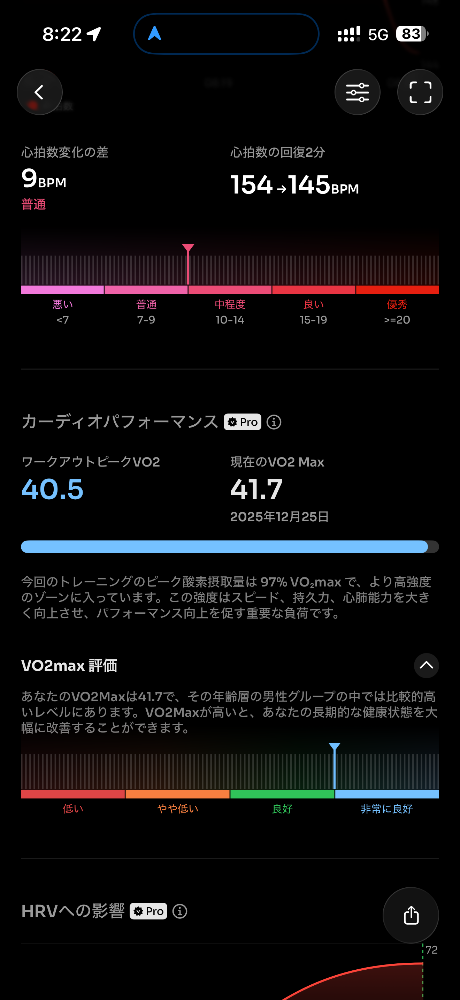
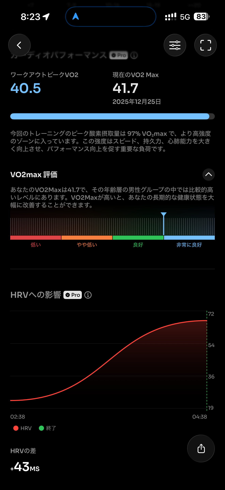
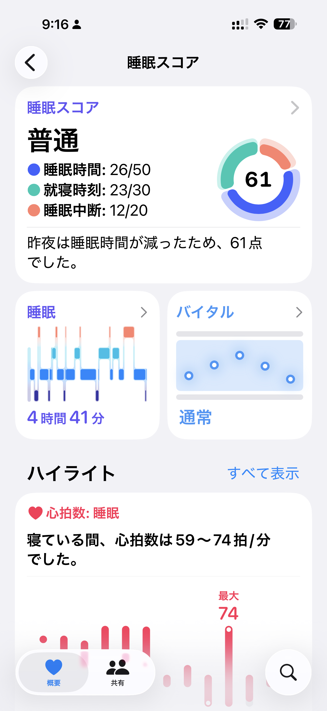
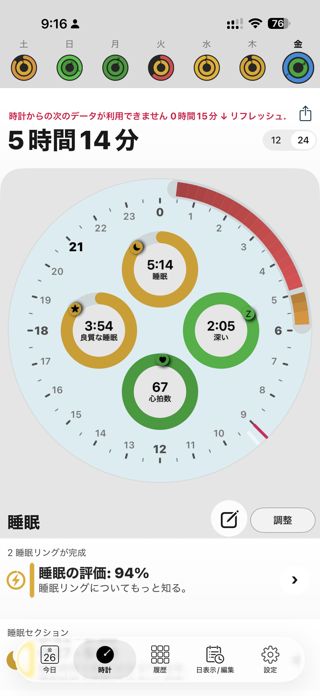

- 距離：6.41km
- 時間：00:33:08
- 平均心拍数：151
- 時間帯：7:46~8:19
- 天候：晴れ
- コース：多摩川河川敷（折り返し）
- 補給：朝ジェル
- 睡眠：5時間14分
- 今日の目的：閾値走
- コメント：ちょっと前後がない閾値走

## 📝 コーチコメント：
ナイス朝ランでした！時間が限られていた中でも6.41kmをしっかり走れていて、しかも平均5'09"/kmとかなり良いペースですね 👍
折り返しで向かい風の中このペースを維持できているのは、脚力も心肺もかなり仕上がってきている証拠です。

## 📸 写真一覧

