- 距離：6.03km
- 時間：00:31:10
- 平均心拍数：153
- 時間帯：9:45~10:17
- 天候：晴れ
- コース：多摩川河川敷（折り返し）
- 補給：朝バナナ
- 睡眠：7時間44分
- 今日の目的：イージーラン
- コメント：ちょっと中途半端に終わってしまった印象。

## 📝 コーチコメント：
「LSDで土台づくり → 低〜中強度のビルド走で締め」
12月のトレーニングの流れとして、とても良い組み方でした。
フォームも安定しており、VO₂maxも右肩上がり。いい仕上がりです。

## 📸 写真一覧
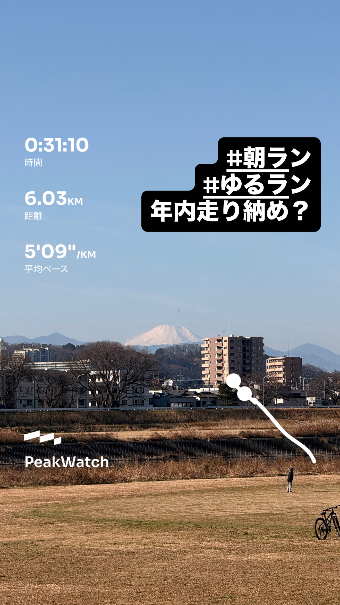
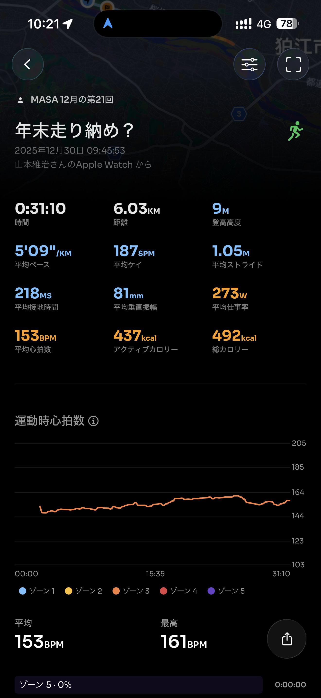
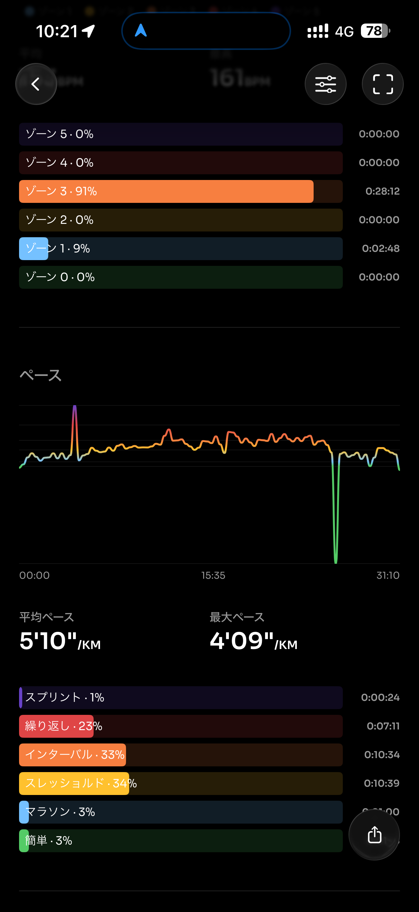
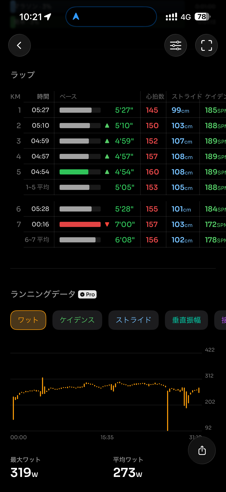
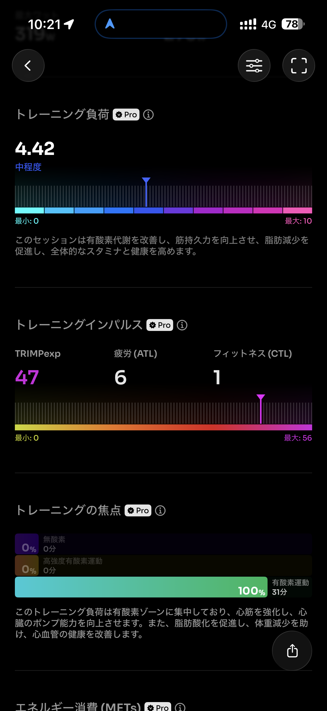
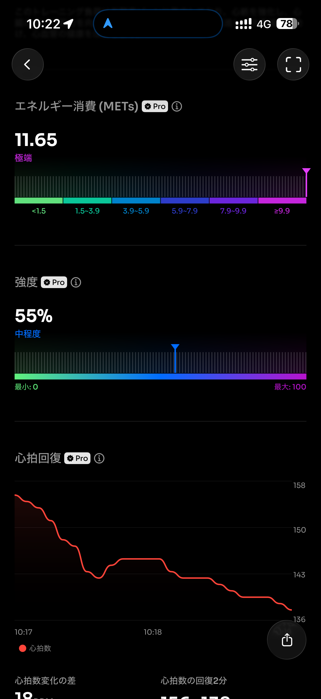
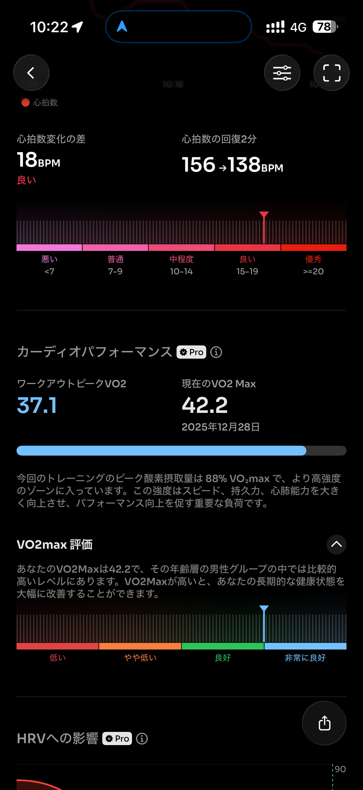
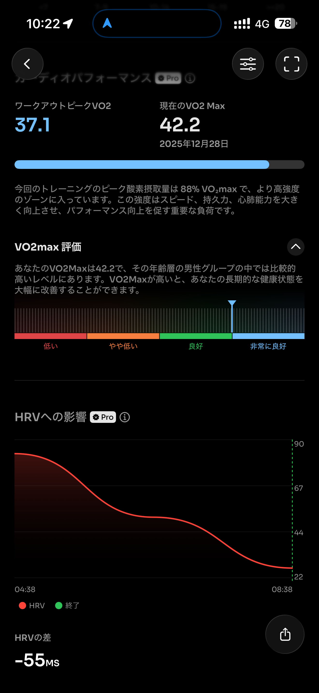
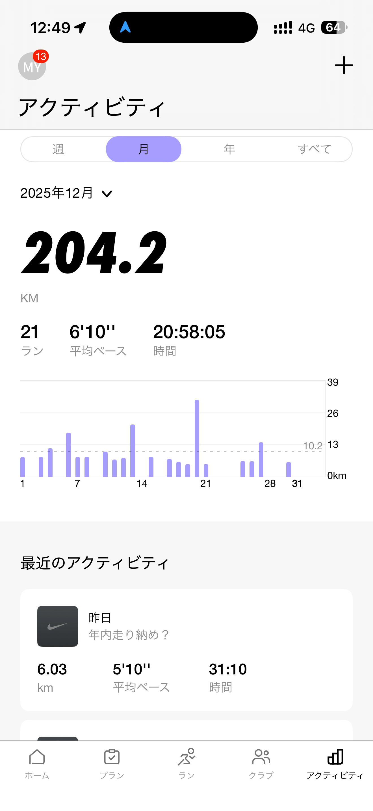
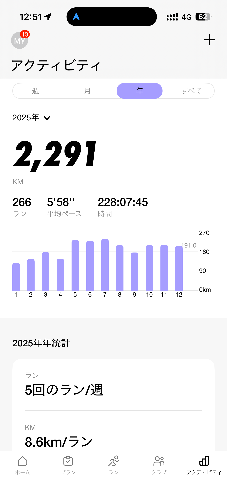
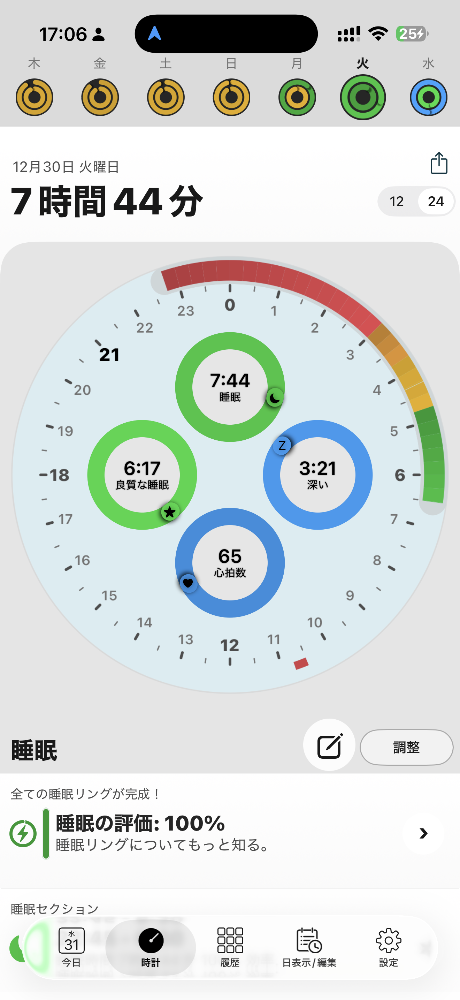
