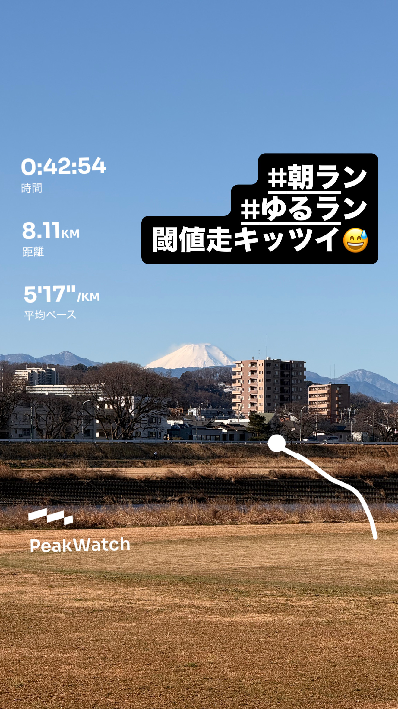
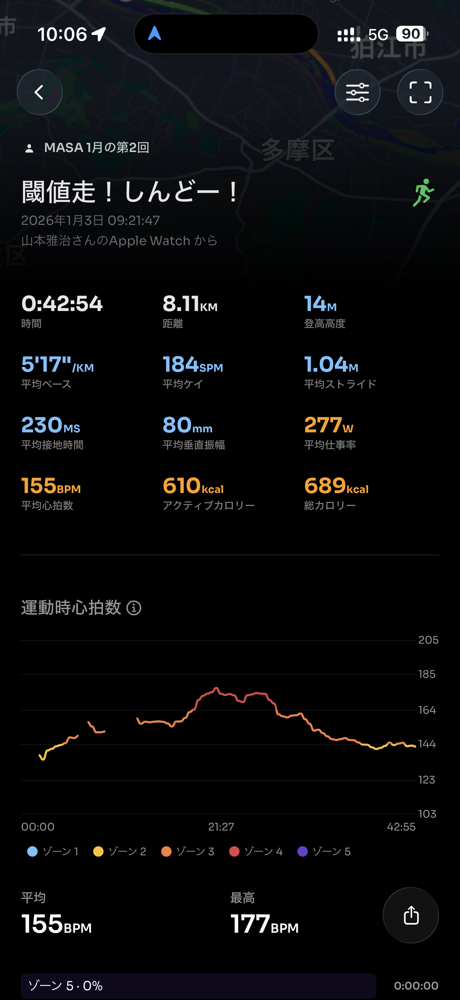
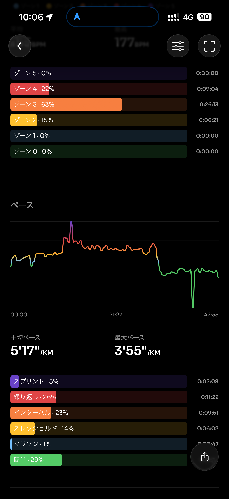
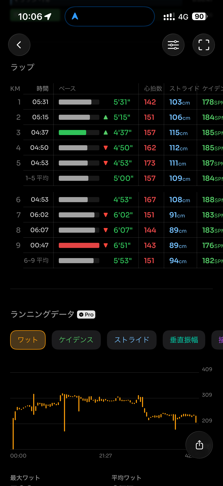
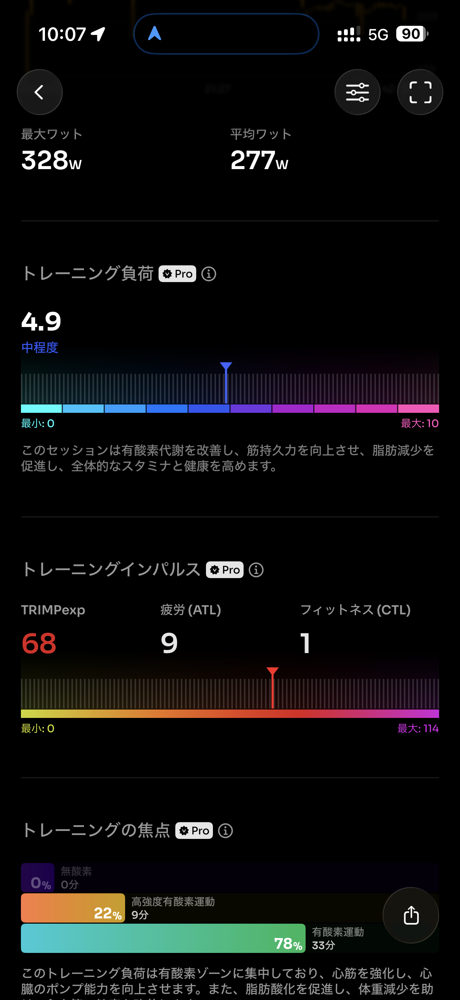
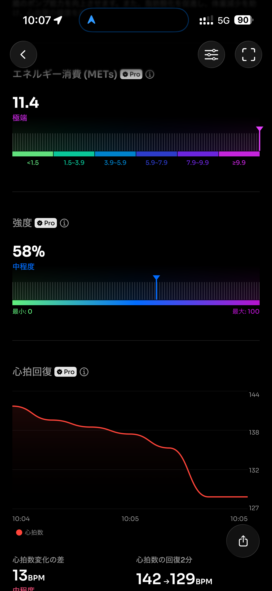
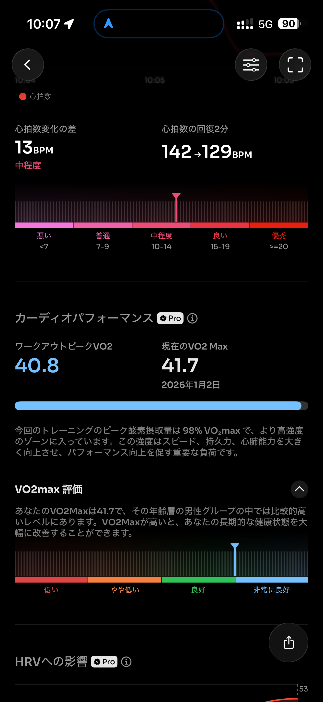
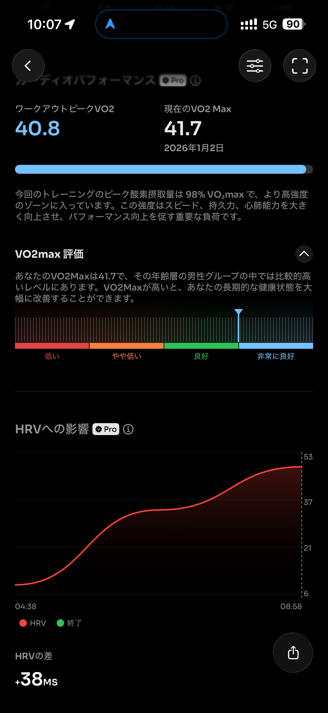
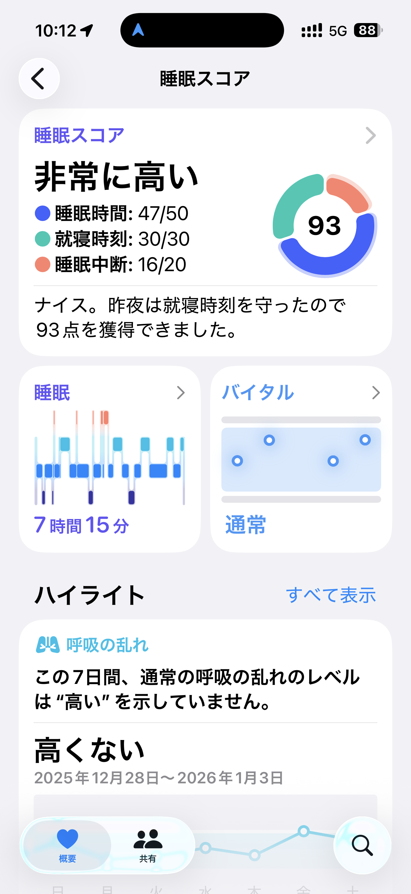
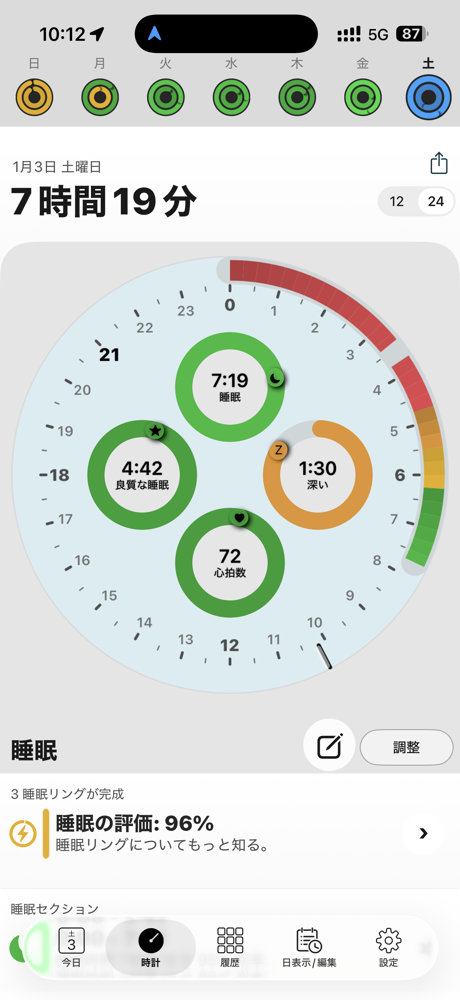

- 距離：8.11km
- 時間：00:42:54
- 平均心拍数：155
- 時間帯：9:21~10:04
- 天候：晴れ
- コース：多摩川河川敷（折り返し）
- 補給：朝ジェル
- 睡眠：7時間19分
- 今日の目的：2kmアップ、15〜20分（5'00"〜5'05"）閾値走、2kmダウン
- コメント：予定よりペースが相変わらず上がる・・・

## 📝 コーチコメント：
前半でしっかり体を温めてから、3〜5kmで一気にギアを上げて 閾値ゾーンにきれいに乗せられていました。ピッチは184〜188spmで安定、ストライドも伸びており、フォームの乱れが少ない走りです。心拍もゾーン3〜4中心で、「キツいけど粘れる」ちょうど良い負荷に収まっています。

5km以降に少し落ちたのはオーバーペースではなく、呼吸が先にきつくなった自然な失速。今の段階では問題なし、むしろ良い刺激が入りました 👍
「頑張りすぎないT走」がちゃんとできており、ハーフに向けた持久スピード強化として理想的な仕上がりです。

## 📸 写真一覧

