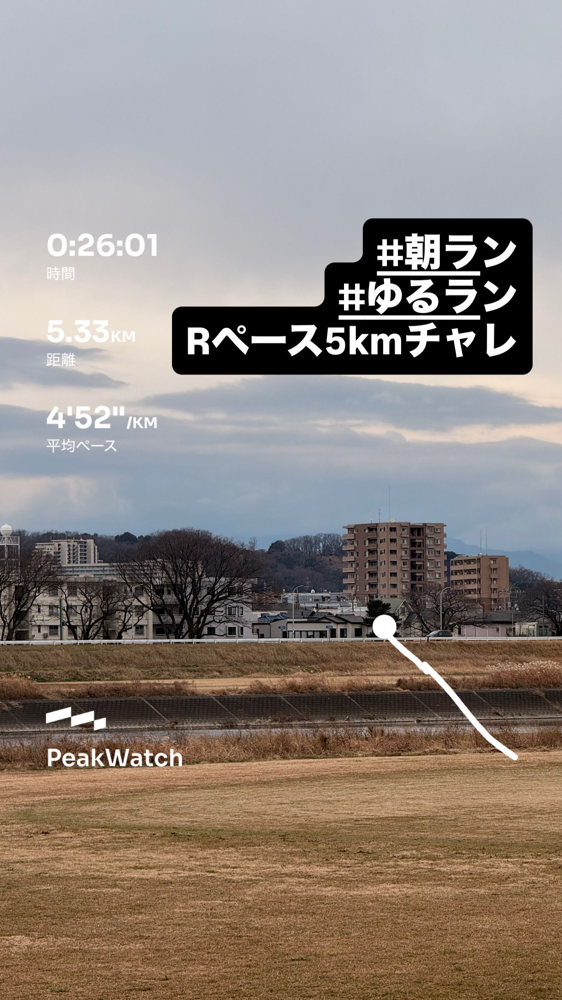
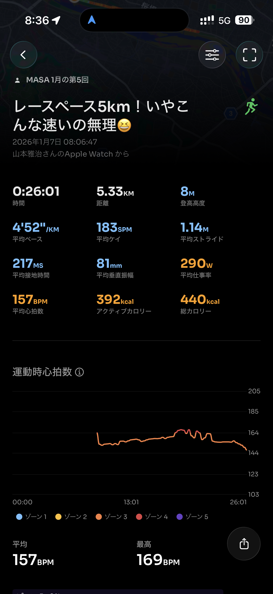
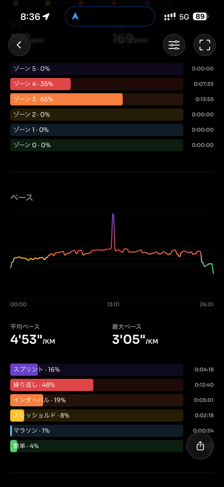
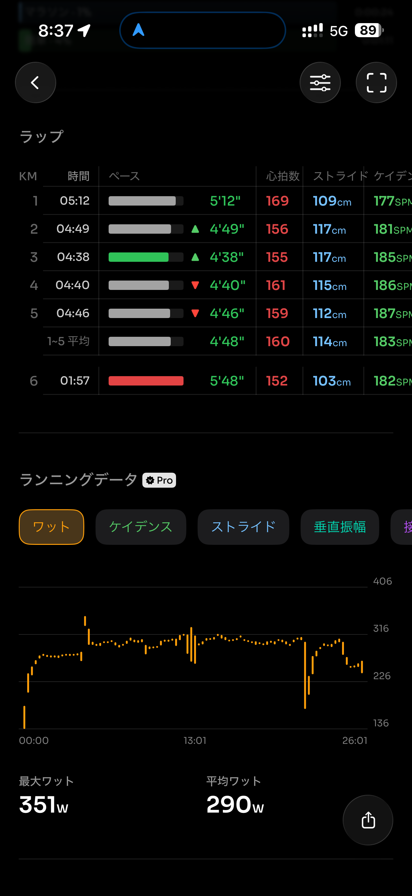
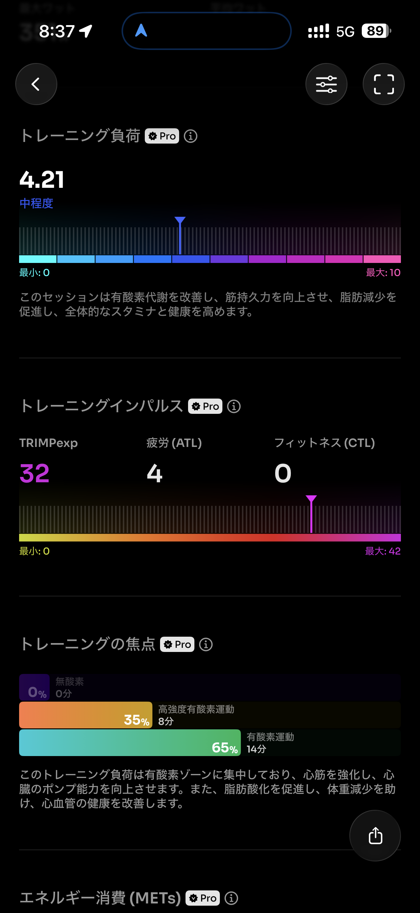
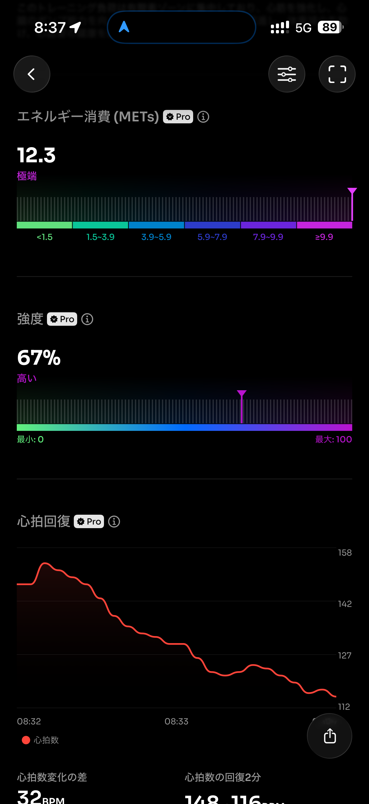
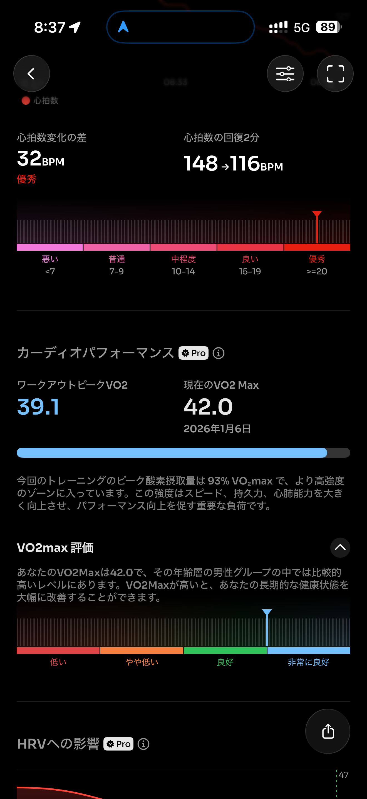
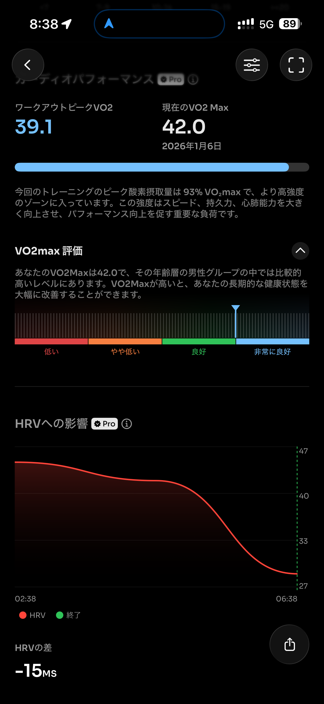
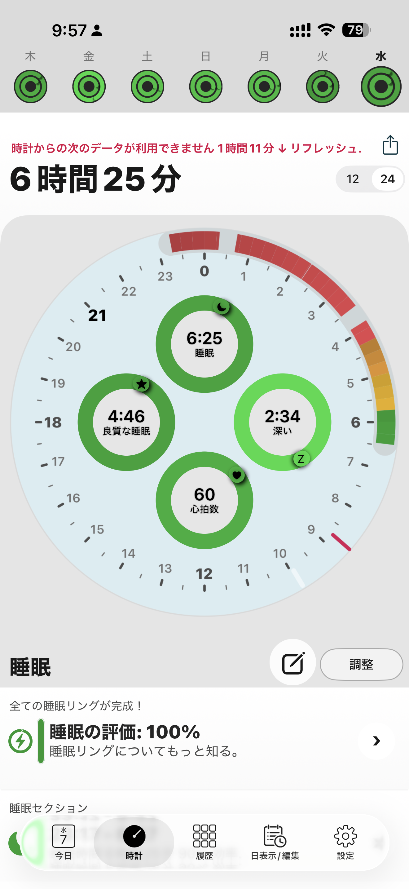
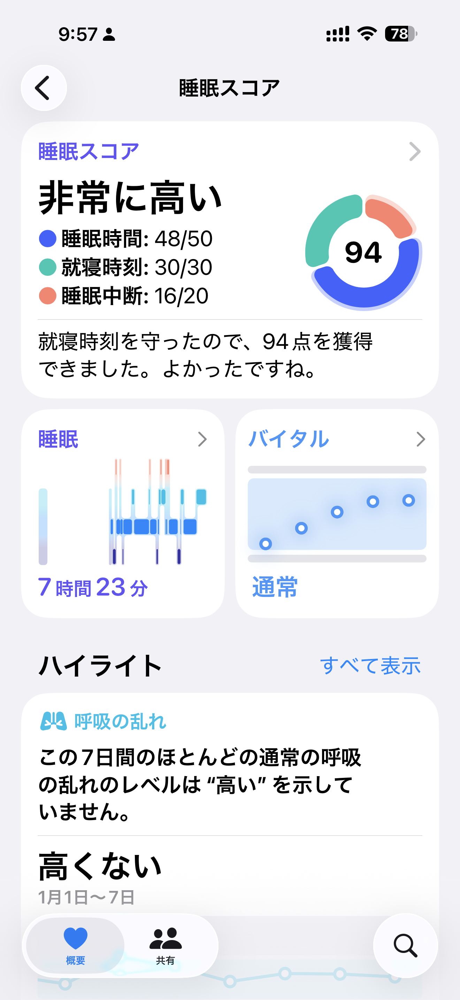

- 距離：5.33km
- 時間：00:26:01
- 平均心拍数：158
- 時間帯：8:06~8:32
- 天候：曇り（寒い）
- コース：多摩川河川敷（折り返し）
- 補給：朝ジェル
- 睡眠：6時間25分
- 今日の目的：レースペース5km
- コメント：ちょっと速すぎたかもしれない。

## 📝 コーチコメント：
今日のRペース5kmは前半を抑えて後半までフォームとピッチを保てており、とても良い仕上がりです。
少し速めでしたが許容範囲。次回は入りを5:00前後にして余裕度をコントロールできるとさらに◎。

## 📸 写真一覧

